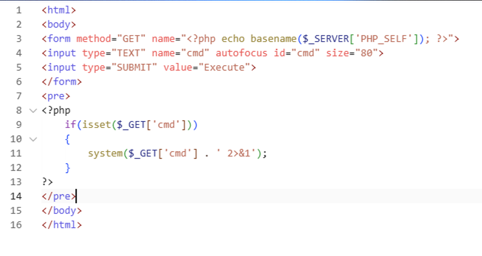
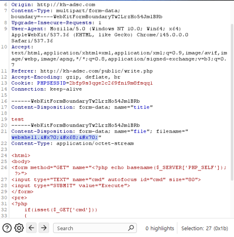
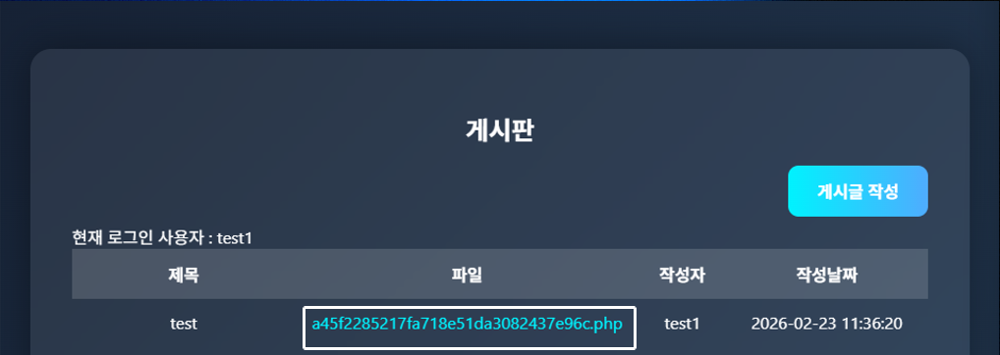
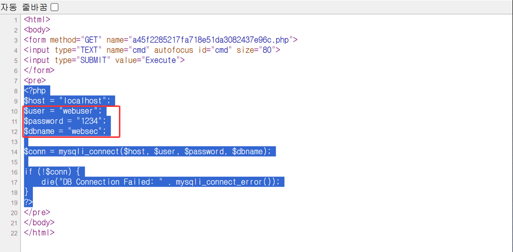
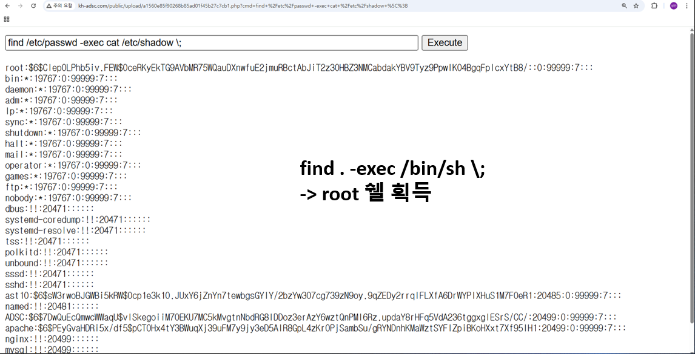

# WebShell 기반 파일 업로드 취약점을 이용한 권한 상승과 Database 탈취 및 대응방안

---

## 프로젝트 개요

| 항목 | 내용 |
|------|------|
| 프로젝트명 | WebShell 기반 파일 업로드 취약점 분석 및 대응 |
| 분류 | 웹 취약점 분석 / 모의침투 실습 |
| 수행기간 | 2026.02.14 ~ 2026.03.04 |
| 참여인원 | 4인 팀 프로젝트 |

---

## 개발 목표

- 파일 업로드 기능 하나가 잘못 구현됐을 때 어디까지 이어질 수 있는지 직접 확인해보고 싶었습니다.  
- 단순히 공격이 되는지 확인하는 것에서 끝내지 않고, 취약점이 생기는 원인과 대응 방법까지 직접 분석했습니다.

```
파일 업로드 필터 우회 (HTML Entity 인코딩)
        ↓
WebShell 업로드 성공
        ↓
dbconn.php 탈취 → Database 계정 정보 획득
        ↓
SUID 설정 오용 → root 수준 권한 상승
```

- 각 단계를 따로 보는 게 아니라, 하나의 침해 흐름으로 이어지는 구조를 이해하는 게 목표였습니다.

---

## 사용 기술 및 개발 환경

| 구성 요소 | 버전 |
|-----------|------|
| OS | Rocky Linux 8.10 |
| Web Server | Apache HTTP Server 2.4.37 |
| Backend | PHP 7.2.24 |
| Database | MariaDB 8.0.44 |
| DNS | BIND 9.11.36 |
| Frontend | HTML5, CSS |
| 분석 도구 | Burp Suite Community Edition 2026.2.1 |

---

## 담당 역할 및 구현 파트

- 팀 프로젝트에서 제가 직접 담당한 부분입니다.

**웹 애플리케이션 소스코드 작성**

- `dbconn.php` — 데이터베이스 연결 설정
- `login_process.php` — 로그인 인증 처리
- `register_process.php` — 회원가입 및 중복 아이디 검사
- `upload_process.php` — 파일 업로드 처리 (확장자 검사 없음)
- `write_process.php` — 게시글 작성 및 파일 업로드 처리 (블랙리스트 필터 적용)
- 취약점이 실제로 발생하도록 입력값 검증 순서를 의도적으로 잘못 설계

**공격 시나리오 설계**

- 파일 업로드 필터 우회 → WebShell 업로드 → DB 탈취 → 권한 상승으로 이어지는 흐름 직접 설계
- Burp Suite로 HTTP 요청 가로채기 및 파라미터 변조 실습

**취약점 대응 방안 적용**

- 각 취약점 원인 분석 후 보안 적용 코드 직접 작성
- 블랙리스트 → 화이트리스트 전환, 처리 순서 재배치

---

## 공격 과정

### 파일 업로드 필터 우회 — WebShell 업로드

- 게시판 파일 업로드 기능에서 `.php` 확장자를 블랙리스트로 막고 있었습니다.  
하지만 `.php` 확장자를 HTML Entity로 인코딩한 `&#x70;&#x68;&#x70;` 형태로 변경하여 업로드했을 때 확장자 검증 필터를 우회하였습니다.  
- 서버가 디코딩 전에 확장자를 검사하고 있었기 때문입니다.

WebShell 코드 구성:



Burp Suite로 확장자 변조:



WebShell 업로드 성공:



---

### Database 연결 정보 탈취

- WebShell에서 상위 디렉토리로 이동해 `dbconn.php`를 열어봤더니 DB 계정 정보가 평문으로 그대로 적혀 있었습니다.   
따로 권한 상승 없이도 DB에 바로 접근할 수 있는 상태였습니다.



---

### SUID 설정을 이용한 권한 상승

- 시스템을 확인해보니 `find` 명령어에 SUID가 걸려 있었습니다.  
- `find /etc/passwd -exec cat /etc/shadow \;` 명령어로 일반 사용자 권한에서 `/etc/shadow` 파일을 열 수 있었고,  
`find . -exec /bin/sh \;` 형태로 root shell 획득까지 가능한 상태임을 확인했습니다.



---

## 취약점 분석 및 대응 방안

### 파일 업로드 취약점

- 블랙리스트 방식은 막을 확장자를 하나하나 다 적어줘야 해서, 새로운 우회 방법이 나오면 그때그때 또 추가해야 한다는 한계가 있습니다.

```php
// 취약한 코드 (Vulnerable/app/write_process.php)
// 디코딩 전에 검사 → &#x70;&#x68;&#x70; 는 필터 통과
$ext_raw = pathinfo($original_name, PATHINFO_EXTENSION);
if ($ext_raw === "php") { exit; }
$decoded_name = html_entity_decode($original_name, ENT_QUOTES, 'UTF-8');
```

그래서 확장자 검증을 다음과 같이 바꿨습니다.
- 디코딩을 검증보다 먼저 수행하도록 처리 순서를 바꾸고,  
- 블랙리스트 대신 허용할 확장자만 정해두는 화이트리스트 방식으로 전환했습니다.  

```php
// 대응 방안 적용 후 (Secure/app/upload_process_secure.php)
// 디코딩 먼저 수행 → 실제 확장자 기준으로 검증
$decoded_name = html_entity_decode($original_name, ENT_QUOTES, 'UTF-8');
$ext = strtolower(pathinfo($decoded_name, PATHINFO_EXTENSION));

// 블랙리스트 → 화이트리스트 전환
$whitelist = ['jpg', 'jpeg', 'png', 'gif', 'pdf', 'txt'];
if (!in_array($ext, $whitelist)) { exit("허용되지 않는 확장자"); }
```

---

### SUID 권한 상승

- SUID는 일반 사용자가 파일 소유자의 권한으로 프로그램을 실행할 수 있게 해주는 설정입니다.
- `find` 명령어처럼 `-exec` 옵션으로 외부 명령을 실행할 수 있는 프로그램에 SUID가 걸려 있으면,   
일반 사용자 권한에서도 root 수준의 명령을 실행할 수 있게 됩니다.  
- 운영 과정에서 잘못 설정됐거나, 설정한 사실 자체를 잊어버리는 경우가 실제로 많습니다.

- `find`에는 SUID가 필요하지 않기 때문에 제거하고,  
어떤 파일에 SUID가 걸려 있는지 주기적으로 점검하는 것이 중요합니다.

```bash
# SUID 제거
chmod u-s /usr/bin/find

# 정기적으로 SUID 설정된 파일 점검
find / -perm -4000 -type f 2>/dev/null
```

---

### Database 정보 노출

- DB 접속 정보를 소스코드에 평문으로 적어두면,  
WebShell 하나만 올라가도 파일을 그대로 열어볼 수 있기 때문에 DB 계정 정보가 즉시 노출됩니다.  
- 소스코드는 여러 사람이 보거나 GitHub에 올라갈 수도 있어서, 민감한 정보를 직접 적어두는 건 위험합니다.

```php
// 취약한 코드 (Vulnerable/app/dbconn.php)
$password = "1234";  // 평문 하드코딩
```

- DB 접속 정보는 소스코드 밖으로 꺼내 환경변수로 관리하는 방식으로 바꿨습니다.  
이렇게 하면 소스코드가 노출되더라도 실제 접속 정보는 드러나지 않습니다.

```php
// 대응 방안 적용 후
$password = getenv('DB_PASS');  // 환경변수로 분리
```

---

## 폴더 구조

```
Semi_Project/
│
├── img/                    # 공격 과정 스크린샷
│
├── Vulnerable/             # 취약점이 포함된 원본 코드
│   ├── app/
│   │   ├── dbconn.php
│   │   ├── login_process.php
│   │   ├── register_process.php
│   │   ├── upload_process.php
│   │   └── write_process.php
│   └── public/
│       ├── board.php
│       ├── login.php
│       ├── register.php
│       └── write.php
│
└── Secure/                 # 보안 대응 적용 코드
    └── app/
        ├── login_process_secure.php
        └── upload_process_secure.php
```

---

## 프로젝트 참여 소감

처음에는 WebShell 업로드가 되지 않아서 우회 방법만 찾으려고 했는데, 팀원들과 같이 서버가 파일을 어떻게 검사하는지,  
입력값이 어떤 순서로 처리되는지 하나씩 분석하다 보니 공격 방법보다 문제의 원인을 먼저 파악하는 게 더 중요하다는 걸 느꼈습니다.  
특히 작은 로직 차이 하나가 DB 탈취, 권한 상승까지 이어질 수 있다는 걸 직접 확인하고 나니까,  
앞으로는 코드를 짤 때도 "이게 우회될 수 있지 않을까"를 자연스럽게 생각하게 될 것 같습니다.

---

> 이 저장소의 코드는 교육 및 실습 목적으로만 작성되었습니다.  
> 실제 운영 환경이나 허가받지 않은 시스템에 사용하는 것은 법적으로 금지되어 있습니다.
